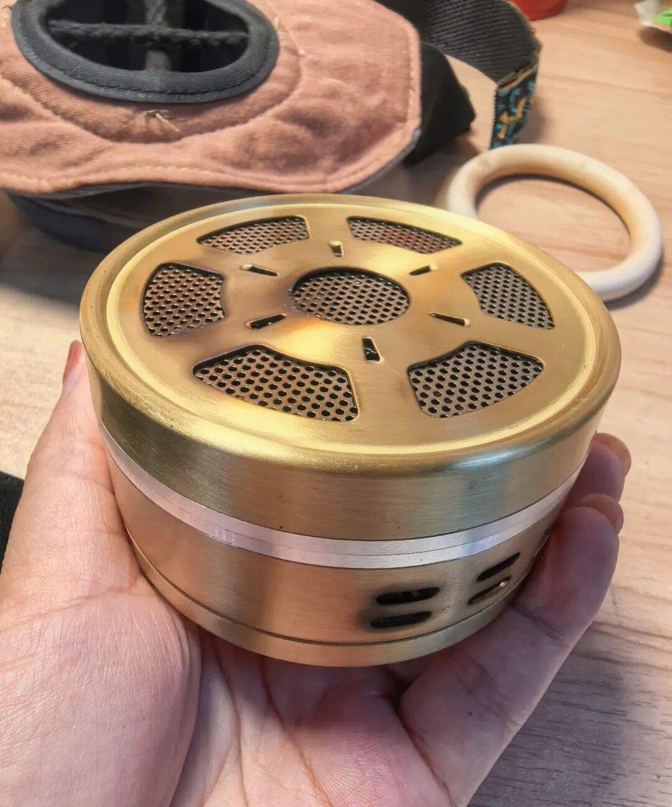
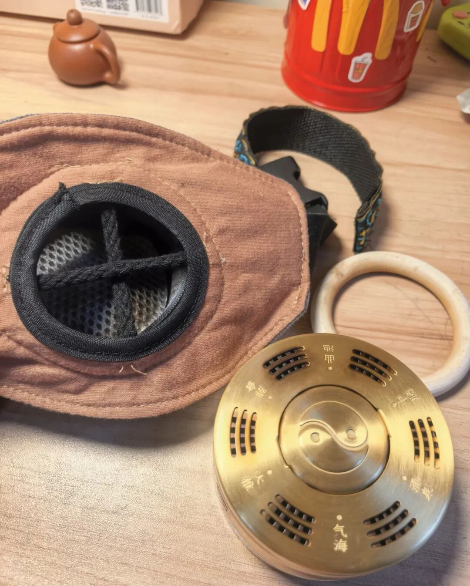
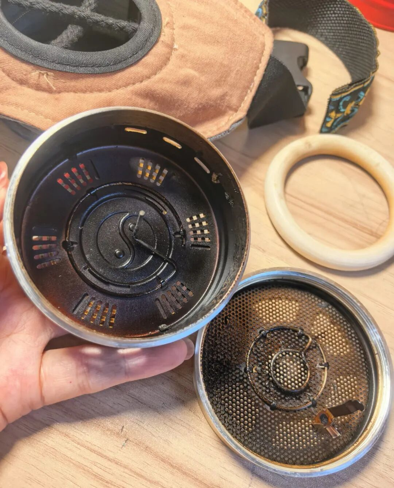
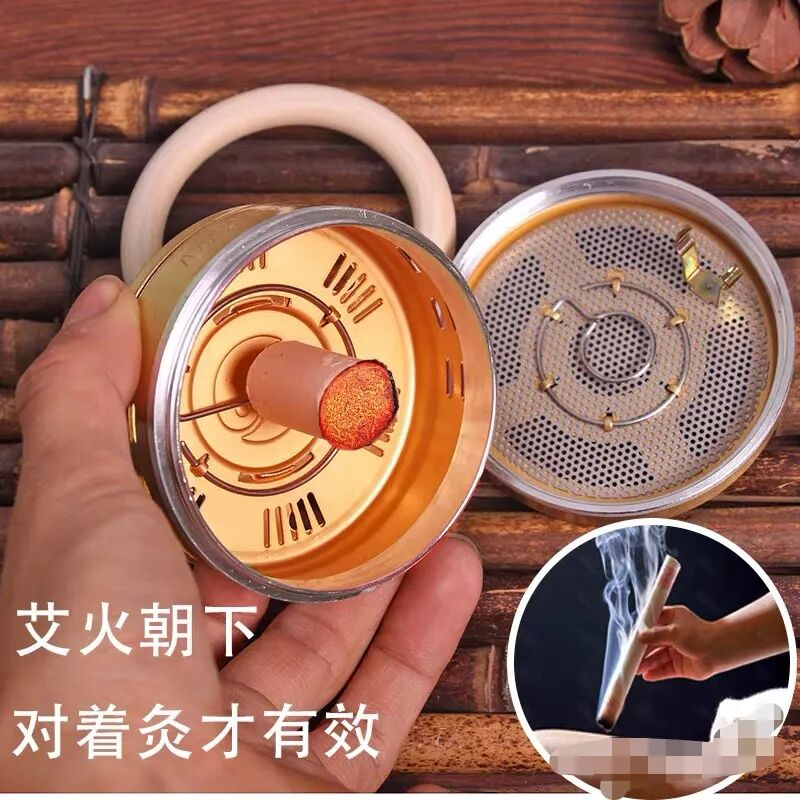

这几年买了七八种艾灸盒。

各有各的优点，但是又觉得差了点啥。

温灸宝这种效果好，但是太大了，真的不方便。

铜盒方便就是大部分隔热，还是横着插艾条的，灸感不是很强。

今年终于买到合适的。

铜盒很有质感，详情介绍说140g，插的针是竖着的，基本可以做到悬灸的效果。

特别表扬铜盒是旋转式拧开，之前多多买了一个扣的好难用。

布包中间是隔开的，不那么容易熄，而且温温的灸感也很舒服。一个艾柱可以用2小时左右。

有个小圈圈垫在，不会烫到。

这个我用来主要灸神阙穴和关元穴。

果然女人过了三十岁就开始偏爱养生。