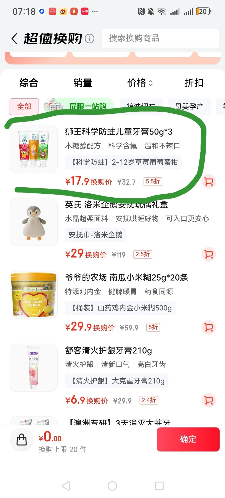
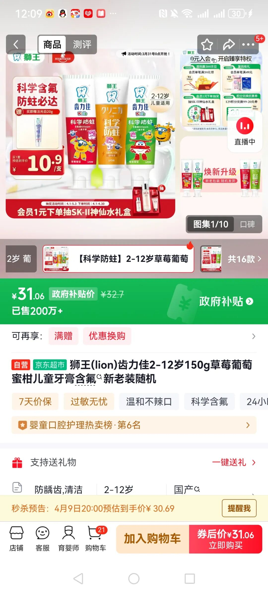
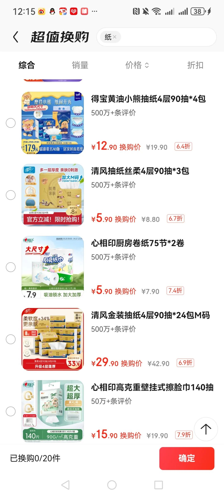

给大家分享一个我平时在京东买东西的思路。

不针对所有产品，但大部分日用品都很实用。

举个例子，比如我要去买儿童牙膏，我会先去搜一下，然后找到比较便宜的几个商品，都点开看看里面有没有“优惠换购”。

把它加入购物车之后，再去选我需要的商品。

你可以看到正常页面进去的话，价格要30多，但是换购就差不多便宜了一半。

换购区域搜索的时候可以按折扣排名，或者直接搜。

不需要凑单，很轻松就可以打到折扣。我一般会选择大概5折左右的商品。

根据我的经验，像纸巾、日用品这类东西都挺多的。

尽量选择同一品类，比如母婴用品就选类似宝宝棉签，尿不湿试用装这类的单价便宜的去找你需要的商品。

你们可以自己根据自己需要的，挨个去测试一下，适合不喜欢蹲活动的人。

我平时喜欢京东买买东西，而且基本是需要就买，早上下单，下午就到了。

所以对于我来说还挺实用。