每个月最开心的时刻又到了。

没错，就是我来交拼多多购物作业的时候。

这个月其实也踩了一些雷，但更多的是挖到宝的感觉。

话不多说，直接开始吧！

生鲜水果类

我真的很喜欢多多买水果，原产地，而且性价比高。

1、西双版纳金钻凤梨。

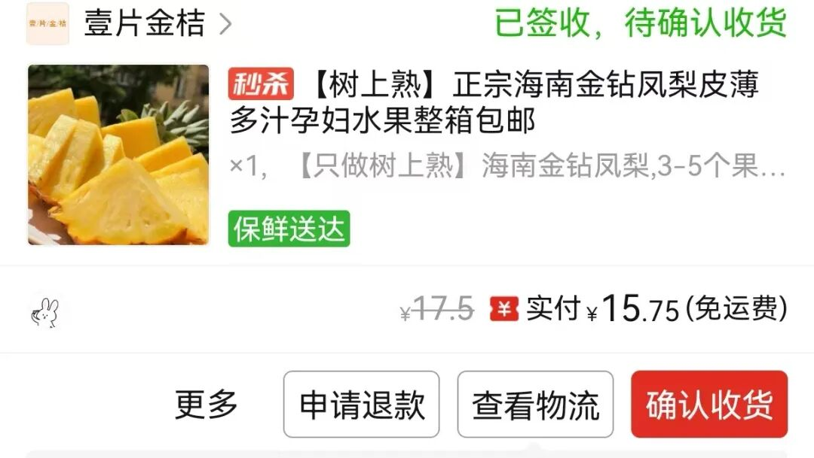

第一次在网上买到这么好吃的菠萝，真的很甜。一个大概一斤左右，觉得大小刚刚好，不泡盐水也没有那种涩口的感觉。

2、芭乐。

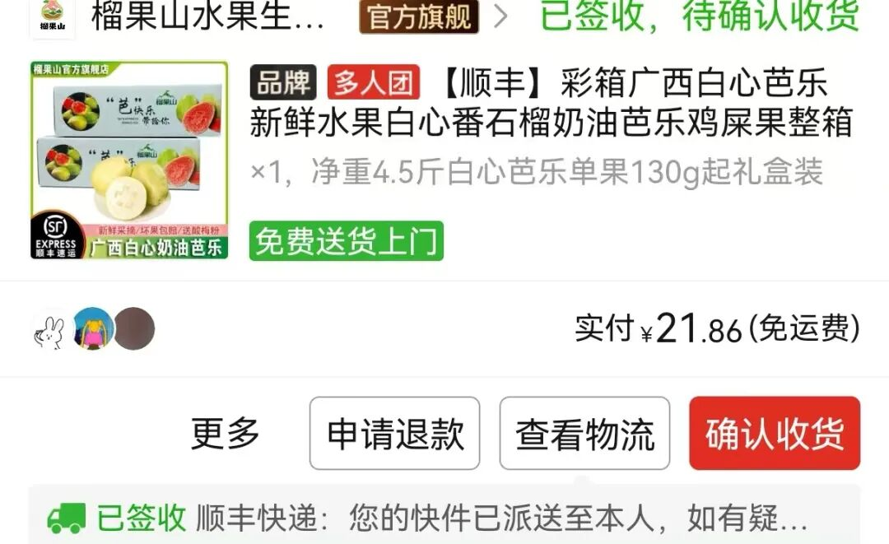

我买的是白心的芭乐，完全没有踩雷。一箱大概有8个左右，每个大小只有一个拳头这么大，而且不是那种很轻的，基本上到手就可以直接吃。果香很重，果肉很丝滑。

3、青梅。

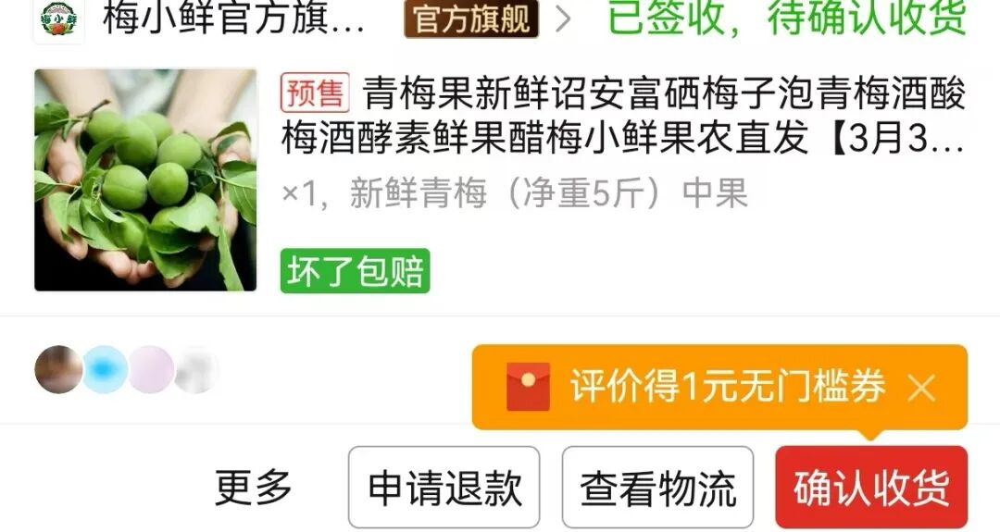

这家已经是我回购三年的青梅了，基本上每年3月份我都会买5斤，用来做梅子露和泡青梅酒。梅子到手基本上没有什么磕磕碰碰，特别好，特别新鲜，个头也很均匀。

泡出来的青梅酒是琥珀色的，果香很好闻，而且每年做的梅子露味道都特别好。

4、土豆。

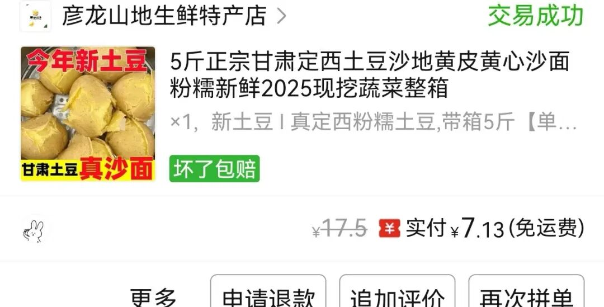

菜场的土豆都要快4块钱一斤了，这个五斤才7块钱还包邮，真的是觉得太划算了。土豆是很粉糯很粉糯的那种，我觉得比菜场的好吃多了。

5、豌豆。

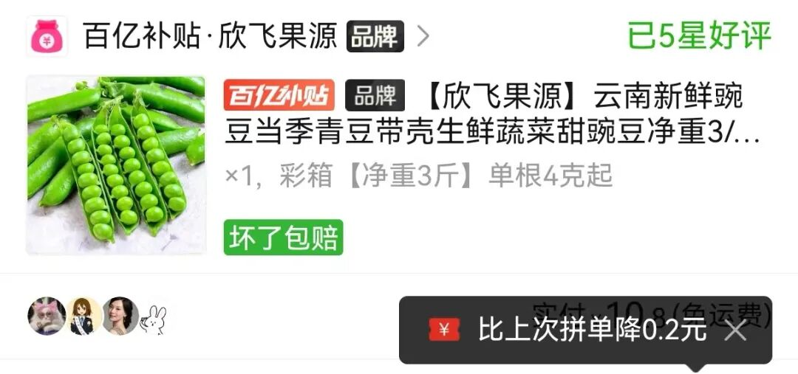

这个豌豆也是我回购的。2月份和3月份买的话感觉还不错，收到的也挺新鲜的，不过现在到了豌豆的季节，应该更加划算了。

6、融安金桔。

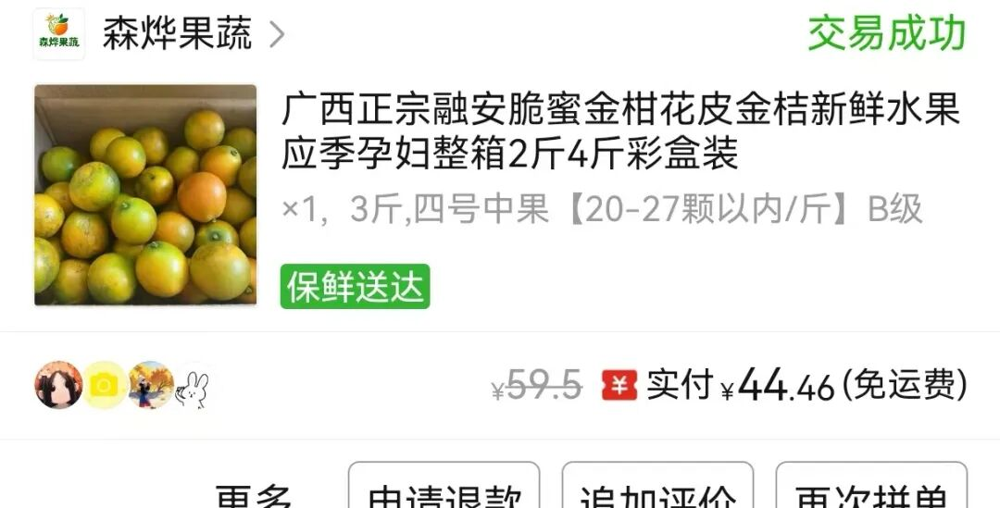

这金桔真的太给我惊喜了，之前在超市看的，大概在20块钱一斤左右吧，这个买来大概在15块钱一斤左右，每个都是单独的包装，真的是很甜。

这家也是我在小红书上找了很久看到的别人推荐的，买来确实比那种其他的金桔味道都好很多，而且个头很大，自己吃和送人都相当不错。

7、甘蔗。

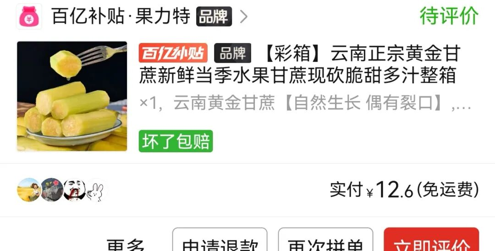

这个甘蔗我不夸张地说，我回购了三次，因为我真的还是比较喜欢吃甘蔗的，而且现在外面的一根大概要30块钱吧。

这个是云南的黄金甘蔗，基本上都是中段的，特别脆，很甜。不过要注意的是，不知道是不是季节问题，我第一次买的特别好，后面两次买的就比前面的稍微差了一点，但这家确实是我买甘蔗最好的一家。

8、鲜花。

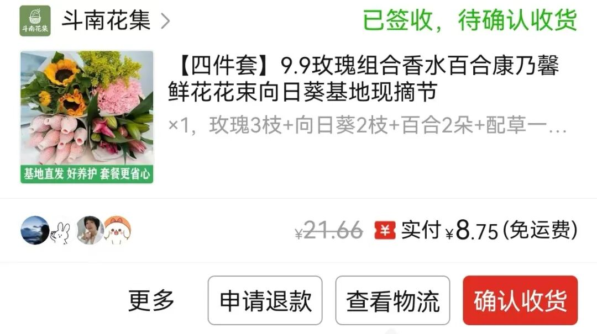

这个是我第一次在拼多多上买鲜花，价格真的很便宜，到手也还可以吧。哈哈

**玩具篇**

除了买生鲜比较多之外，再就是买一些日用品和玩具比较多。因为小孩子比较皮嘛，经常拼多多上买个几块钱的东西，可以硬控他一下午，要么就是可以让他一个月表现得好一点，奖励一个小玩具。

9、涂色游戏本。

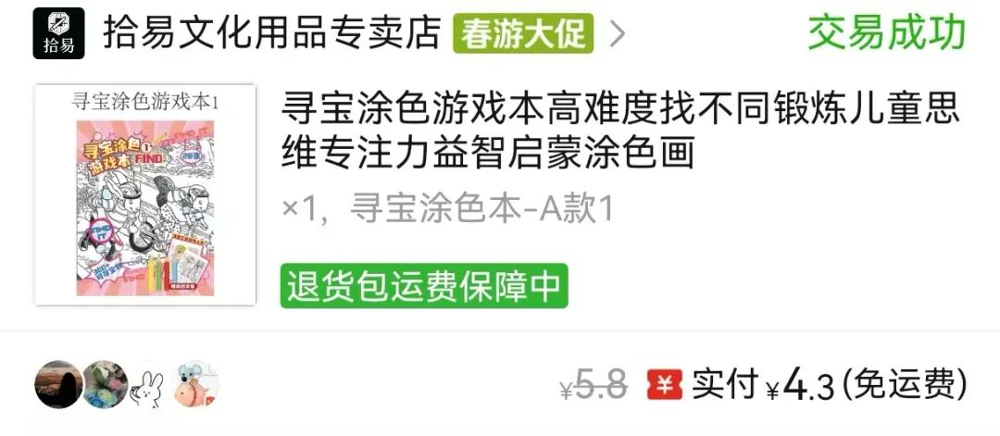

这个我不夸张地说，真的太费娃了。它就是这种活页的，然后里面就像寻宝一样，要找到一些隐藏在画里面的指定的物品，对于小孩来说很有挑战性。我经常就是坐车或者是搭高铁的时候会让小孩玩。

10、掌心尺。

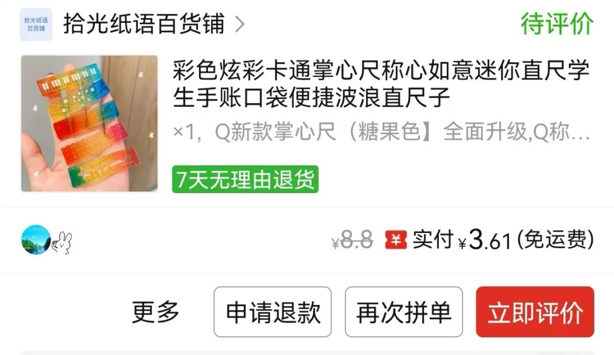

这是小朋友说看到同学有的，他想要的。确实很便宜，几个小尺子给他下课画一画也挺好的。

11、口袋书。

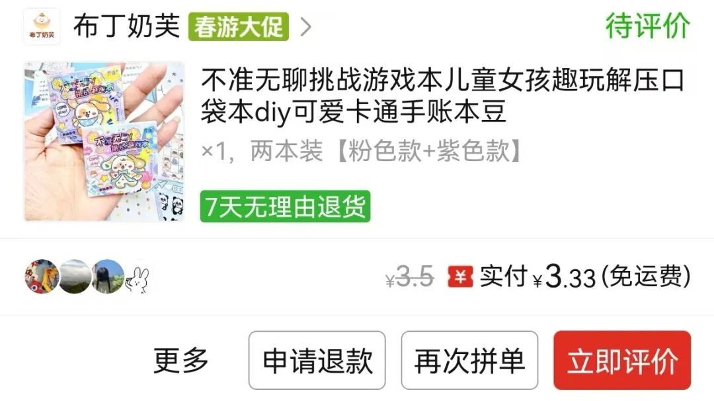

这个就特别小，就是可以揣口袋里的，就是给平时小朋友带的，在学校课间的时候玩一玩。里面就是有一些猜谜语的、脑筋急转弯的小游戏。

12、科幻书。

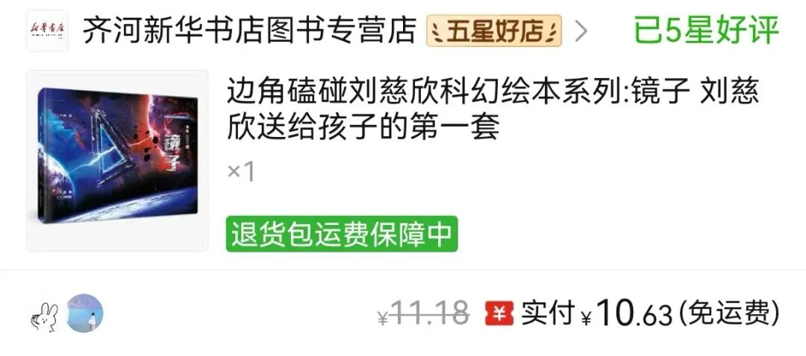

这个是刘慈欣的一本科幻小说《镜子》。可能需要三年级以上的小朋友才能看吧，里面的文字稍微有一点点多，但是整本书的质感特别好，全部都用的是克重很重的铜版纸。而且这个包装都还蛮精美的，以这个价格来说。

13、游戏书。

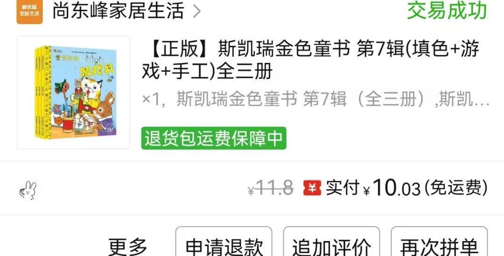

这个游戏书我特别推荐，就是大概七八岁以下小朋友都能够玩。它是有三本，里面分为有填色的、游戏的，还有做手工的书，每本都特别厚，我觉得很划算。基本上小朋友在里面剪剪画画玩玩，内容很丰富的。

14、望远镜。

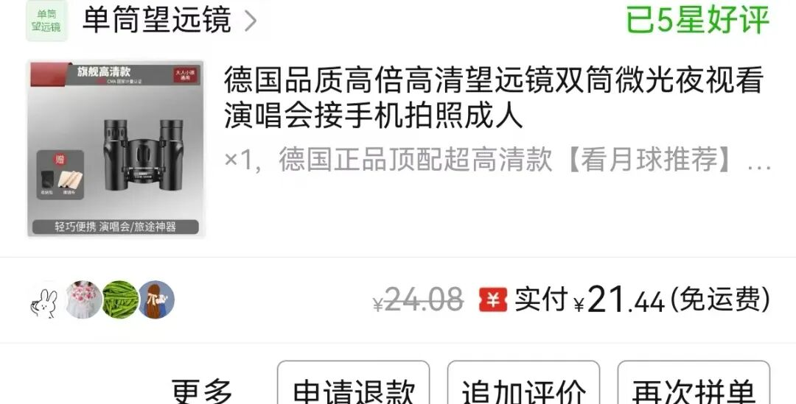

这个望远镜就一巴掌这么大，然后也比较好携带，之前买了给小朋友去乡下看鸟的，清晰度还不错，质感也还可以。

**生活用品篇**

谁能不爱在拼多多上买生活用品，各种各样的小玩意，真的是太让人长见识了。

15、电磁打火机。

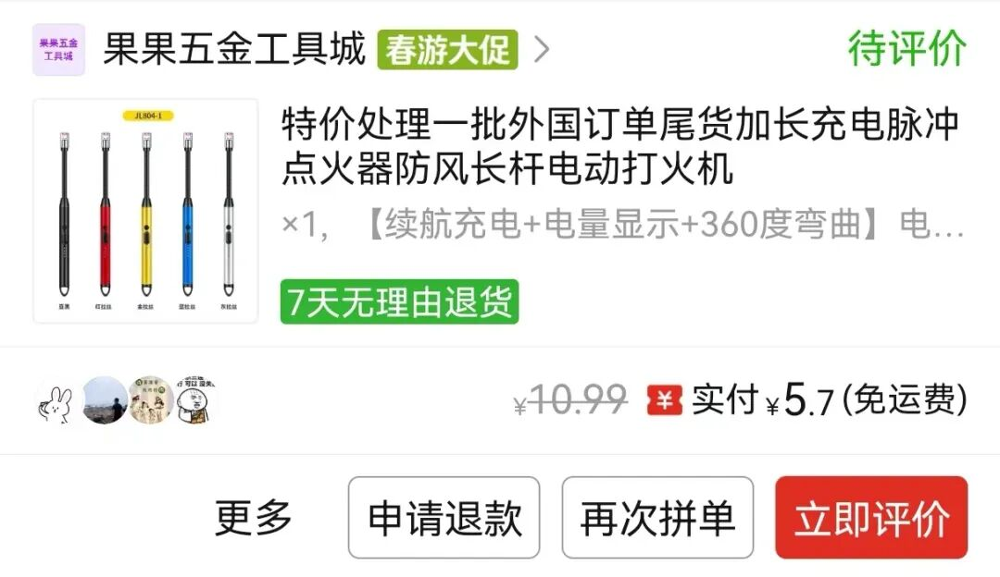

我第一次看到不用汽油直接可以充电的打火机。我还特意去搜了一下，是用的高压的电池产生的火花。用这个去点纸，或者是点煤气灶，都特别方便。而且它上面有一个可以伸缩的条，就是对于长的短的都可以，那最主要的是感觉可以一直用，划算。

16、抹布。

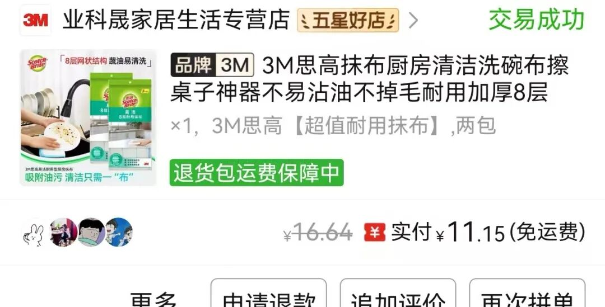

3M这款抹布真的无敌了，它真的很厚，一点都不像那种很便宜的抹布，洗两下就感觉松松垮垮的。而且它就是不沾油，你擦完台面什么的，再用点洗洁精，这个抹布就又洗得很干净。

17、带胸垫的内衣。

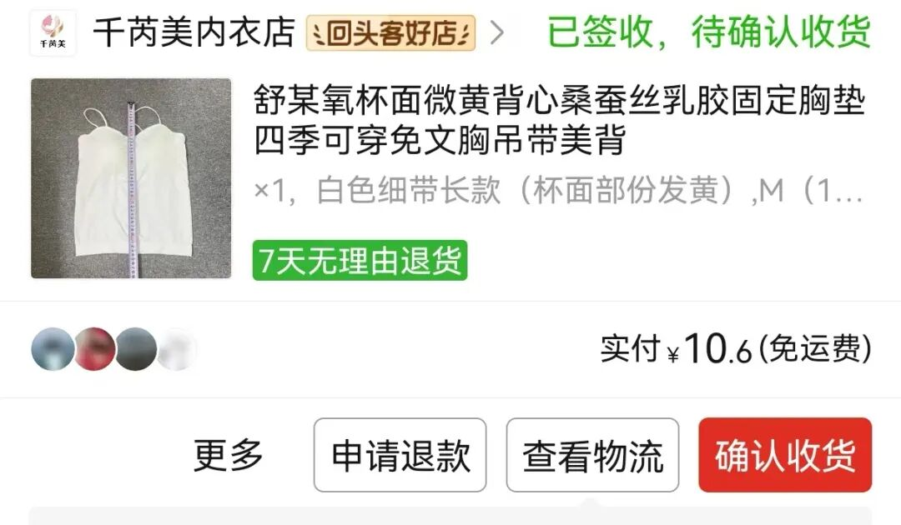

这款内衣它的质量还不错，而且胸垫的位置也挺好的，整个上身的效果很好，也没有发黄，根本看不出来。我觉得穿在镂空的毛衣啊，或者是当做白色打底都特别不错，就10块钱性价比真的拉满。

18、果冻硅胶拉力器。

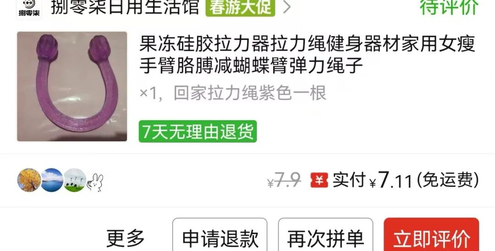

这个是瞿颖姐姐种草的。挺小的，但是拉力真的蛮大，我觉得夏天可以锻炼锻炼肩颈，还有手臂。

19、牛皮纸贴纸。

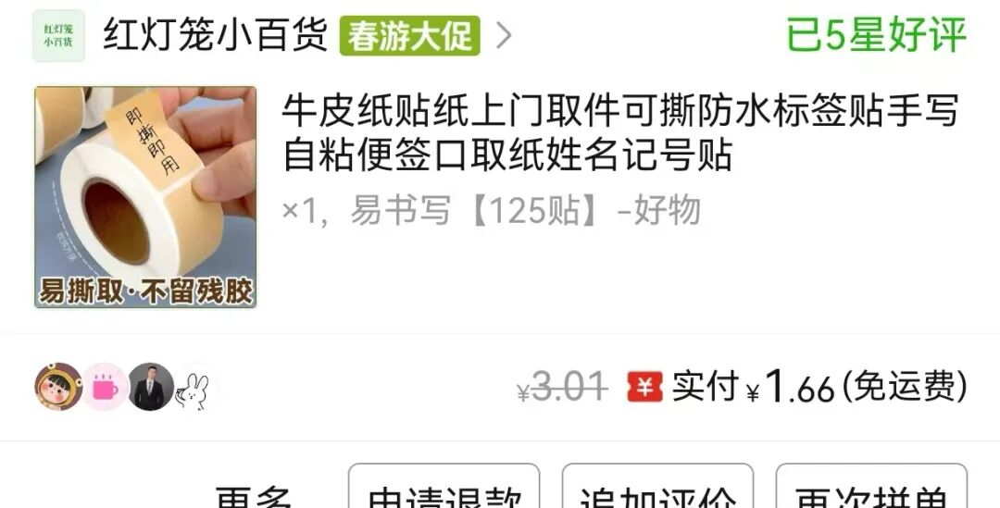

因为有时候经常寄快递啊找不到纸，我觉得这个都特别方便。是牛皮纸，然后可以随时写随时取，包括自己做一些标签，都挺方便的，而且不会留下胶印，直接撕掉就可以。

20、隐形眼镜盲盒。

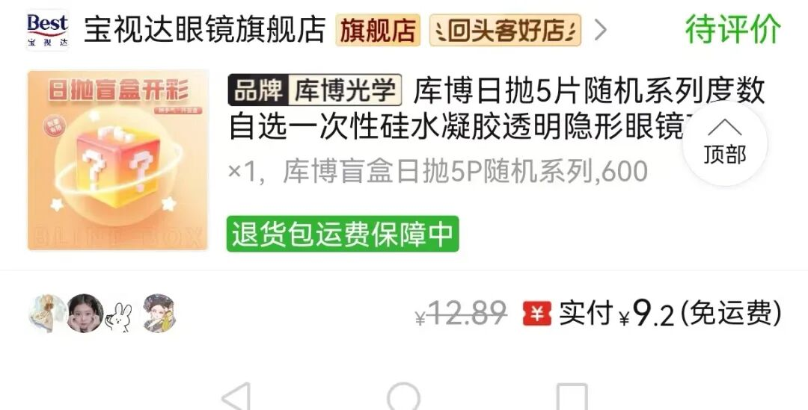

反正我第一次买隐形眼镜盲盒，但是库博光学的我是一直有在买，使用感都还不错，这次随便试了一个，感觉挺好的，很润，戴一天眼睛也不累。

21、香水。

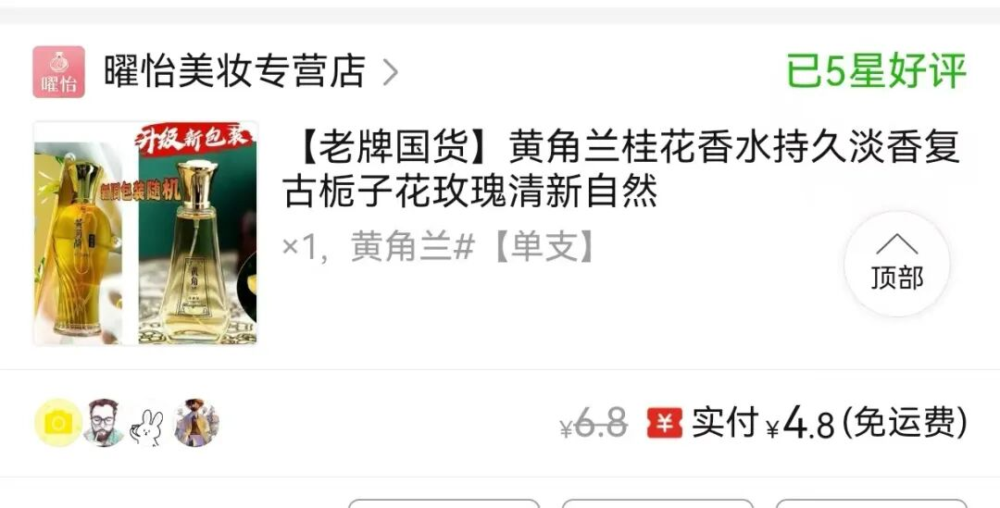

我买这个只是为了做一个小的香氛放在洗手间，这个味道还挺好闻的。之前想买栀子花的没买到，就这个黄角兰桂花香，我觉得挺好闻的。然后把它拆开，放了一个外卖袋的手柄在里面做扩香器，效果还挺好的。

22、拖把。

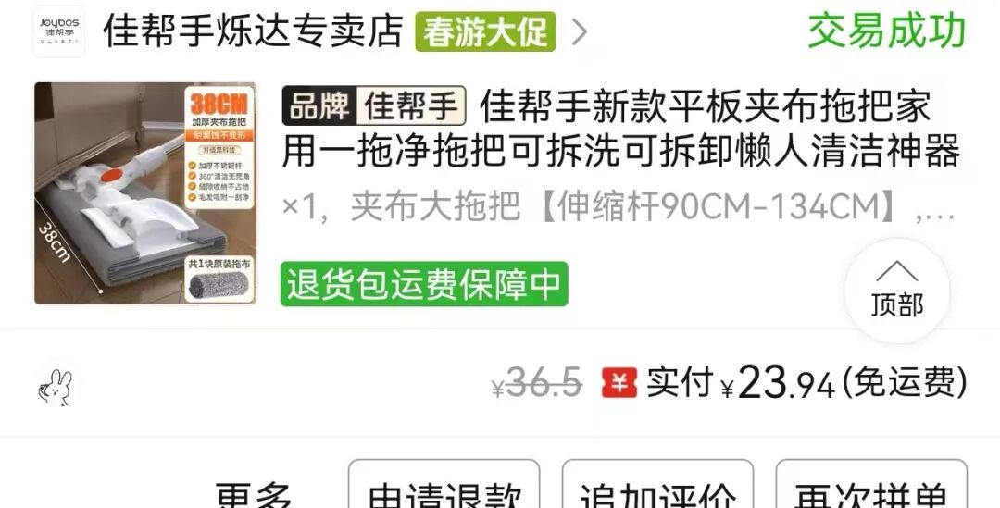

我觉得这个拖把也挺好的，主要是它的拖把布可以卸下来，每次拖完地就把它洗洗干净，挂起来很方便，而且这个拖把下面也是可以折叠的，不是很占位置。

**食品篇**

我在拼多多上买吃的也不算很多，也踩雷过一些，推荐几个我觉得还不错的。

23、丹香海盐曲奇饼干。

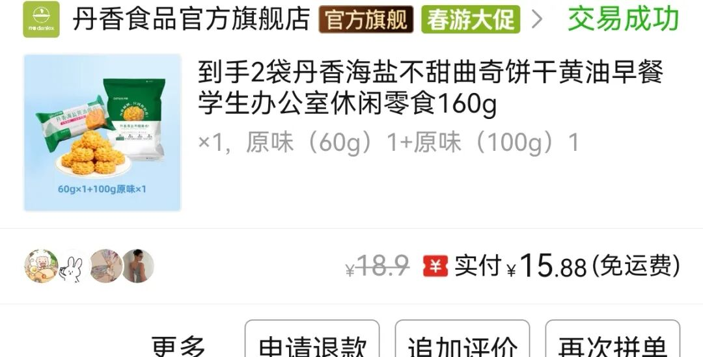

这个应该是我近期吃到最好吃的曲奇饼干，它入口就化，而且一点都不甜不腻。每个都是单独的包装，做小零食或者吃还蛮合适的。

24、毕节豆腐干。

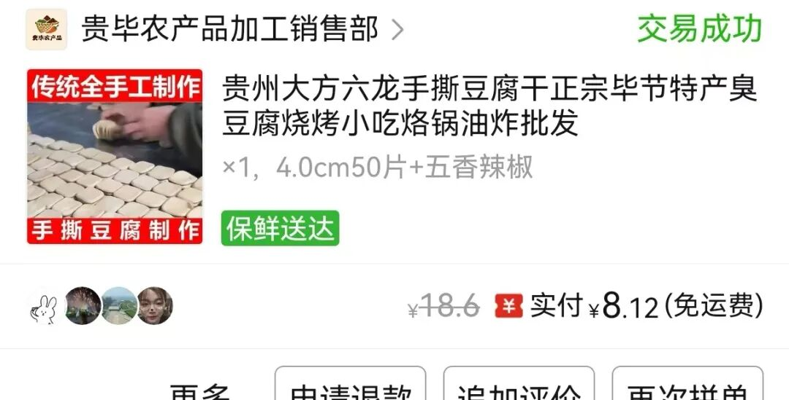

我天天刷视频刷到贵州特色小吃，所以买了一点这个豆腐干。感觉还可以，就是用油煎煎，然后蘸点辣椒粉，作为小零食吃还不错。

25、面条。

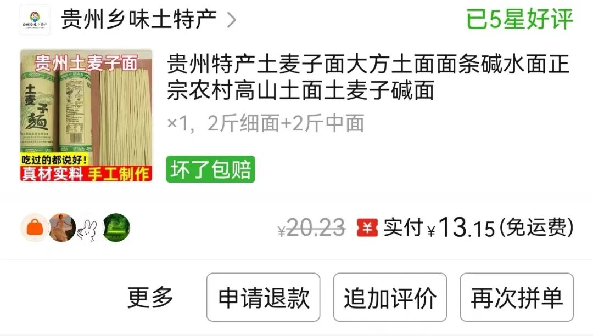

面条我就推荐两个，这都是我经常买的。一个是贵州特产的那个土麦子面，面条我觉得它比较有韧劲，然后我自己也比较喜欢吃碱水面，所以觉得挺好吃的。

然后另外一个就是我经常买的，是做热干面的这种原材料的碱水面。

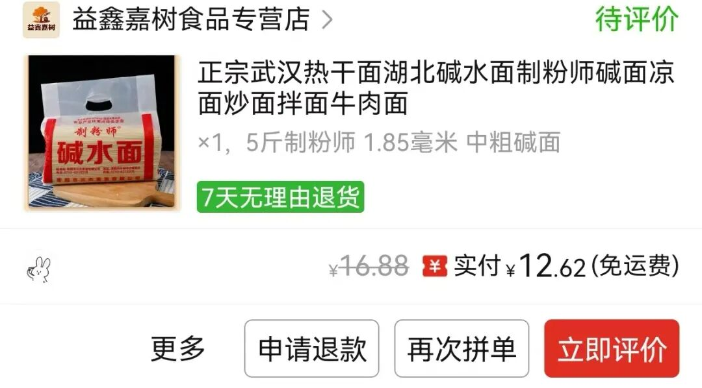

**踩雷篇**

1、巧克力。

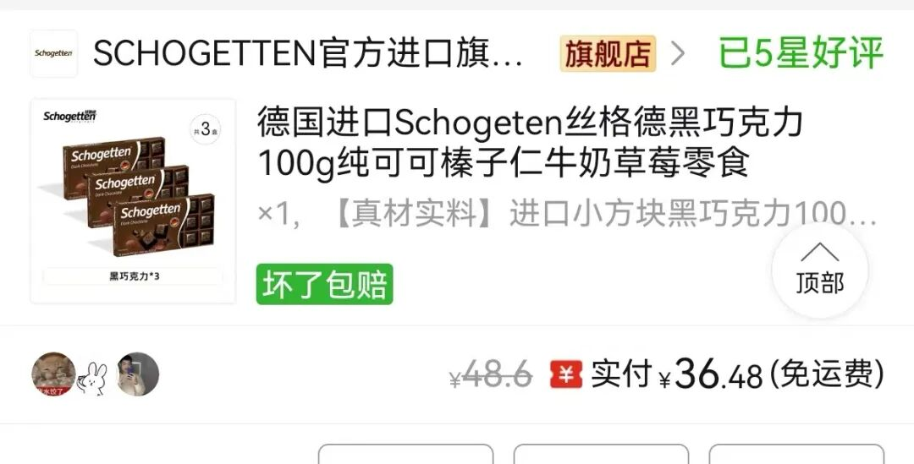

这个巧克力之前还蛮多人推荐的，然后我买了大概4盒吧，买了几个口味的，个人感觉就是偏甜了一点，我不是很喜欢。

2、一次性酱料盒。

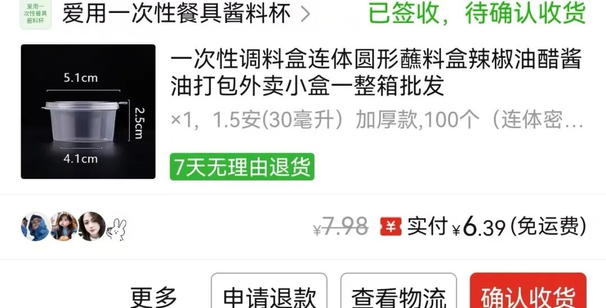

一次性的酱料盒，我主要是用来分装梅子露、番茄酱这些之类的，这里买的话就感觉它的质量挺差的，也不是很好扣紧。我去年买的那一个就质感、厚度都好多了。

3、考古盲盒。

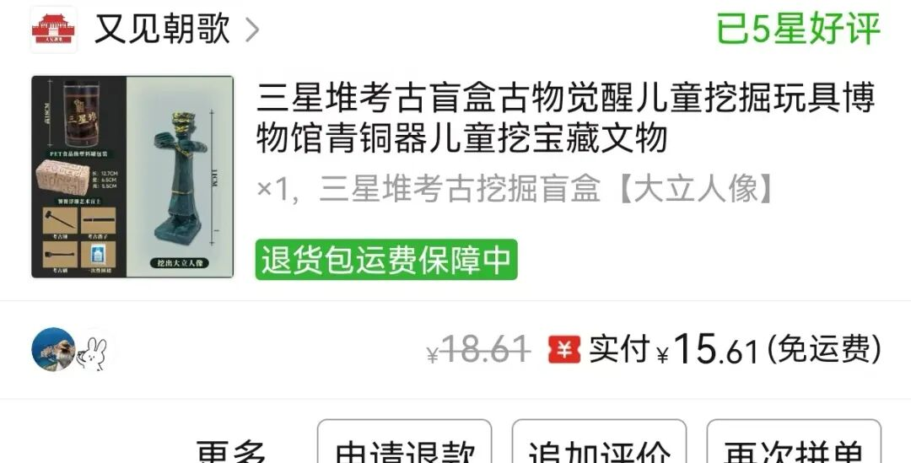

这个是给孩子买的一个考古盲盒，总体来说也谈不上什么踩雷，就是性价比不是很高。一下下就玩完了，没啥意思，还玩得家里到处都是土，再也不去买了。

4、眼镜盒。

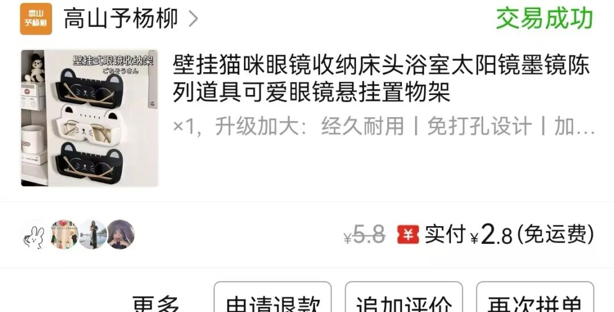

这个眼镜盒，因为我眼镜喜欢乱丢，本来以为有这个的话会很方便，结果这个真的是太垃圾了，后面的背胶完全粘不紧。

总体来说3月份的购物还是很满意的。花的钱不多，但是每次买到还是觉得很有成就感，很开心。一点小小的消费欲，就完全取悦了自己。

4月继续努力淘。