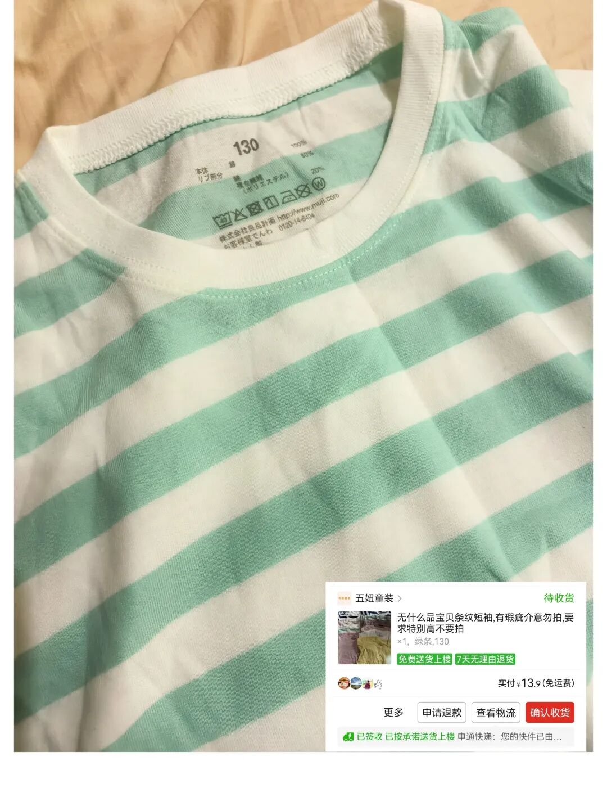
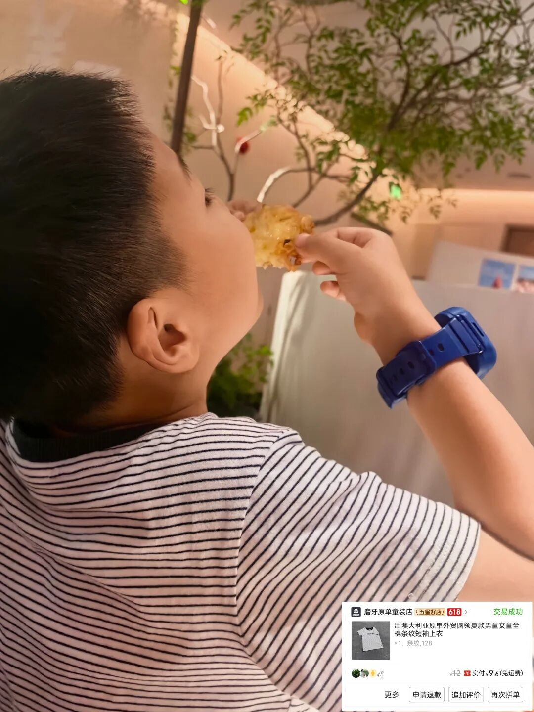
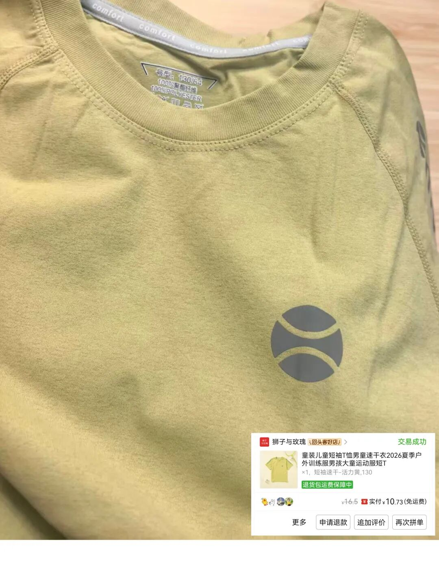
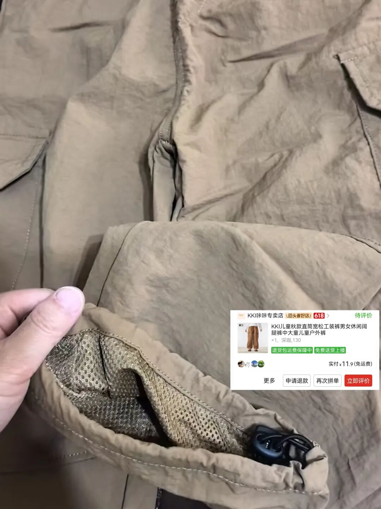
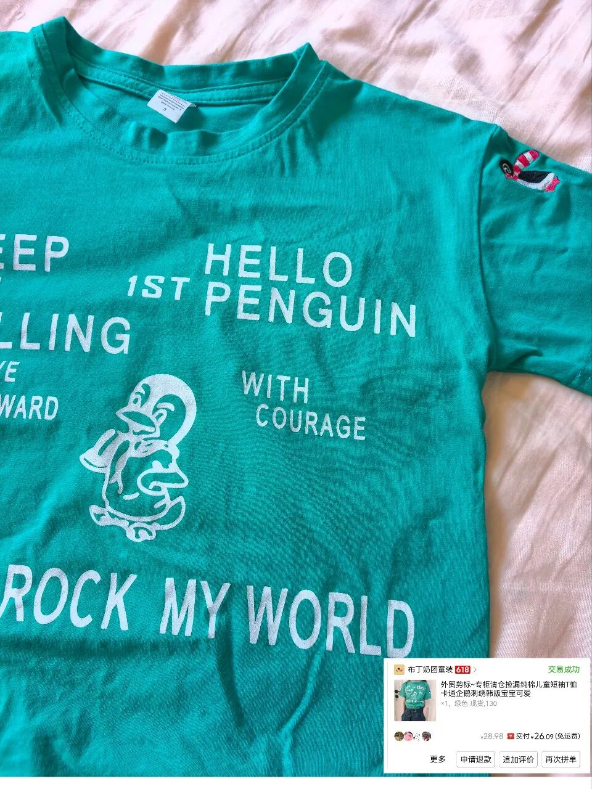
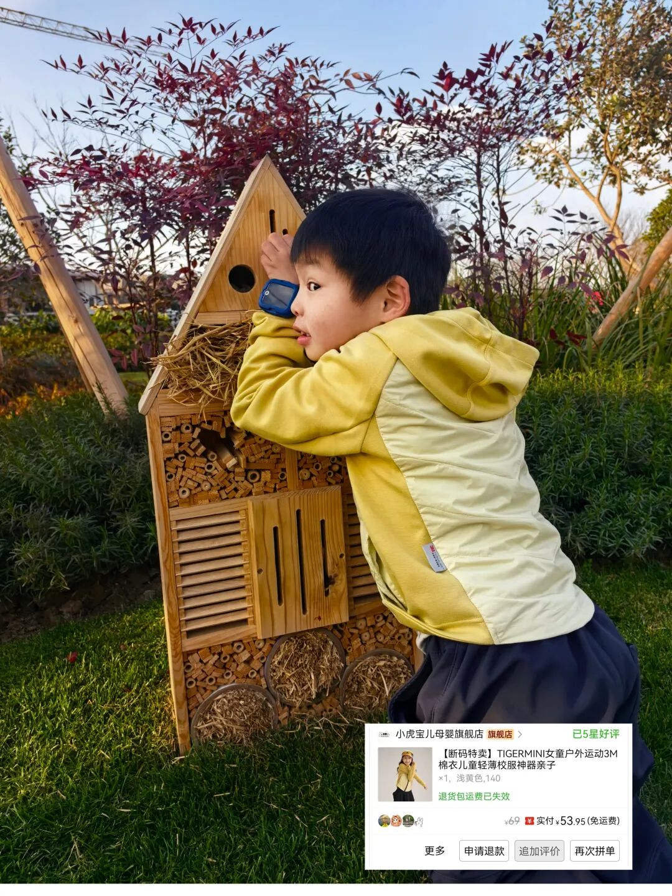
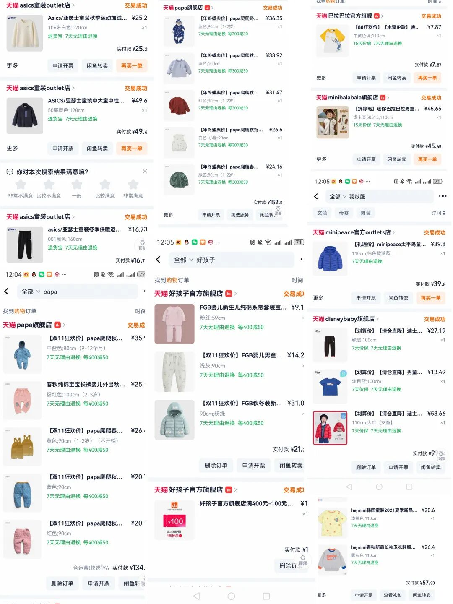

为了防杠，我先提前说一下：孩子上小学之前，我还是正正经经地给他买各大品牌的衣服，最多就是趁打折多买一点。

现在孩子大了，越来越费衣服了，有时候在拼多多看到便宜的，也忍不住给他买一点。

但功能性的衣服，像羽绒服、羊毛内衣、速干服这些，我还是正正经经给他买品牌的。羽绒服一般价位在300左右，买得比较多的品牌保姆鹅。

还有一些轻薄的羽绒服，就在唯品会看各大品牌打折，大概100左右一件。

另外经常给他穿的美利奴羊毛内衣，一般一套在150到200左右。速干服我基本都是买品牌的，主要就是纳桔、q21、森林棠之类的。

裤子的话，我一般在1688给他买，之前有分享过的，均价大概40块左右一条。一年大概要买十来条，太费裤子了。

鞋子的话，基本上就是给他买安踏的。从小到大也买过很多品牌，反正穿来穿去他最喜欢安踏。我一般趁打折的时候给他买个几双，价格五六十块钱一双。

夏天的凉鞋买的是迪卡侬那款，我觉得性价比比较高，平时溯溪、登山都可以穿。

然后说回来，夏天的衣服是我觉得最可以随便买的。

只要质量是纯棉的就行，主要小孩太费衣服了，吃点东西弄脏了，我洗不干净的话衣服就浪费了，所以就不高兴给他买贵的。现在拼多多看到便宜的就给他买，一点也不心疼。

最近买了好几件短袖，要分享一下。

1. 无印良品短袖

这就是在拼多多买的。发现有时候拼多多买东西图拍得越丑，东西性价比越高。

这个我看评价还挺好的，买回来摸了一下，确实是无印良品的，我个人感觉还挺正的。而且是纯棉的，质感很不错。强烈推荐。

数量不多了，我又回购了一件黄色的条纹款。我个人觉得这种小朋友穿还是蛮百搭的，也挺清爽的。

2. 澳洲纯棉条纹短袖

因为便宜的东西还是不敢买太花里胡哨的，一般都是越简单越好，而且我会看一下成分，基本上都是纯棉的比较多。

这个是澳洲的一个品牌，我不认识，但买回来发现它的刺绣很不错。十来块钱的东西，刺绣上面做得挺精细的，质感不会太差。也挺百搭的，我觉得男孩女孩都很适合。

3. 速干服

这种没有纯棉的那么舒服，但它会比较排汗一点。质感没有我之前买的像森林棠什么的那种那么舒服，稍微硬一点。但版型还可以，夏天穿穿还行，而且很便宜。

4. 速干裤

说是速干的，成分是聚酯纤维。双层的走线还可以。本来没想买，天天送我券，实在太便宜了。这个价位性价比还是很好高的。个人觉得很浅的那种卡其色会更好搭配一点。

5. 韩国品牌小企鹅图案

我主要是很喜欢它的图案。那个小企鹅的刺绣我觉得很惊喜，收到手之后觉得还不错。而且前面的印花也不容易掉，穿了几次都还可以。

6. 秋冬款新雪丽材质衣服

这个我还挺推荐的。他们店里主打的可能女孩子更适合一点，但我觉得男孩穿也挺好看的。

它胸前是新雪丽材质，手臂比较薄，平时做内搭，或者秋冬的时候穿在外面也挺好的。女孩子穿更好看，我觉得。

但是实在太喜欢这个版型了，就给男孩也买了。后来推荐给我同学，她女儿也很喜欢，还要买大人版。

总之我觉得只要去选，就是看材质。这些也都是随机刷到的，经常给我推，觉得有些还不错的。

买夏天的性价比挺高的，反正也就穿一个夏天，十来块钱。穿脏了穿破了一点都不心疼，一扔。

男孩子真的很不爱惜衣服，不得不说一句。

最后的最后，又拉了一下自己以前买的图，很怀念以前。

淘宝的618是真的618大促，是真的大促，童装真的好便宜好便宜。

现在的618感觉一点氛围都没有，完全不想买东西了。