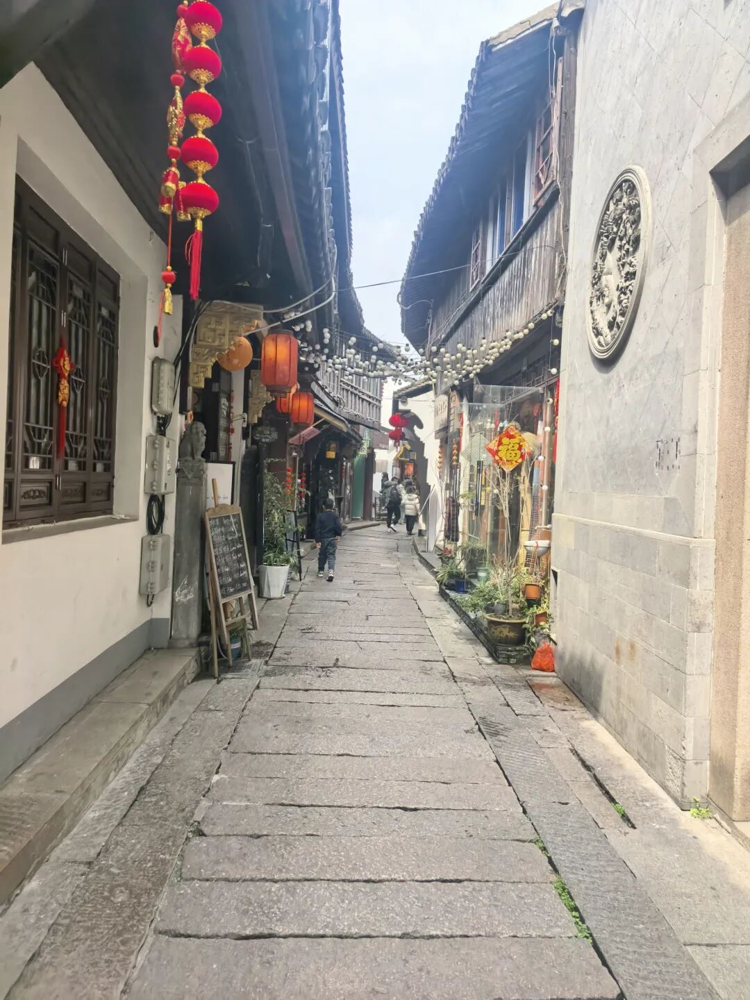
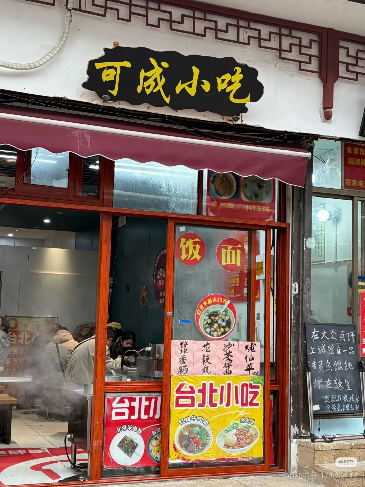
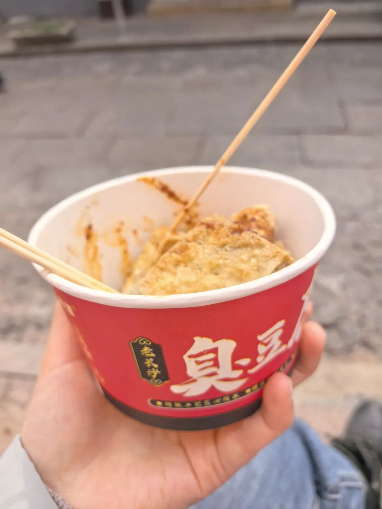

还记得是七年前去过，古镇的商业氛围没有这么浓，人也不多，基础设施也比较陈旧。

今天去了一趟，人是真的多，人挤人，而且外国人特别多。

厕所也很干净和记忆中的完全不一样。

人少的地方拍了张照片。

古镇里面吃吃喝喝的和其他地方大同小异。

在路口吃了一家萝卜丝饼真的很好吃，店名写的是大闸蟹，但是看有老阿姨一次性买了六个，就知道没错了。

平时不怎么做攻略，但是跟着本地人真的没错。

有家台湾人开的小店很想打卡，可惜今天关门了，听说卤肉饭很好吃。

旁边买了一份臭豆腐，一般般，果然景区里都臭豆腐都不咋地。

景区最舒服的地方就是课植园临水的小路，坐在长凳上看来往的摇橹船，好不惬意！

回去的路上吃了晨鑫小吃，本地人都推荐都烧卖，真的很好吃，汤汁很鲜，小朋友很爱吃，开店的阿姨特别好，还送了我们半笼。

路上垂柳依依，是春天的来了。

总的来说，周末逛一逛，还是不错的。