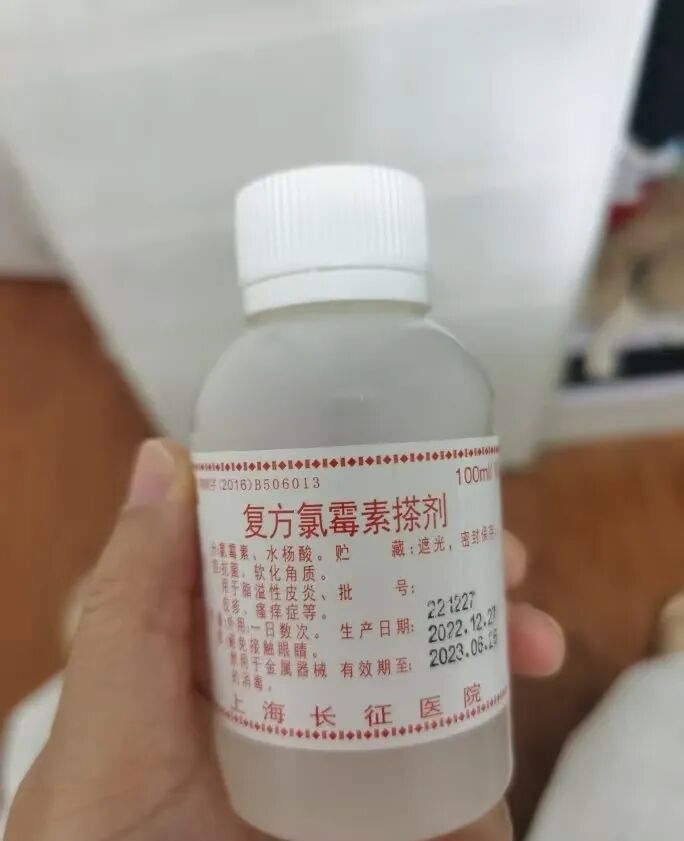
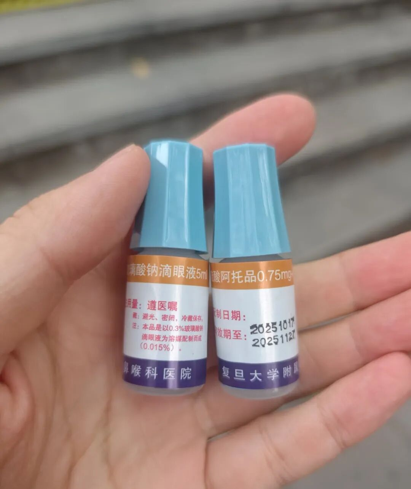
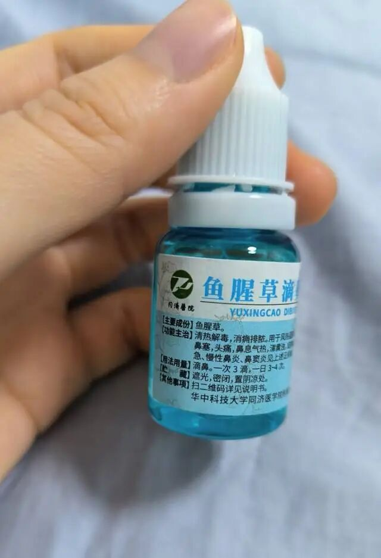
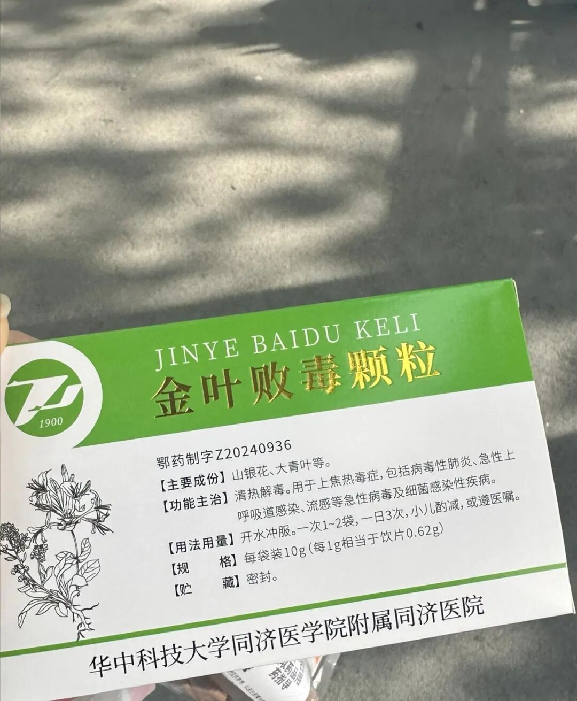
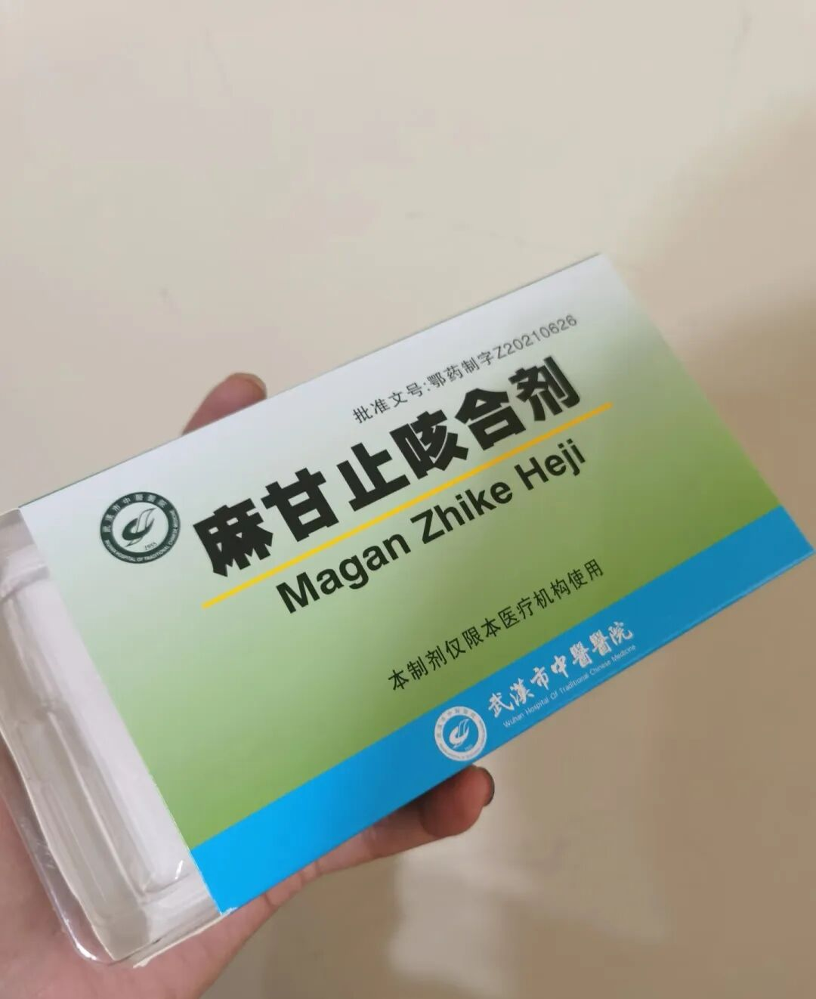

我发现很多很好的药都不在市面上流通，尤其是一些医院的自制药，效果真的很好。缺点嘛，一是保质期比较短，二是只能去医院开。不过好在现在很多互联网医院也能开到了。  
  
我生活在武汉和上海，下面推荐的都是我自己在这两个地方用过、效果比较好的医院自制药。  
  
1. 复方氯霉素搽剂（上海长征医院）  
  
这是上海长征医院的“网红”药水了。价格很便宜，大概5块钱一瓶，但效果真的很绝。它的主要成分是水杨酸，对去闭口特别有效。

我之前换环境到上海的时候，额头上长了特别多闭口，下巴上也是密密麻麻的。用了各种护肤品精华效果都不大，反反复复一直复发。后来去长征医院开了这瓶药，抹了两周左右闭口就下去了，效果真的很惊艳。

前几年我背上长痘痘，又开了一瓶。我也推荐过很多青春期的朋友。用上去稍微有一点点疼，但坚持下来效果很不错。  
  
2. 双参咽炎颗粒（上海复旦耳鼻喉医院）  
  
这款药我之前单独推荐过。它对咽炎效果特别好，像我老公的慢性咽炎，家里一直备着这个药。我之前咳嗽一直不好、咽喉痛，用了它效果也很好。我去医院配药时经常看到很多老年人都是好几袋好几袋地开。前几天还帮朋友代购了一盒。

3. 阿托品滴眼液（上海耳鼻喉医院）  
  
这个药很多人可能比较陌生，它主要是控制眼轴增长的。市面上阿托品的药比较少，我是给我近视的侄子开的，到现在已经用了4年了。他读初二，眼轴控制得还不错，每半年检查一次，目前没听说度数有增长。我觉得我这4年每个月去给他开药，也算是有回报了。

很多医院的自制药保质期都很短，这个也只有一个月，所以每个月都要去开。但效果真的还不错。建议小朋友比较小、有近视问题的，可以跟医生咨询一下。  
  
4. 鱼腥草滴鼻液（武汉同济医院）  
  
这是我朋友推荐的。之前小朋友有鼻炎，各种药都试过。这个滴鼻液效果还可以，鼻塞、打喷嚏的时候滴进去，能起到一定的控制作用。

但问题就是味道不太好，小朋友比较排斥。我觉得成年人如果能接受这个味道，可以试试，早期控制效果不错。  
  
5. 金叶败毒颗粒（武汉同济医院）  
  
这也是同济医院比较有名的自制药，效果挺好。据说哺乳期和孕期都能吃。

我之前发烧去医院开的。对感冒效果不错，大家都说它是“同济的咖啡”，因为冲出来的颜色跟咖啡真的很像。

对病毒感冒也有一定作用。唯一就是味道很冲，真的很难喝。一股子鱼腥草的味道。现在不在武汉了，开药比较麻烦，我就用了其他药代替。如果方便的话，还是可以考虑的。  
  
6. 麻甘止咳合剂（武汉中医院）  
  
这个药有点戏剧性，是我杭州的朋友推荐给我的，她觉得我在武汉有人脉，让我帮他代开。后来我自己也留了几盒。

她说冬天一受寒立马开始咳嗽的时候，这个药特别有效。小朋友5岁之前特别容易生病，那时候鼻炎引发的咳嗽比较难搞，这个止咳效果确实比较好。

秋冬或者天气变化，受寒，吸入冷空气咳嗽时候用效果最好，基本晚上睡前一支，早上就好了。

如果到了中期或者比较严重的时候，效果就没那么好了。我看了一下成分里有大黄，这应该是止咳效果比较好的原因吧。  
  
之前还看到北京有个皮肤科开的治湿疹的药特别好，广东有个什么小朋友健脾胃的口服液也很不错。感觉我国的医疗确实不错，每个医院都有自己的拿手绝活。

大家有啥好的自制药推荐么？