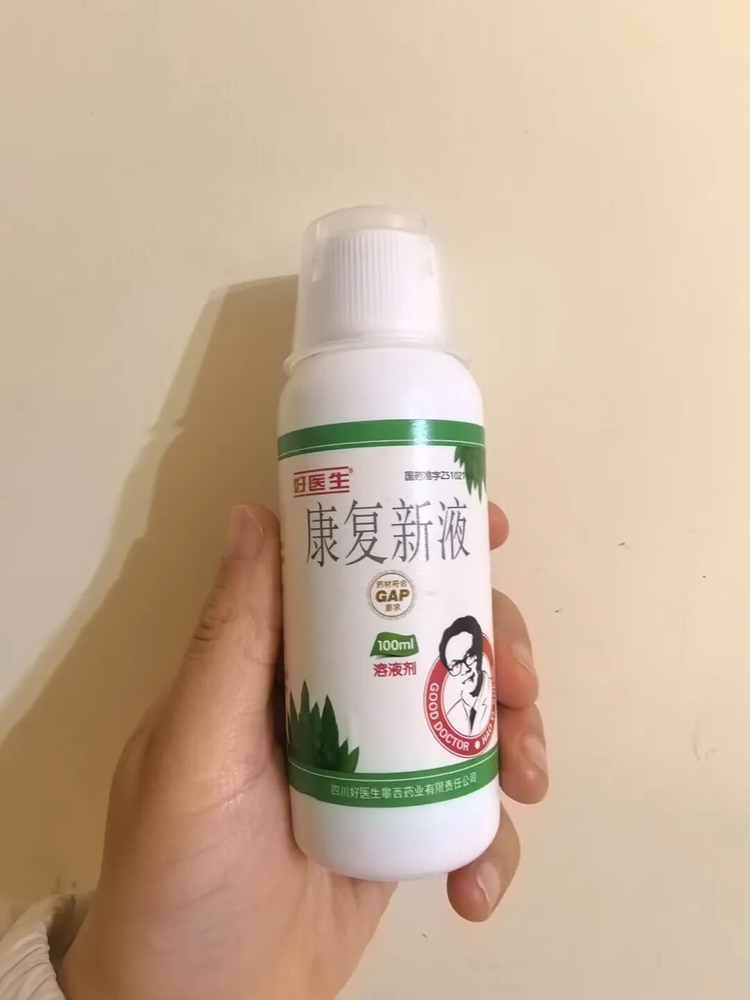
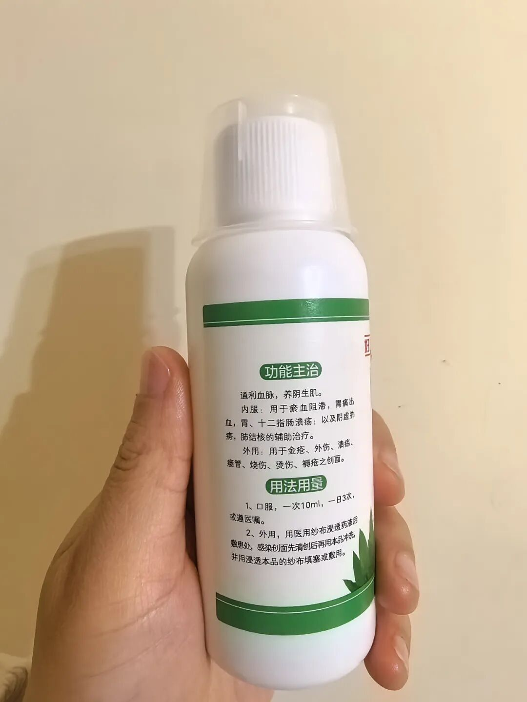
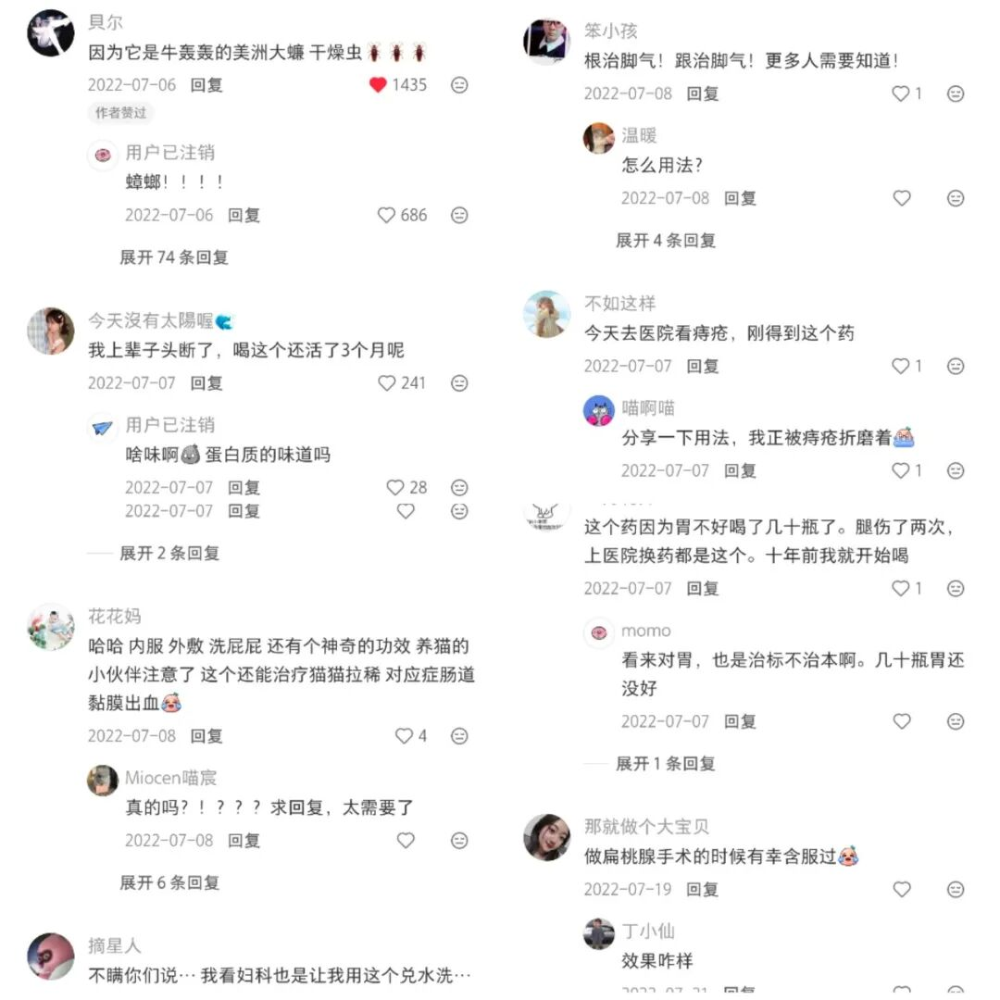

到目前为止我觉得最神奇的药就是康复新液。

感觉它像我小时候听到的狗皮膏药一样可以治百病。

它是我碰到唯二又可以内服又可以外用的药。

另外一个就是藿香正气水了。

一开始用康复新液是因为剖腹产手术线不能吸收，伤口有个小洞溃烂了一个月。最后医院开了康复新液湿敷一周就好了。

那时候我看配方是美洲大蠊就觉得好神奇，怎么效果这么好。

于是发到网上问网友，这是啥东西。

一下子几万网友给我科普美洲大蠊就是生命力超强的蟑螂。同时也给我分享了康复新液各种神奇的功效。

康复新液日常用法就是帮助伤口愈合，网友分享的从口腔溃疡到湿疹，肠胃炎，阴道炎，咽炎，扁桃体，痔疮，更离谱的是说能治脚气。

你就说神奇不神奇。

完全不同机理的发病方式，居然在同一种药这里找到了终结。

康复新液我感到神奇的另一点是它居然解决了望望流鼻血的问题。

望望差不多4岁的确诊了过敏性鼻炎，那一年疯狂流鼻血，一周好几次，有时候打个喷嚏都能喷出一大坨血。

去上海五官医院挂了好几次专家号，开了一些生长因子凝胶也不能解决。

后来看到康复新液，心想鼻子流血也是鼻黏膜受损，说不定也能修复。

于是用棉球沾了康复新液塞鼻子里十来分钟，再抹点红霉素软膏。

就这样用了一周左右，流鼻血就不这么频繁了。

后面每次流鼻血就这么个流程，这样陆陆续续一年，后面就没有流过了。

现在它已经是我们家常备药。大家有什么神奇的药可以分享下？