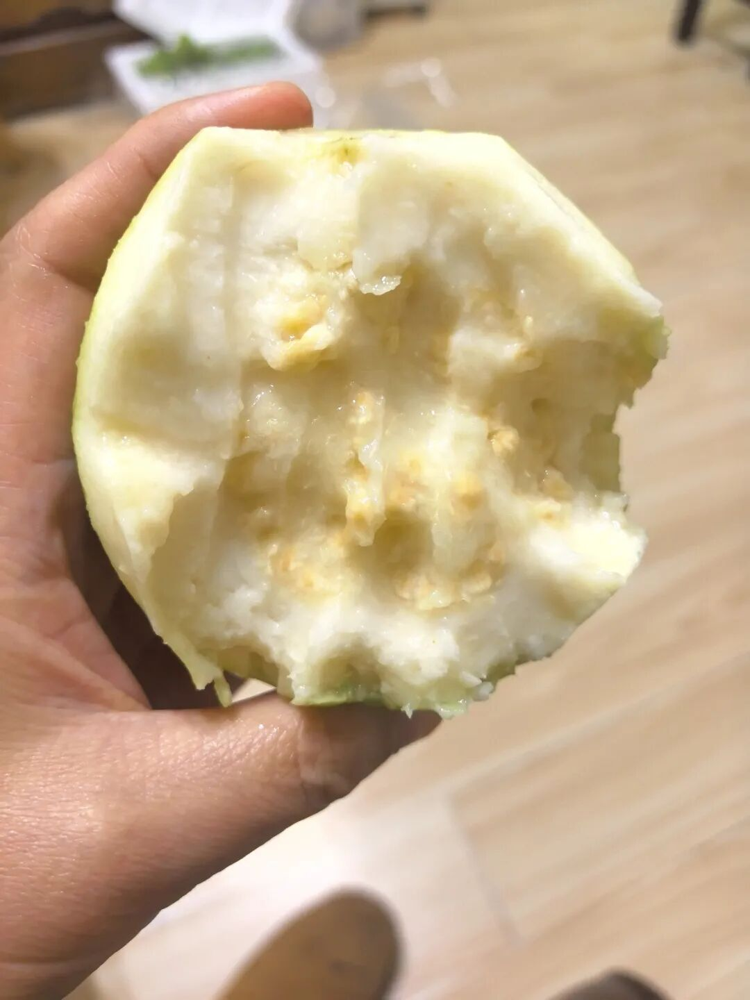
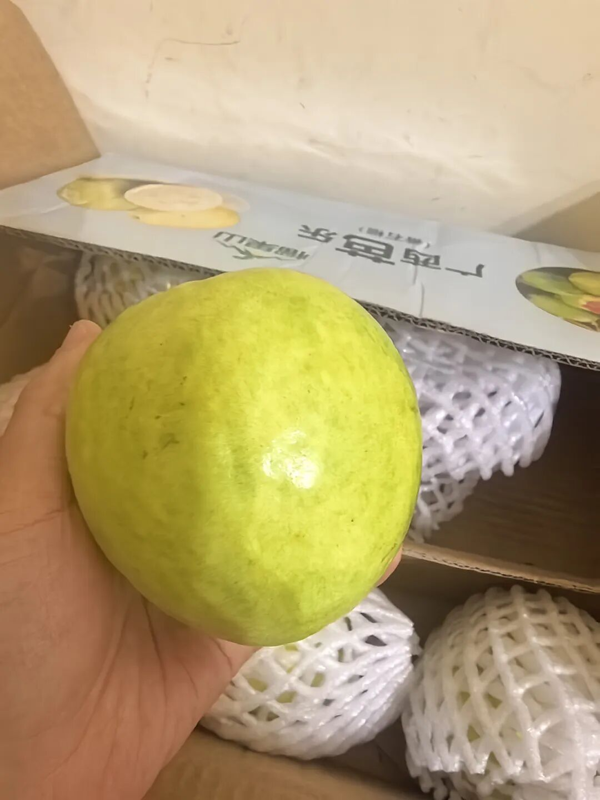

第一次吃芭乐，真的很神奇。

我小时候对食物特别抵触，很多东西都不爱吃。比如牛羊肉、各种内脏、各种无鳞鱼，还有那些气味很重的蔬菜水果——像香菜，还有榴莲。

那时候我对所有食物都守在自己的“安全区”里，很少去尝试。

从进化心理学来看，这其实是一种保护机制。在人类漫长的进化过程中，对新事物保持警惕，能有效避免中毒或死亡。对食物保持界限，本质上是一种刻在基因里的生存策略。

食物是少数我们每天都要面对、又完全由自己掌控的领域之一。

到了三十岁以后，我突然开始敢去尝试了。以前对食物的那种洁癖和偏执，好像一点点被自己打破了界限。

去年试着吃了牛肉，现在已经能接受，虽然谈不上多爱吃，但至少愿意吃了。很多以前觉得不好吃的东西，也开始慢慢说服自己去尝试。比如螺蛳粉，我居然吃上了瘾，还因为它定下了去广西旅游的计划。

再说回芭乐。

这个水果一直让我觉得挺神奇的。水果我其实没有那么抵触，但以前吃过莲雾，真的很难吃，所以对一些不太常见的水果，我还是挺警惕的。去年试了广西的百香果，觉得是一种很特别的水果，很好吃。

今年是因为听朋友说芭乐很神奇，我也去搜了一下，大家都说它吃起来像冰淇淋的质感。我一下就好奇得不行。本来还担心它会不会有什么怪味，后来还是买了一单白心芭乐。

吃第一个的时候，真要说特别好吃，倒也谈不上。那是一种很奇妙的味道，酸酸甜甜的，交织在一起，还带着一种自己独特的味道——不是特别酸，也不是特别甜。皮比我想象中薄很多，果肉很细腻，软软糯糯的，难怪别人说像冰淇淋。老实说，虽然没觉得有多好吃，但吃着吃着还真有点上头。

第二天又吃了一个。顺便说下pdd买水果真的好便宜，5斤才20，还发的顺丰，不敢想。

其实最让我开心的是，我对食物愿意去尝试了。

这好像证明了我现在内心的一种松弛度。我应该比以前更稳了。