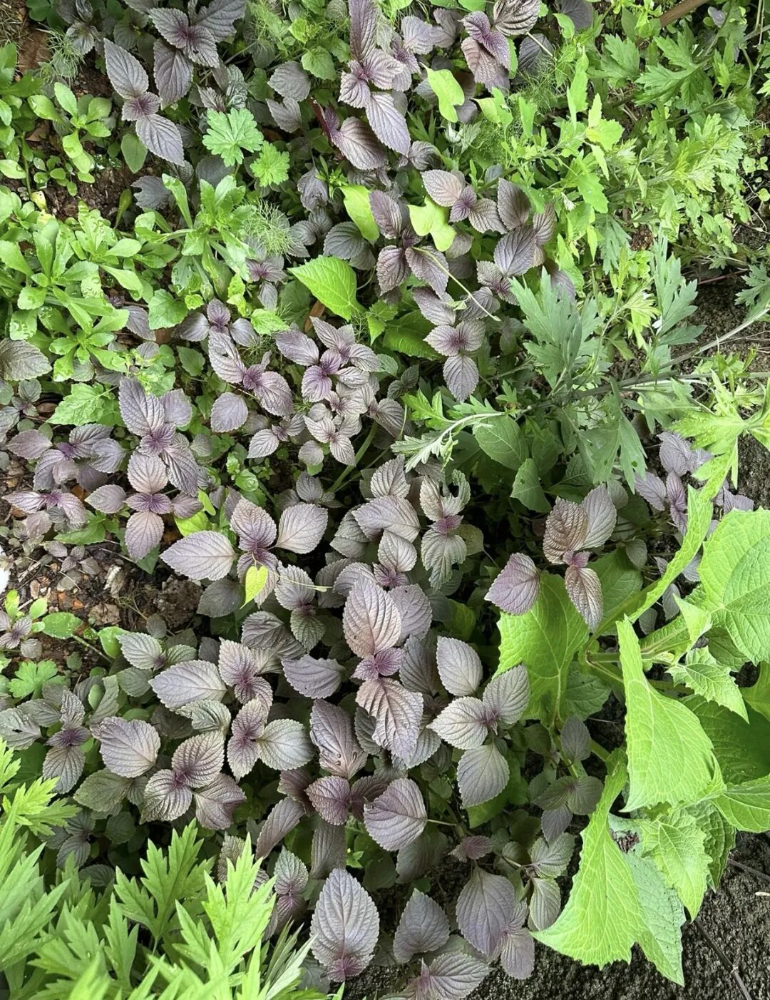
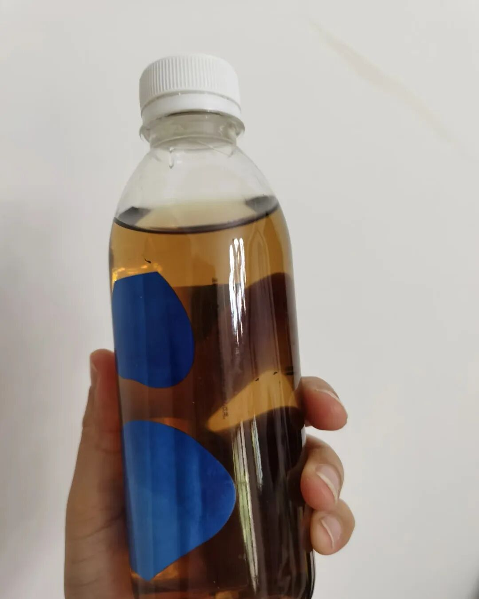
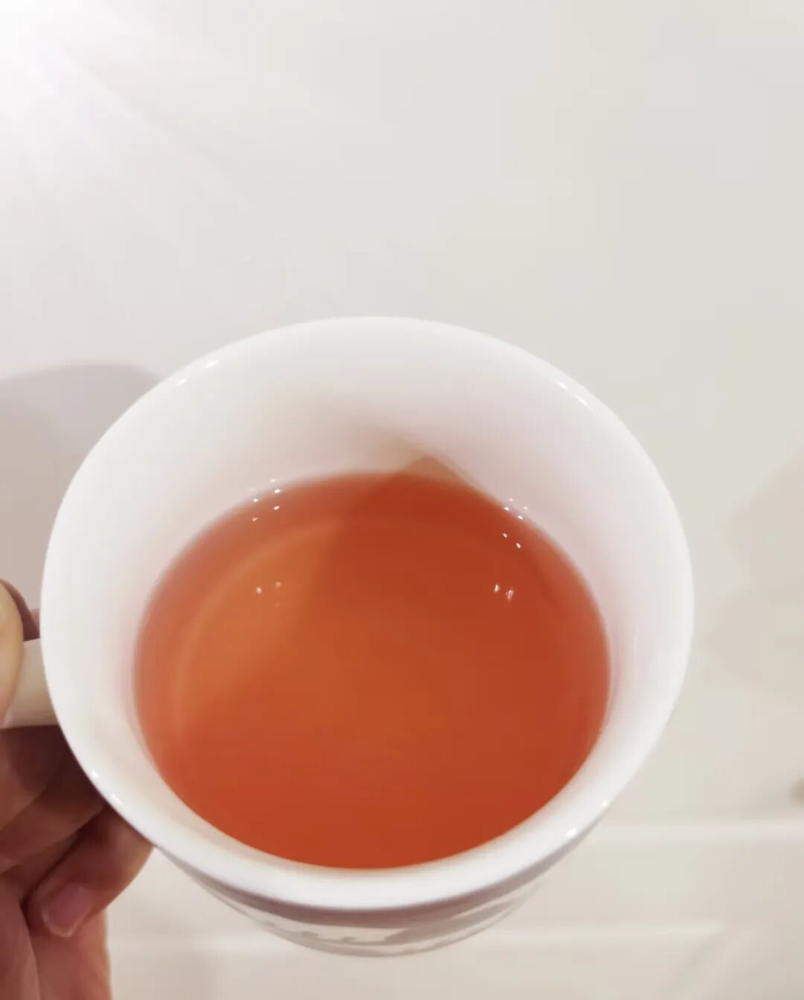
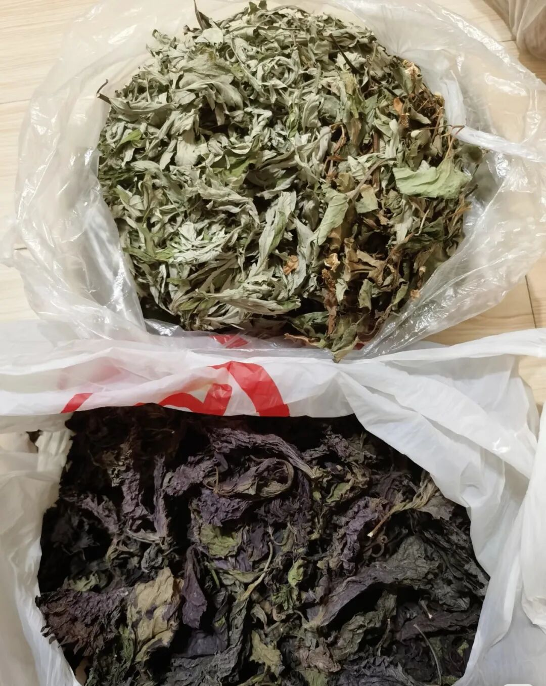

今天想说的这个养生好物，其实是书……哦不对，是紫苏。

很多人应该都见过它。我记得小时候，屋前屋后到处都是。

现在很多老小区里也长了不少。但说实话，真正用上它的人不多。

我小时候家里就从来没摘过。现在倒是常在韩国烤肉店里看到，用来垫烤肉。或者看有些人在做鱼的时候会撒一点紫苏去腥。但紫苏的养生功效，真的被严重低估了。

我第一次知道紫苏的厉害，是因为我家小孩。

那时候他大概两三岁，咳嗽一直止不住，各种药都吃了，就是不见好。我妈跟我说，邻居家之前阳了之后也一直咳嗽，后来把家门口的紫苏摘了一点，泡水喝了几天，咳嗽就好了。我当时真的是抱着试一试的心态，在京东下单了一袋子干紫苏叶。

那几天，我天天给小孩泡紫苏水喝，也用紫苏叶煮水给他洗澡。效果真的很好，三天左右就完全不咳了。

后来我查了一下才知道，紫苏性温，主要功效是散寒解表、行气和胃。小孩那时候应该是病好得差不多了，但身体里还残留一点寒气，所以才会一直咳。紫苏正好把那一层寒气给逼出来了。

从那以后，家里只要有人咳嗽，我除了正常吃药，也会把喝的水换成紫苏水。其实紫苏泡水味道不难喝，淡淡的草本味，喝习惯了还觉得挺清爽的。

包括我自己。一到夏天，天天待在空调房里，时间久了总觉得身上发凉、容易没精神。我现在夏天基本都会泡紫苏喝，感觉能中和一下空调带来的寒气。

我记得几年前刘亦菲演的《梦华录》里面，不就出现过紫苏饮子吗？我也试着做了一下，真的很简单。

泡出来的颜色特别梦幻，是那种淡淡的粉紫色，比白开水多了好多滋味。我还会加点甘草进去，整个味道更柔和。

每次端在手里，感觉喝的不是水，是一杯浪漫。

马上就到端午节了。端午是一年里最好的养生时节。这个时候阳气最旺，非常适合驱寒祛湿。

每年到这时候，我妈都会给我寄自己种的紫苏和艾叶。妈妈寄的，都是自己种的。拿回家泡脚、泡水，都特别好。

夏天适合提升阳气，体虚的大人和小孩，都行动起来吧！

你身边是不是也长了紫苏？不妨从今天开始，认识一下这个不起眼的小叶子。