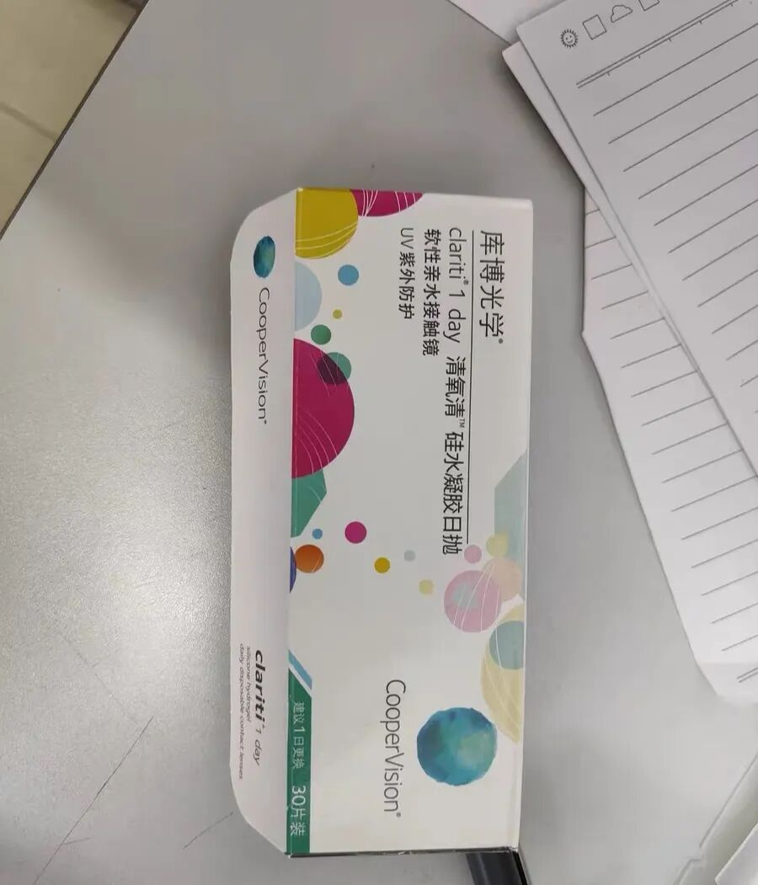
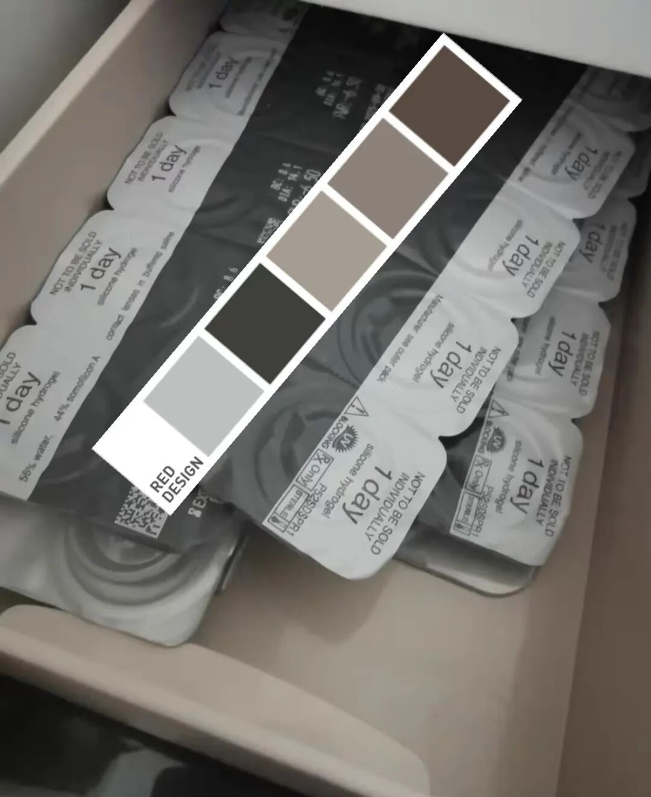
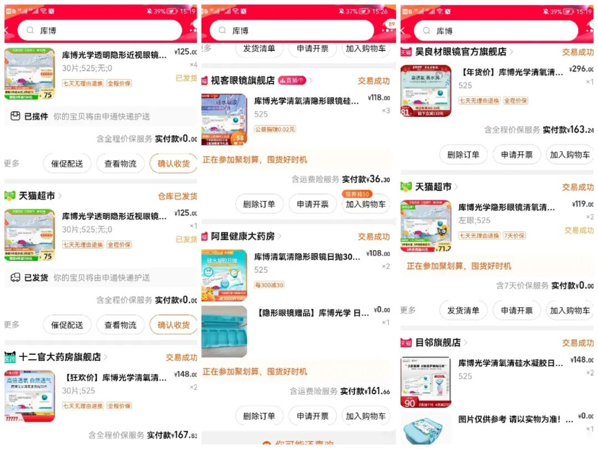

朋友问我618囤点啥，有没有好用的隐形眼镜推荐。

我一下子就想到了回购过几百片、安利过无数朋友的那款：库博光学清氧清日抛。硅水凝胶的，含水量56%。

我一直用日抛，主要是图干净，不用每天搓护理液，打开就是新的，对眼睛好。戴起来也舒服，薄薄一片没什么感觉。出门旅游带几片塞包里，用完就扔，很方便。

硅水凝胶的透氧性比普通的好很多，眼睛能“呼吸”，加上这款56%的含水量，一天下来不容易干。

这也是我戴上基本没异物感的原因。早上出门到晚上下班，眼睛都挺舒服的。有时候中午太困，也会抱着侥幸心理戴着睡个午觉（这个真不好，别学我）。

最长一次戴了12个小时，后面会觉得有点涩，眨眨眼感觉镜片要掉出来。但平时8小时完全没压力。

买之前看评论说不好摘，本来有点担心。后来发现，干手取其实很简单，一捏就下来了。

我中间也试过别的，比如水梯度，好是真好，但太贵了。兜兜转转还是觉得这款性价比最高，就是一年比一年贵，最开始才60多一盒。

现在平时价格偏高，得等大促囤几盒才划算。我一般是框架和日抛换着戴，眼睛和鼻梁都没怎么变形。算下来每天大概6块钱，说贵不贵，但眼看着涨价，心里还是有点嘀咕。

姐妹们如果有其他好用的日抛也推荐给我呀，用了好几年了，想换换，又怕找不到比这个更合适的。