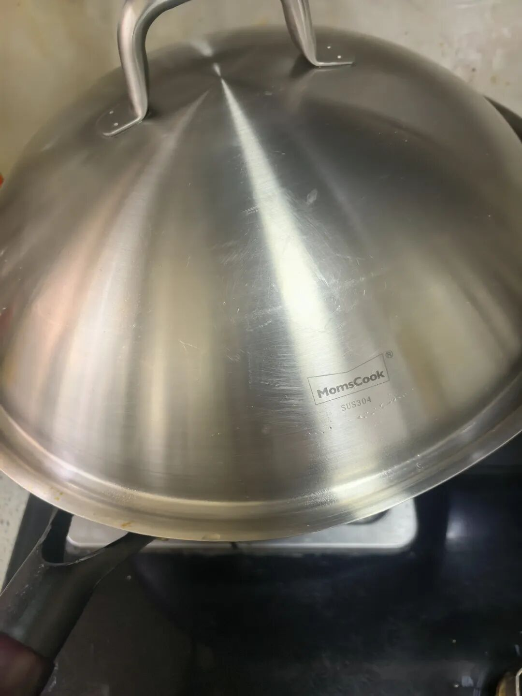
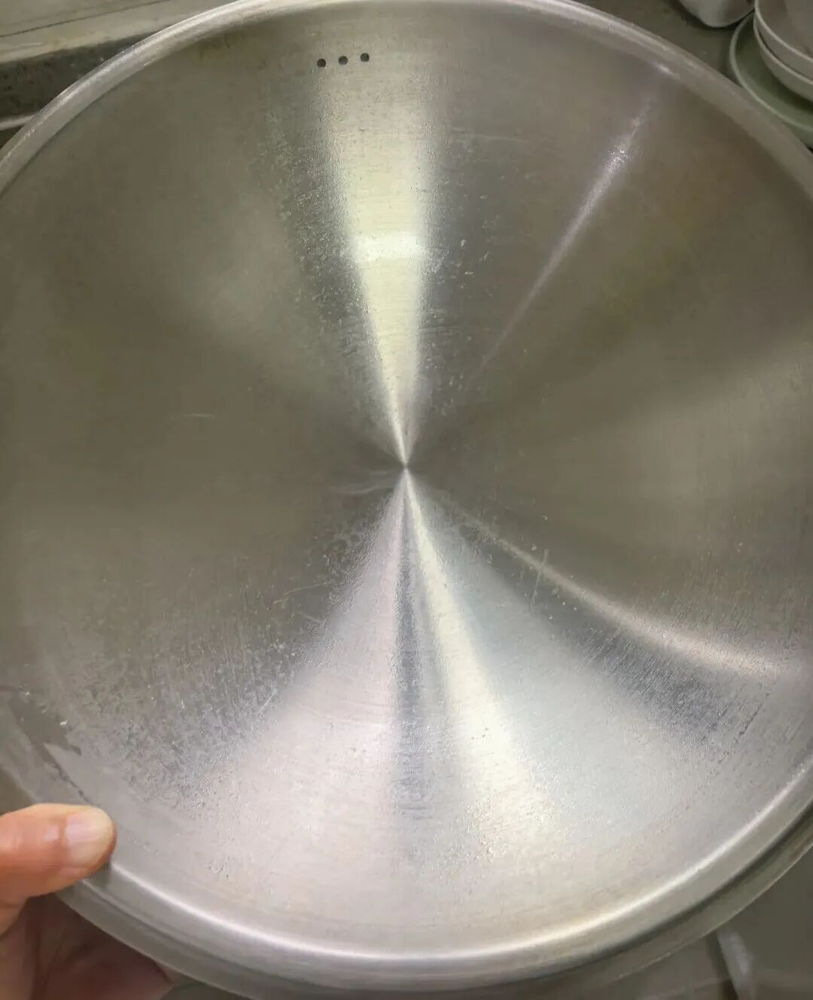
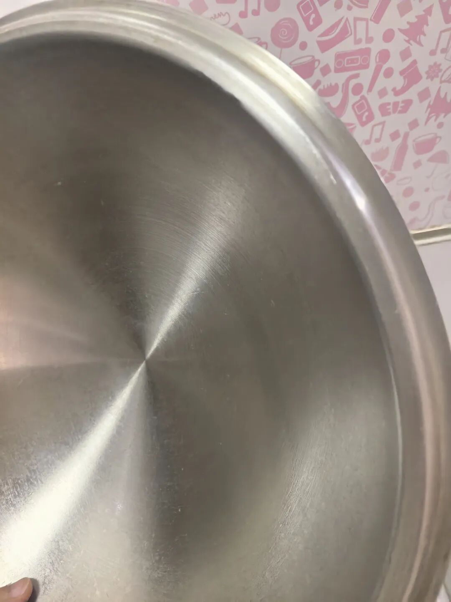

说真的，你们绝对想不到我为了找一个趁心的锅盖花了多久！

以前做过超多功课，但之前用过的很多锅盖，包括市面上很多款，它们接缝处特别多，用一段时间油污就积得厚厚一层，擦起来费劲死了，时间久了根本擦不干净，我这个人吧，对这点特别特别介意。  
  
后来我就疯狂做攻略，就想找一体成型的锅盖，终于让我挖到了这一款！它整个设计完全戳中我的点。

首先，它是不锈钢的，材质特别好，拿在手里沉甸甸的很有分量。上面的把手设计也很贴心，就算锅盖很烫，你拿着也不会觉得烫手。  
  
最最最关键的是，它的反面是真的完全一体成型！你们知道吗，很多锅盖号称一体成型，但翻过来看，背面其实都有螺丝帽固定，很难做到真正的一体。但这个，你们看它的侧面，完全就是一体成型的，这个工艺要求其实挺高的。

清洗起来简直不要太方便，其他地方容易藏污纳垢，这个用抹布随便擦擦就干净了，一点都不费劲。  
  
这个我用了差不多一年了，每次洗的时候也就随便用点洗洁精，现在看起来虽然有使用痕迹，但整体还是很干净，而且它的边缘也没有那种凹进去很难洗的死角，是那种敞开的宽边设计，清洗起来也特别方便。

要说唯一的缺点，就是真的有点小贵，这个锅盖大概要100块钱左右。但我觉得它真的超级耐用，感觉能用好几十年，算下来也值了！