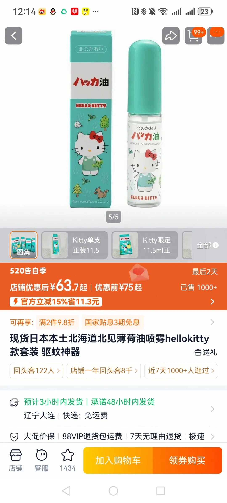
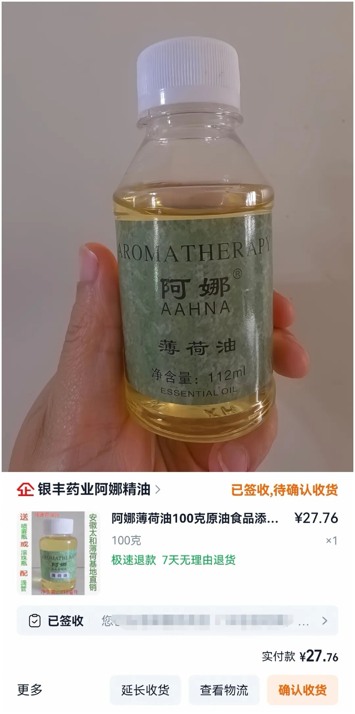
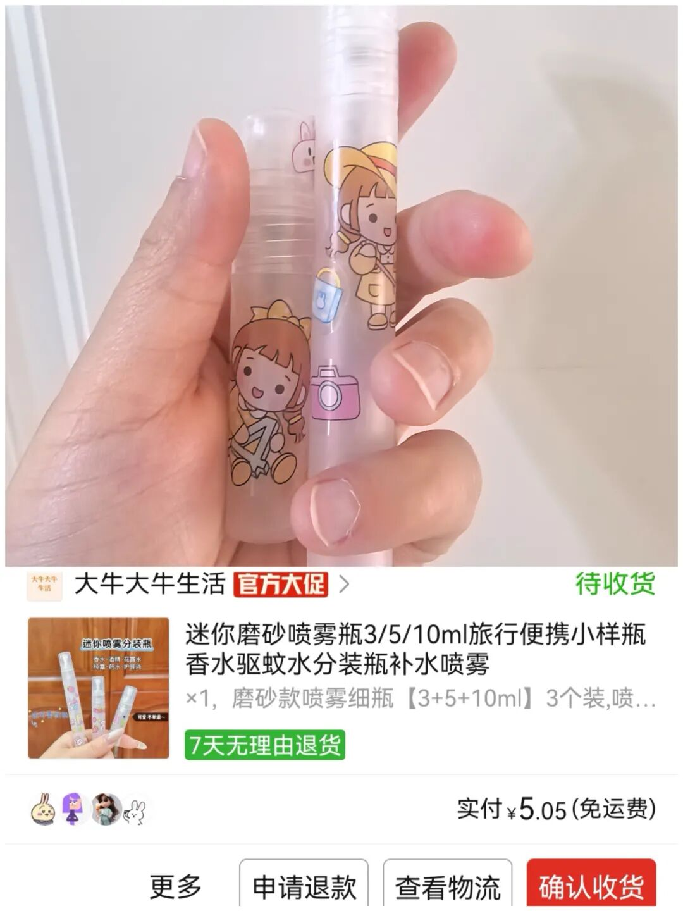
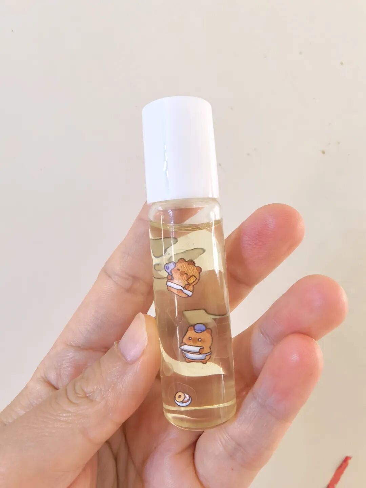
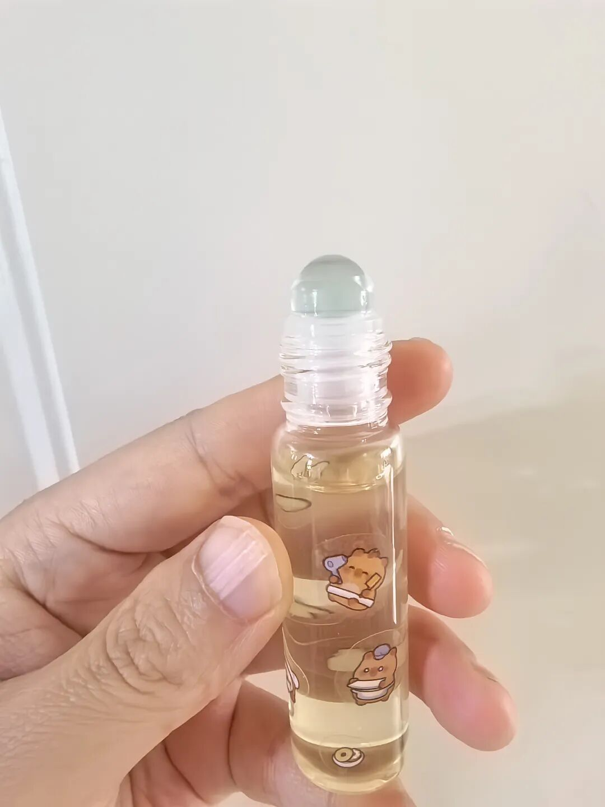

我真的感觉，现在商家很难再骗到我的钱了。

前几天刷视频，看到一款日本产的薄荷油，是可食用的天然薄荷油，图案还是Hello Kitty的，我觉得超可爱，特别想买。结果一搜，最便宜的都要50块钱。

我想想太贵了吧，就那么一个小瓶子，装点天然薄荷油，没什么技术含量，凭什么卖50？

我立马不服气了。想想我国地大物博，这种原材料不要太便宜。果然在网上找了一下，普通的可食用薄荷油，100毫升也就20来块钱，小喷瓶更便宜了。立马淘宝和拼多多下单，到货之后完美组装。

薄荷精油我在淘宝找了一个销量比较好的。

只要27块一瓶，还送了一个带滚珠的小瓶子。

  
这种小瓶子拼多多太有优势了，随便买了一家，3个规格的。  

  
  

现在算算，我这100毫升至少能做5个她那种精油。这么一算，立马省了200多块，心里美翻了。

顺便说一句，薄荷油还挺推荐大家用的。特别是夏天，很清凉。平时出去玩，皮肤容易过敏也可以用一用。

我本来还担心买到假的，结果做好之后用滚珠在手上试了一下，确实很清凉，而且能凉很久。

小朋友嘛，你们懂的，一天到晚身上这里痒那里痒。我就送了他一个，让他自己在身上滚一滚，这种天然的也比较放心。

还有一个小用途，瓶子小，平时揣口袋里带出门。夏天蚊子多，或者碰到草啊虫啊，滚一滚特别方便。而且100毫升真的很耐用。

上次我不是自己做了个可挥发的香薰放洗手间嘛，给这个精油滴几滴进去，放那里也挺好的，味道很清新。

虽然它是可食用的，我看很多人会往饮料里喷，但我应该不会去吃。不过洗澡的时候滴几滴，或者天气热的时候往额头上滚一滚、喷一喷，真的很舒服。

我这次做了两个，一个是滚珠的，一个是喷雾的。滚珠的给小朋友了，身上痒的时候滚一滚。

喷雾的自己带，夏天在公共场合闻到汗味、臭味，或者车里闷的时候喷一喷，空气会清新很多。吃完火锅衣服上有味道，喷一喷也很好。用完还可以续瓶。

发散思维想一想，其实很多小东西大家都可以自己DIY，真的能省不少钱。

呵，我感觉我再也不会交可爱税了！