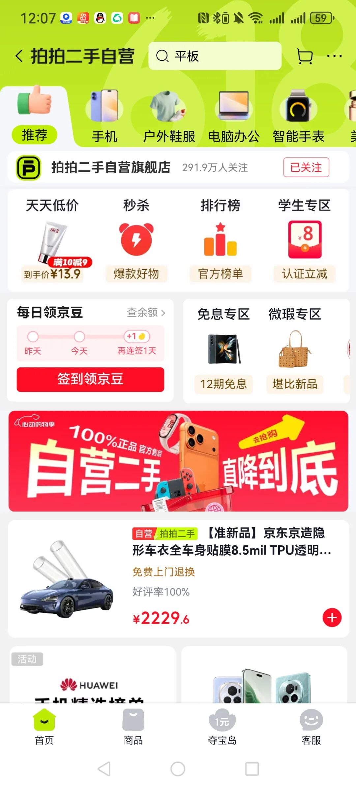
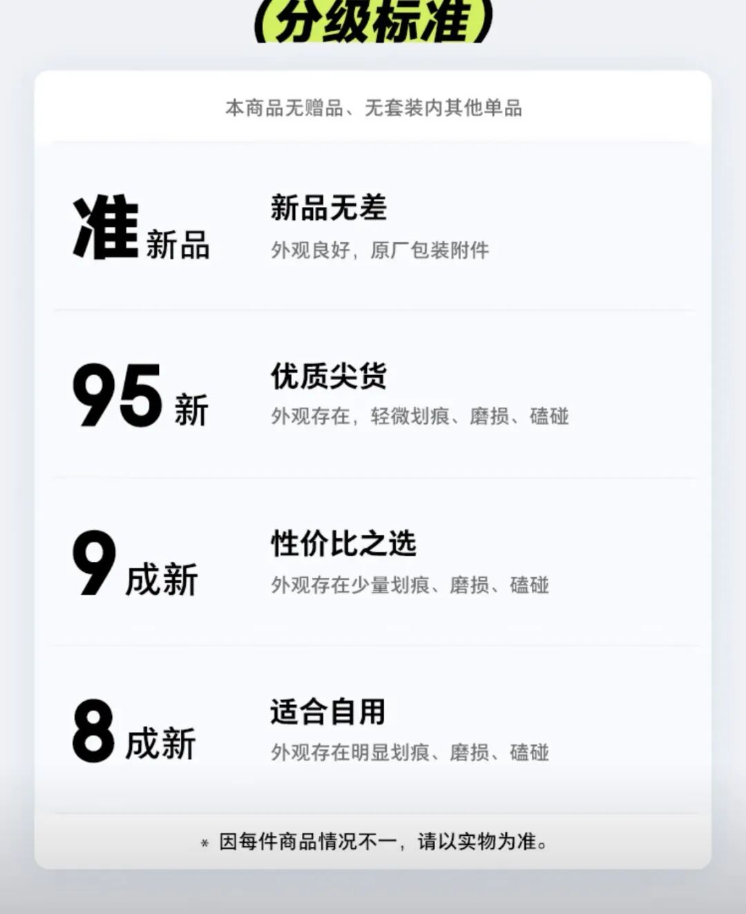
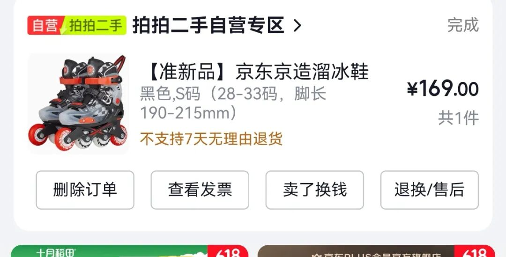
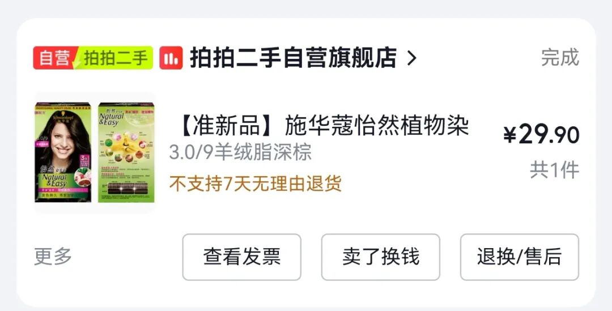
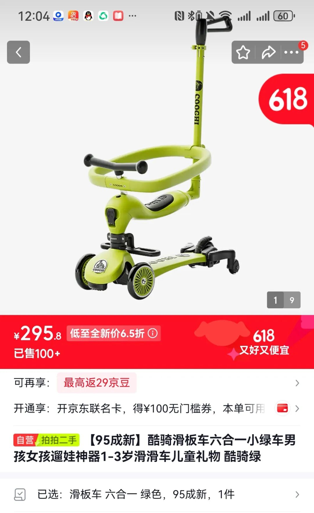

这是一个比较小众的方法，主要针对标品，并且你自己退换货概率比较小的商品。你可以去试试京东备件库。

以前它是有一个单独的店铺叫“京东备件库”，现在改名了，和二手店合并了，叫做“拍拍二手自营”，大家可以去搜一下。

大家都知道京东的售后很好，基本上有问题的产品都能上门换货。很多产品，哪怕你打开过包装，京东也会直接给你换新。

那么这些换下来的商品去了哪里？它们被放到了一个叫备件库的地方。这里平时会打折出售，大家在闲鱼上看到的很多比正价便宜的京东产品，有些也是直接从备件库发货的。  
  
这些商品基本上没什么问题，可能只是包装被打开过，或者包装损坏了，部分可能用过几天。

京东会对商品进行分级，叫做“准新品”，有99新、95新之类的。基本上95新都和新的差不多。如果你自己不是很介意，我觉得可以入手。它比全新的价格便宜很多。

我之前想给望望买一个京东京造的溜冰鞋，这款同事推荐过，还不错。

当时我很急着买，京东店铺的价格是249元，而且很少做活动。

后来我在拍拍里面里面看到刚好有这款的准新品，价格大概是169元，我就直接买了。收到货后竟然和新的没有区别，都带着商标。

还有我之前买施华蔻的染发剂，因为这个色号和产品我都用过，我直接搜了一下它的准新品，价格比全新的便宜很多，大概打了六七折。

为什么我说这个方法不适用于所有人和所有商品呢？因为它其实是当二手卖的，所以退换货没那么方便，不支持7天无理由。

但是产品质量有问题是可以退换的，这个可以放心。  
  
反正大家如果有需求，可以去看一下，多个渠道比对一下。比如小孩的婴儿车、平衡车或者一些玩具，都可以去看看。

虽然同样是二手，但渠道和保障都比闲鱼放心很多。我最近也在看网球拍，感觉价格也还可以。

大家可以把这个作为一个买东西的渠道看着，里面也有很多日用品和护肤品，我没怎么买过。一般差价大的我会选择。

差价不大的还是等京东活动买。