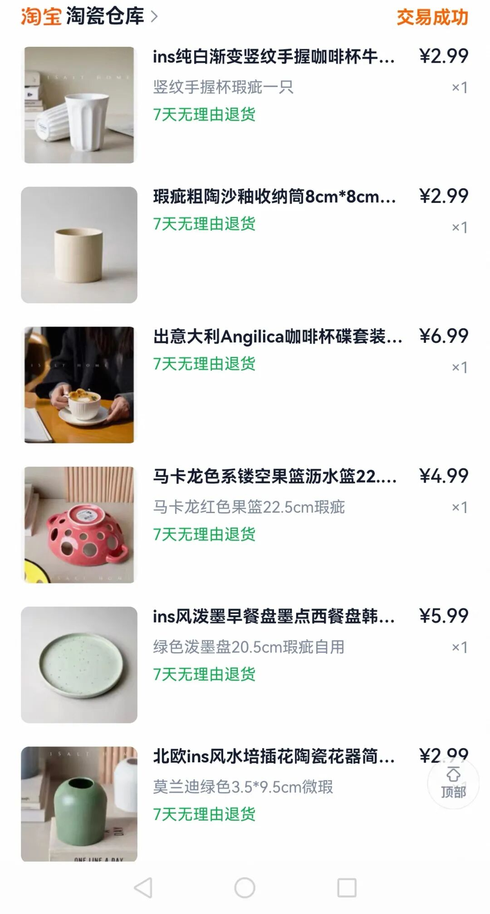
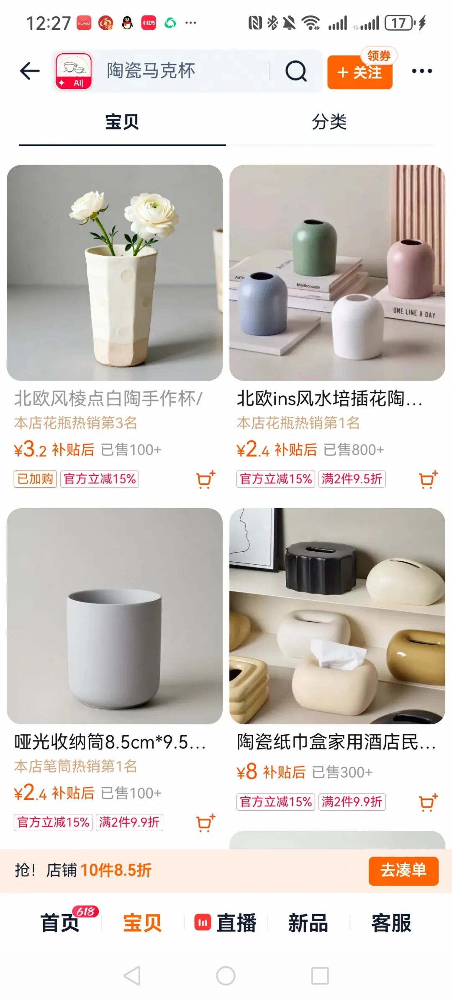
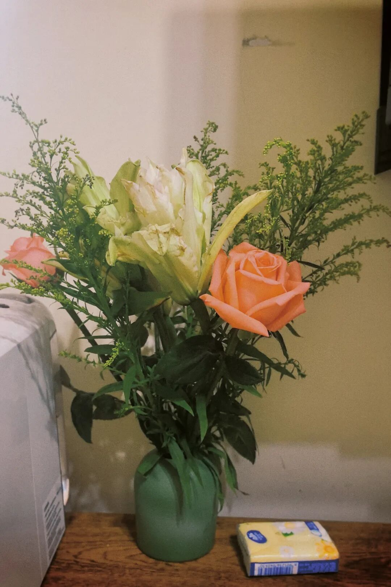

我真的太爱买杯子了，不知道有没有人和我一样，喜欢买各种各样的小东西，尤其是杯子。

咖啡杯、水杯、茶杯、保温杯……材质不一样，大小也不一样，但我都买了好多。

而且我真的觉得，用不同的杯子喝水喝茶，心情都会变得不一样。

这两年特别迷瓷器，买了不少，也踩过雷。但最近遇到一家店，是真的想认真分享一下。

它家是做外贸尾单的。说是尾单，其实就是出口剩下的。

可能会有一点点小黑点、釉面不匀这种小瑕疵，但不影响使用。甚至我觉得这些小不完美，反而让每件东西都多了一点手作的感觉。

不是那种花花绿绿、很“网红”的款式，而是偏古朴、低调、耐看的风格。

有些带着手作的粗糙感，有些是北欧那种干干净净的线条。

拿来喝水好看，拿来当笔筒、插一枝小花、摆点心水果，也都特别上镜。

每次随手摆在桌上，都会觉得：“嗯，今天家里又好看了一点。”

而且真的很便宜，有时候二三十块钱就能买到好几样。

我们都是很普通的人。日子过得平平淡淡，上班、吃饭、打扫、睡觉……一天一天，好像也没什么特别。

但就是这些小东西，让平淡的生活里，多了一点自己给自己的小惊喜。

换一只喜欢的杯子喝水，桌边放一枝随手插的小花，用好看的盘子装刚做好的菜。这些瞬间很小，小到不值一提，但就是让人觉得，今天好像还不错。

生活中的小确幸，大概就是这个样子吧。不是贵的东西才让人开心，是那些刚刚好、很对味的小物件，才让人觉得生活值得认真过。

如果你也喜欢买杯子、喜欢淘瓷器，或许你也会喜欢它。

好东西值得被喜欢它的人知道。