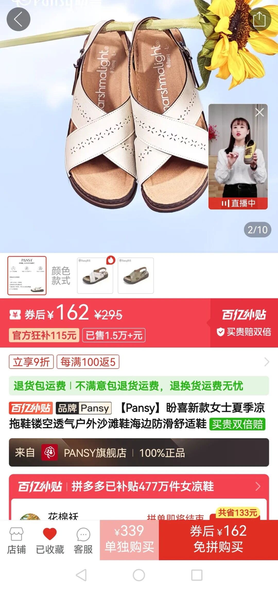
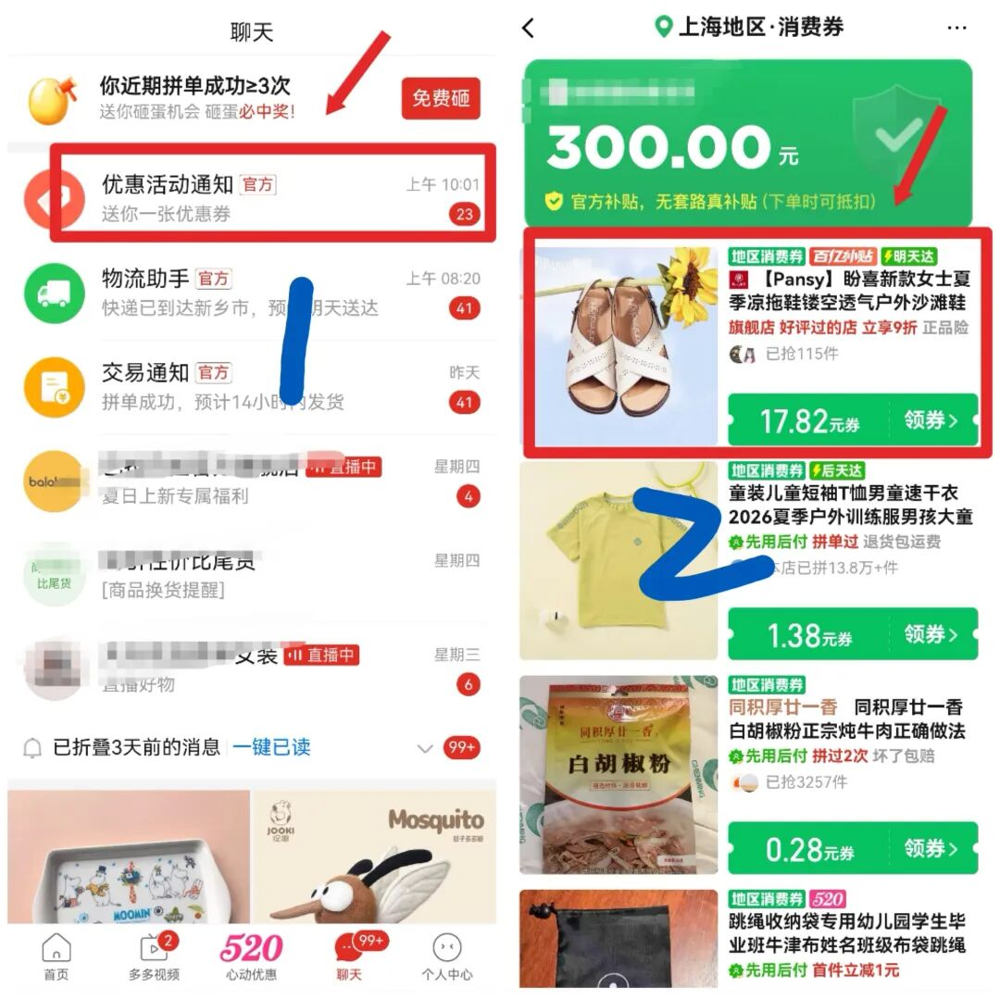
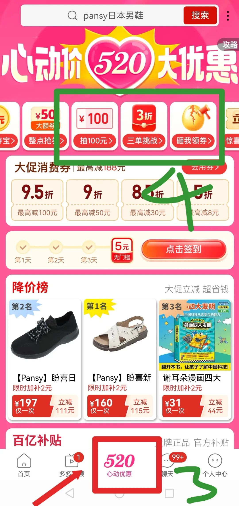
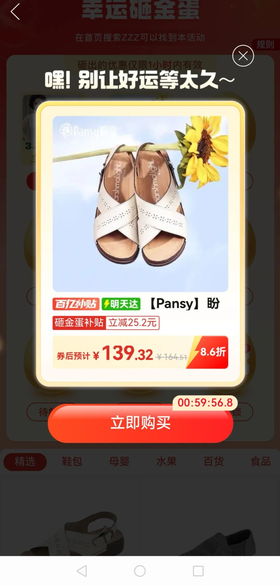
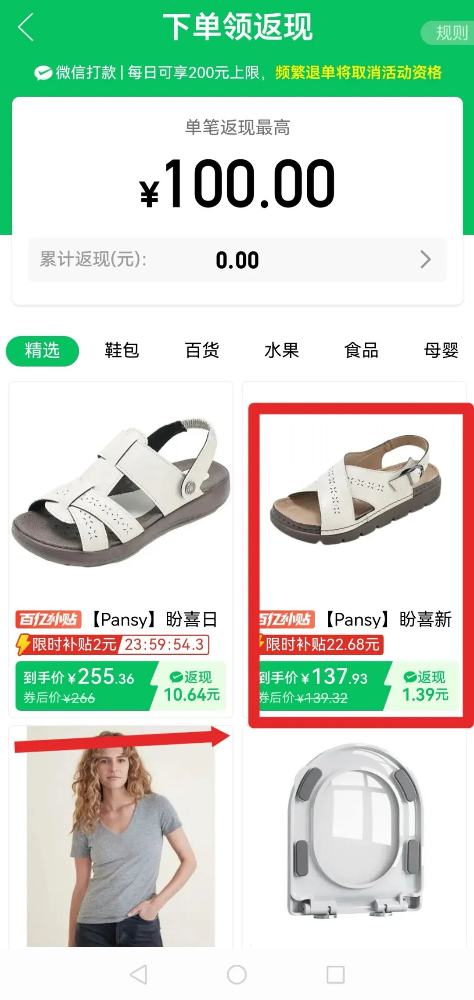

我刚开始用拼多多的时候，点进去一看，哇，好便宜，基本就直接下单了。我想大多数人都跟我差不多。

时间久了才发现，居然还有隐藏的高阶玩法，估计很多人还不知道。买稍微贵一点的东西，至少能省个十几块，时间一长就是一笔不小的钱了。

我说的不是那种准点抢券、兑换啥的，那些太复杂了。

咱们搞点简单的。分享一下我平时买拼多多的步骤。

第一步，想买什么商品，先在首页搜一下，浏览一会儿，再点个收藏，就放着不管了。

第二步，过几个小时或者隔几天，再打开看看。有时候它自己就降价了。

如果没有直降，你就点底部【聊天】进去，会看到一个优惠活动，里面送很多很多地区券。

再点开，你会发现商品已经有了一定程度的降价。这时候贵一点的东西可能已经便宜了十几二十块。没有的话，多刷新几遍。但先别着急买。

第三步，你去主页中间的位置，一般都会有个活动会场，点进去能看到砸金蛋、抽100这类活动。

先点一下砸金蛋，看看你的商品有没有出现更优惠的价格。有的话，也别急着买。

现在到第四步。你发现没有？点一下“抽100”，你会发现你要买的商品在原来优惠的基础上，还能再返现几块到十几块。

买贵一点的东西的话返得更多。这个是下单后直接微信打款给你了。但是不要钻平台漏洞，退款也会把这个钱扣掉。

这是我为了截图流程的一款商品，不同时间刷新金额都不一样，就选你觉得合适的价格下单。

我之前买了个三百多块的东西，返现了三十多，加上之前优惠，比直接点进去买省了五十块。

如果返现页面刷不到你的商品，多刷几次看看，可能隔天就有了。也不是所有商品都参加活动，但大部分都可以。买书也能返现几块钱。

再告诉你一个小技巧，我也不确定是不是100%准，但我自己试过真的很灵。平时看到喜欢的东西，先点收藏别买。

等到晚上11点左右，或者早上8点之前，你会发现很多商品下面多了折扣，而且特别多五折的。

我经常用这个折扣去买些小纸巾、小玩意儿。