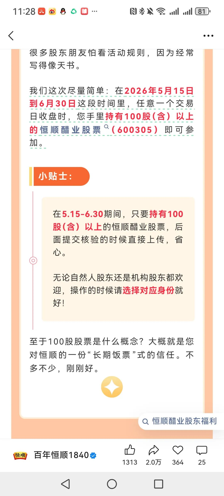
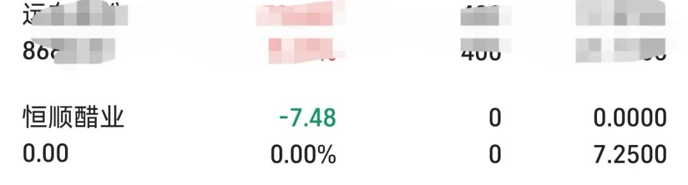
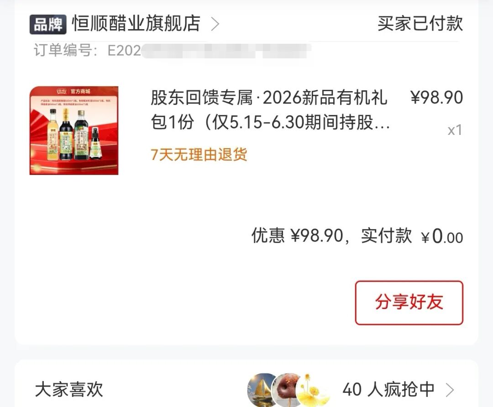

之前从来没有想过，买股票还能薅点小羊毛，毕竟还是嫩韭菜。

虽然一直都知道有股东回馈这种福利，但很多都华而不实。我记得好像去年有哪个景区送的是门票，还有“好想你”送的是枣。

有的价格太高了，风险也大，不想为了点蝇头小利去冒险。

最近看到恒顺也做股东回馈。他们家这个还是挺划算的，看了一下股票价格波动很小，而且很便宜，一手才七百多块钱。而且只要持股一天就行，立马行动起来。

昨天7.25买了一手，今天早上7.28卖掉了，亏了点手续费，七块多。但是有一箱东西还是不错的。

操作很简单，建仓后把持仓截图发到公众号，立马就给你优惠券了。

秒下单，拿到的东西还是不错的，酱油加醋一共有四瓶。而且我们家一直用的是他们家的醋，感觉还是赚的。

  

没有被埋就是最大的幸运。虽然股市红红绿绿的，能薅点小羊毛也很开心。

这也让我想起了去年白银LOF的套利，也是一天几十、百来块的，开心。每天弄一弄，十天半个月也赚了一千多。

虽然后来因为贪心回吐了一点，但加起来也还是赚的。

活动到6月30号，感兴趣的可以提前埋伏，年底利好饺子蘸醋。