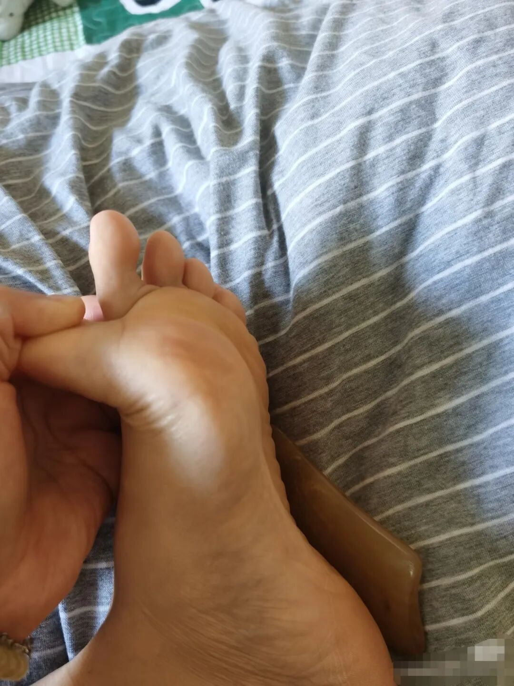
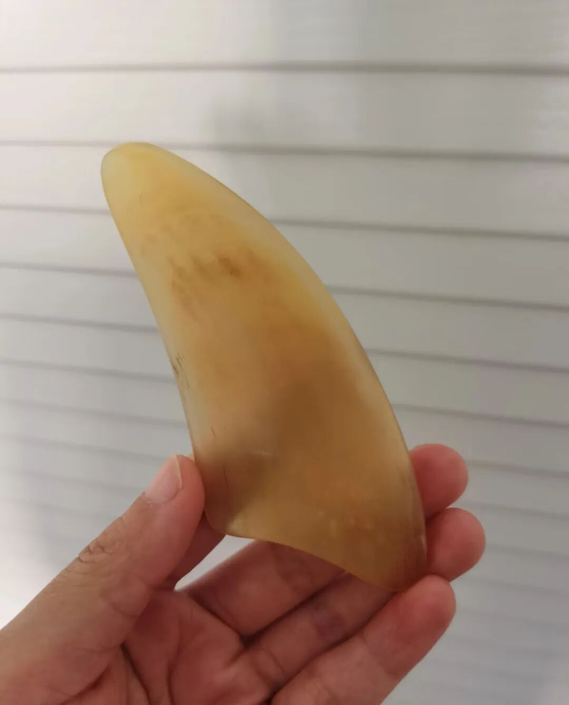

前阵子，我那个学中医的姐姐跟我说：“你最近气色不行啊，晚上是不是又睡不好？试试刮地筋。”

地筋？啥玩意儿？第一次听说。

她跟我说，脚底藏着一条“养肝的筋”，很多人气色差、睡不好、容易累，都跟它有关系。

我寻思反正也没啥成本，就试了试。到现在大概刮了10天，变化还挺明显。今天跟你们唠唠。

这玩意儿在哪儿？怎么找？

特别好找。

你把脚丫子脱了，脚趾头往上翘，脚底中间会绷起来一根硬硬的“筋”，从大脚趾根那块一直延伸到脚心。那就是地筋。

我第一次摸，硬邦邦的，上面还有那种小颗粒的感觉。

刮的时候啥感觉？

我抹了点精油，用刮痧板从脚后跟往脚趾头方向刮。刚刮上去，就听见“咯吱咯吱”的响声，像刮粗糙的树皮似的。

一开始有点疼，但能忍得住。

刮了大概5分钟，那条筋慢慢软了，响声也没了，也不疼了。刮完脚底热乎乎的，挺舒服。

连续刮了10天，我的变化

· 睡觉好多了：以前躺床上翻来覆去睡不着，现在基本能一觉到天亮。

· 拉屎通畅了：每天早上准时去厕所，不粘马桶了。

· 脚底颗粒感没了：现在刮起来不疼了，筋也软了不少。

最让我意外的是，我顺手给孩子刮了几下，他一点都不觉得疼，还说“妈妈好舒服”。

想想也是，小孩哪有啥烦心事？他们那根筋自然就是软的。

咱们成年人呢？工作压力、家里一堆事、熬夜、焦虑……肝气堵住了，地筋就跟着变硬。

为啥春天刮特别好？

现在正好是春天。中医说“春应肝”，春天肝气最活跃，也最容易堵。很多人春天睡不好、脾气大、眼睛干、脸色发黄，都跟肝有关系。

刮地筋，说白了就是给肝“松松土”。脚底这地方连着肝经，你把这条筋刮软了、刮热了，肝气顺了，气色、睡眠、大便都跟着好。

几点小建议

1. 刮痧板不用买贵的：几块钱十几块钱的都行，甚至用圆润的勺子也能凑合。

2. 抹点油：身体乳、橄榄油、精油都行，别干刮，容易破皮。

3. 别太用力：疼了就轻点，每天刮5-10分钟，坚持比使劲重要。

4. 晚上睡前刮：刮完脚底暖暖的，睡得香。

5. 孩子不用强求：他不疼、筋不硬，说明身体好着呢。偶尔当玩一样刮两下就行。

小成本调理身体，这法子真值得试试。当然，它不是仙丹。如果你睡眠问题特别严重，或者身体有啥大毛病，该看医生还是得看。

但如果你是那种“总觉得哪哪都不太舒服，又说不上来”的成年人——睡不踏实、拉屎费劲、气色暗沉、动不动就烦——不妨从今晚开始，给自己的脚底刮一刮。

春天养肝正当时。把地筋刮软了，人也跟着松快了。

祝大家春天舒舒服服，一夜好眠～