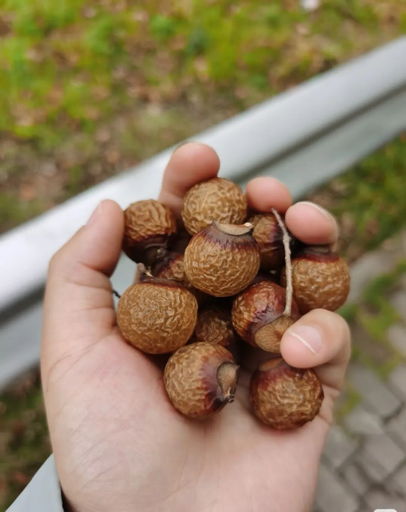
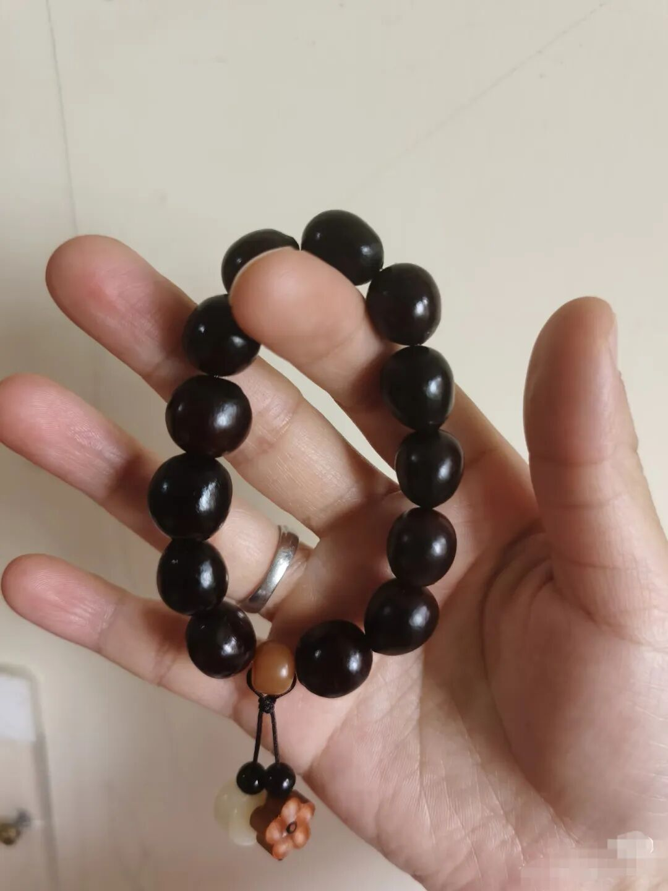
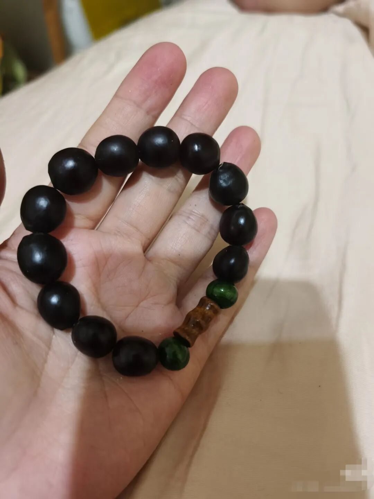
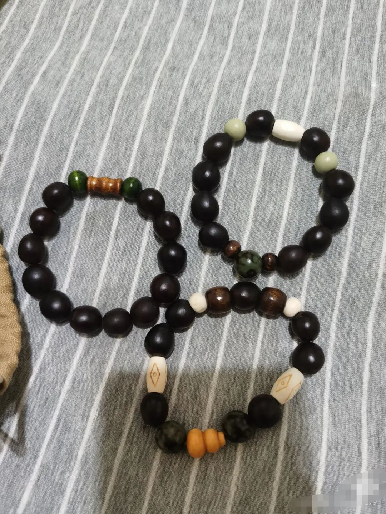

今天想和大家分享一点春天里不期而遇的小惊喜。

去年秋冬的时候，我特意跑去找无患子，结果遗憾地空手而归。没想到上周走在路上，无意间瞥见路边草丛里竟然有，赶紧如获至宝地捡了一些回来。

望望一听这不起眼的小果子能做洗手液，还能做成手串，瞬间来了精神，兴致勃勃地说一定要亲手做好送给老师！

为了满足小朋友的心愿，我火速下单了一些零散的小配件。

昨天放学后，我们娘俩的“家庭手工坊”就正式开张啦！

先说做洗手液，过程出乎意料的简单。我们俩分工明确，他负责剥，我负责收集，配合得相当默契，一会儿功夫就弄好了。

然后洗干净，加水浸泡30分钟，把它剪碎了在锅里煮了20分钟，过滤就好了。

把做好的洗手液倒进买来的起泡瓶里，轻轻一按，绵密的泡泡就出来了。

不得不说，那味道真的太好闻了。有一种很纯粹、很天然的植物清香，是外面买的工业洗手液完全替代不了的。

看着自己做出的洗手液，望望满脸写着开心和神奇，估计他也没想到，路边普普通通的小果子，居然真的能变成香喷喷的洗手液。

洗完手，剩下的果核我们也没浪费。

老实说，我平时绝对算是个“手残党”，很少碰手工。

但这次不知道怎么的，突然兴致大发，拿出了买好的打孔工具。

无患子果核的硬度还挺高的，晾干后，有的是纯黑色，有的带一点点暗红色。

用打孔机小心翼翼地钻个洞，再搭配上自己挑选的小配饰穿起来。

虽然有一点点小遗憾，我捡的这些无患子不是每一颗都那么圆润。

但串在一起看，竟然有一种古朴自然的美，越看越貌美。

我暗自窃喜，这可一点都不比网上卖39块钱一串的差。

结果就是，老母亲做着做着竟然上头了，一不小心就串了好几条。

其实，生活里这些不期而遇的小确幸，还有和孩子一起专注动手捣鼓的时光，真的能治愈一整天的疲惫。

这个春天，大家带娃出门玩的时候，也不妨多留意一下路边的小草丛，说不定也能收获属于你们的小惊喜哦