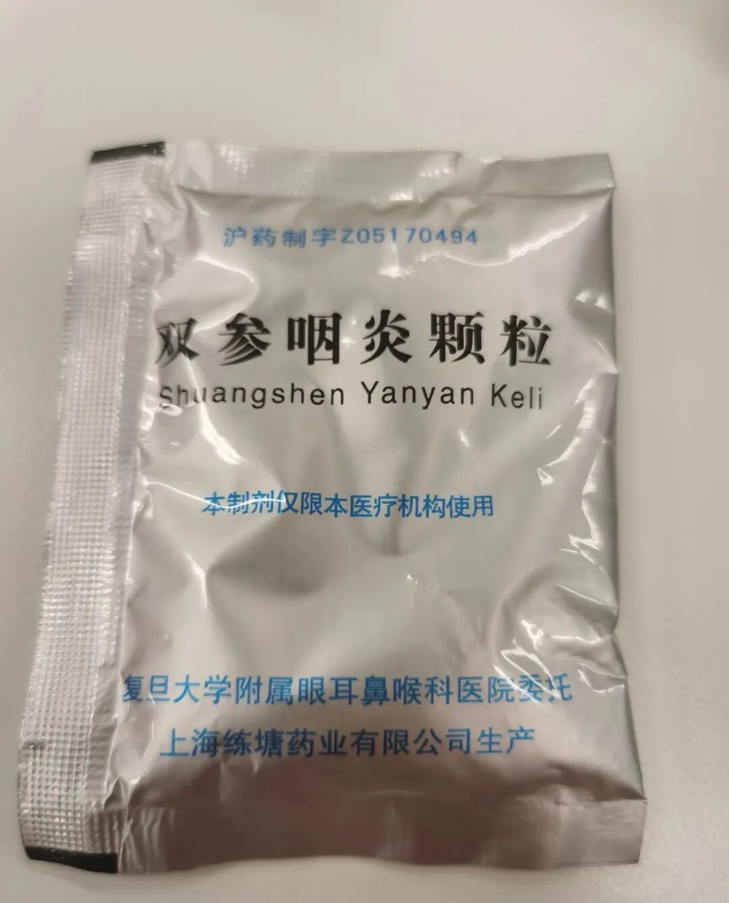
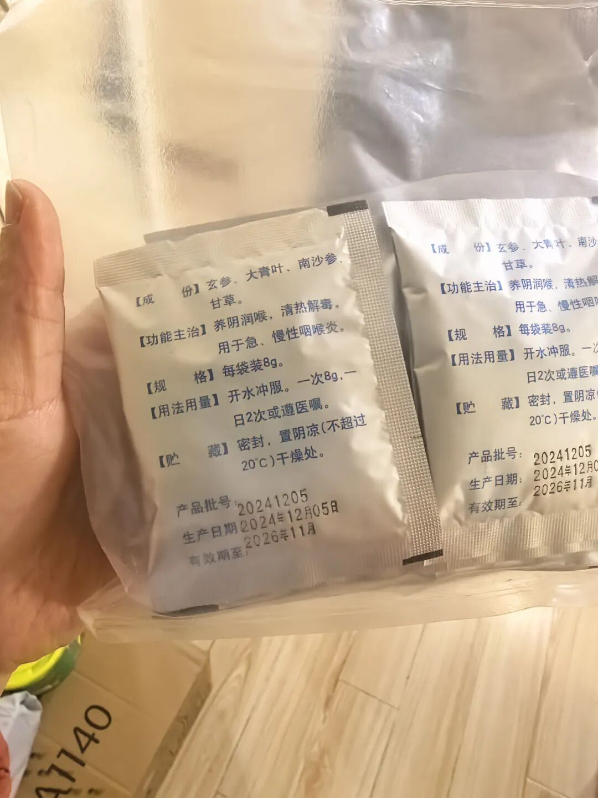
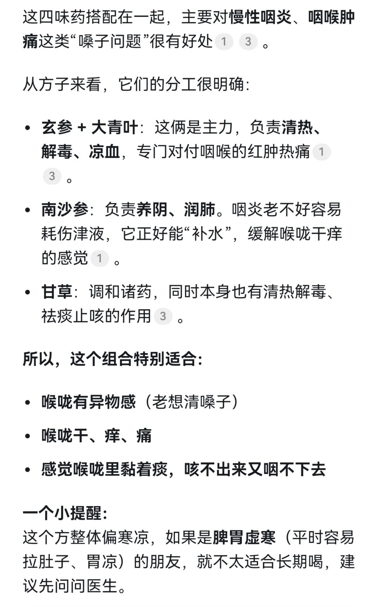

我老公他有慢性咽炎，这个问题困扰我们挺久的了。

之前也带他去看过医生，医生开了一些药，刚开始吃好像有点用，但过段时间又感觉效果没那么明显了。

他每天早上都说喉咙里特别难受，感觉有东西卡着，异物感很强，一天到晚“咳咳咳”地清嗓子，听得我这叫一个烦，人也跟着难受。

后来我们跑到上海耳鼻喉医院，做了个全面的检查，喉镜、胃镜都做了。查出来是因为胃病引起的食道反流，导致了他的咽炎。

医生就给开了这个双参咽炎颗粒。当时医生开了两大包，我拿在手里，还担心用不完会闲置。但没想到，他自己吃了段时间，效果确实很不错。我听他“咳咳咳”的声音少了好多，他自己也说喉咙舒服多了。

这个药成分真的很简单，就四种玄参、大青叶、南沙参、甘草，没有像别的中成药呼啦啦一大串，十几种成分。我也没太上心。

直的我自己用才知道有多厉害。

前段时间感冒，把我的支气管炎也带发作了。虽然咳得不算很厉害，但总觉得喉咙里有痰，忍不住就想清几声，挺难受的。我看到这药有润喉的成分，就想着试试看。

没想到，吃了三天，效果居然就出来了。第三天早上起床，喉咙里那种异物感就没了，感觉好多了。我后来还特意咨询了下deepseek。

不得不说，有些医院自己配的药，确实效果很出人意料。这药唯一的缺点呢，就是它好像只能在上海的耳鼻喉医院才能买到。不过，如果确实有需要，可以在“某书”上搜一下，里面有很多分享怎么通过互联网医院开药的攻略，这样也能买到。