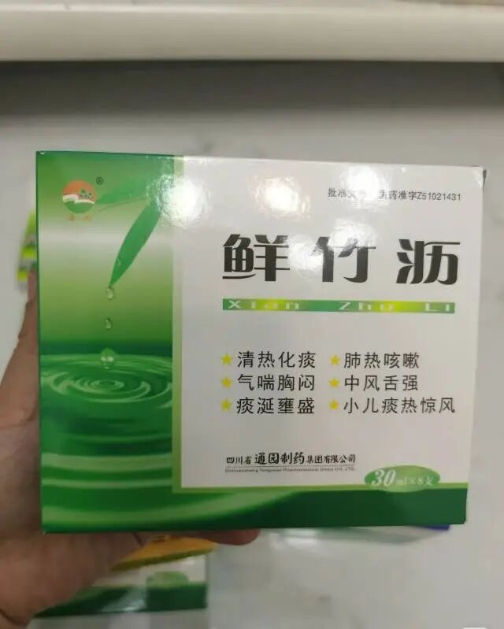

这个应该是我买的最便宜的药了，一大盒才3💰，每次基本囤5盒。

相比动辄五六十的儿童药，实在是太良心了。

关键是它效果毫不逊色，对于孩子咳嗽，感觉喉咙有痰，呼呼的声音，喝几天效果特别好。

相比其他烈性化痰药，竹沥水虽然寒凉，但质地滋润，不燥热伤阴。

对于肺热燥咳、痰稠难咳的情况，它既能化痰，又不会像某些温燥药那样加重津液的损伤。

对于小朋友来说是一个很好的选择。

味道也不难喝，喉咙有痰或者感觉有痰咳不出来的可以试试。

建议有娃的家庭可以备一点。