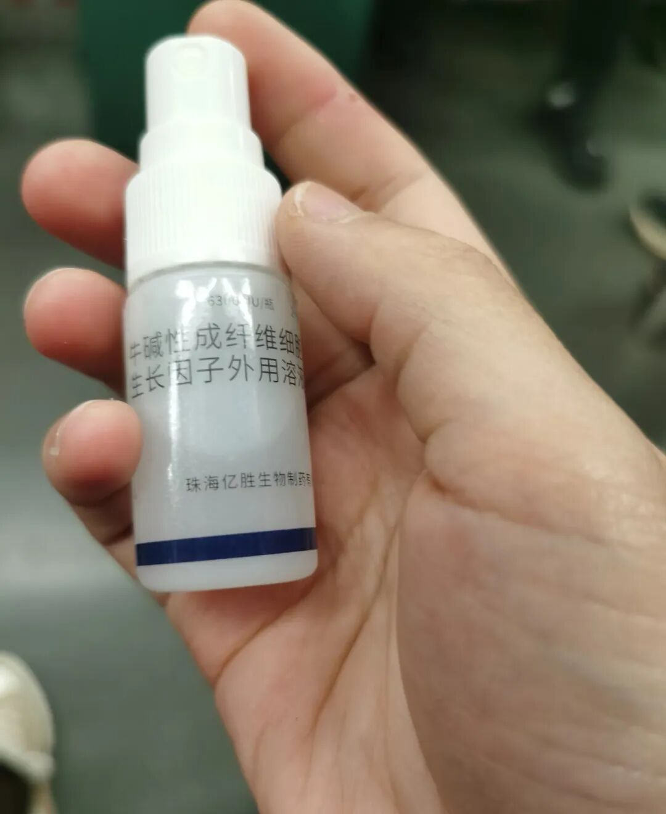

所有家里有小孩的，我都建议备上这一支。

真的，尤其是家里有个调皮娃，三天两头摔跤受伤的那种，家里备一个这个药很有必要。

它就是生长因子，我用的品牌是贝复济，之前医院开的。作用就是帮伤口快点好起来。最让我觉得好的是，小孩用着不排斥。喷上去冰冰凉凉的，一点不疼。  
  
之前我家孩子牙齿摔伤了，嘴唇里面也有伤口，是在上海九院开的这个药。

不得不说，它恢复力确实很强。喷完过几天，伤口很快就结痂了。尤其对一些湿性的伤口，防护效果更好。

小朋友摔地上，腿上、手上擦伤那种，直接喷上去，伤口好得很快，感觉像有一层保护。  
  
还有一次脸上擦伤，用下来有两个好处：一个是恢复快，另一个是不太容易留疤。所以我家里现在常年备着。  
  
它有好几种用法。平时擦伤磕伤，直接喷在皮肤上就行。也可以直接喷在口腔里，有些嘴巴里的伤口真的很难处理，这个喷进去就行。我之前口腔溃疡也喷过，管用。另外烫伤用它，恢复特别好。  
  
我自己就经历过一次。做菜时油溅到脖子上，很大一块。要知道烫伤之后很容易留下深色的疤痕印，我当时特别怕脖子上留疤。

就每天喷这个生长因子，一天喷好几次，再搭配一点祛疤的药。几天就好了，一点疤都没留。  
  
对了，这个药要放在冰箱里保存。  
  
我用完医院开的两盒之后，都是自己在网上买。说实话卖这个药的店铺不多，大家要仔细找找。

我一般是在美团买药上买的，每次囤一点放家里。有点小伤口就喷一喷，小孩不哭不闹，老母亲也安心。  
  
所以真的很建议家里有小宝宝的备一支。绝对比碘酒好使。