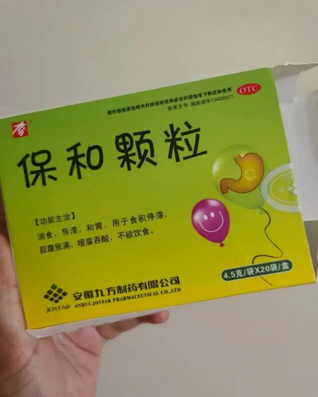
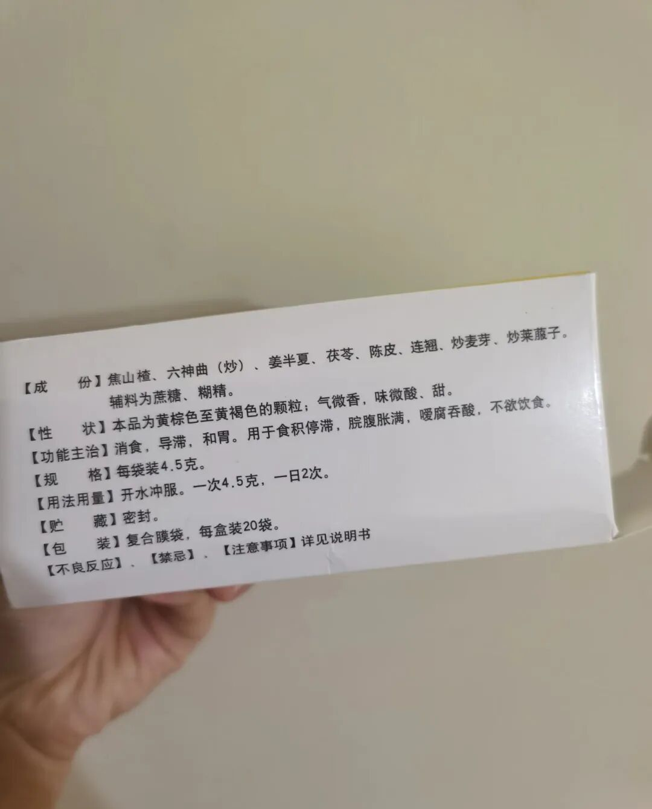

作为一个当年7年的妈妈，如果问我育儿路上有什么心得，那一定是“养娃先养脾”。

今天想跟大家聊聊一款我私藏很久、也给不少朋友推荐过的好东西，真心建议有孩子的家庭，尤其是孩子开始上幼儿园的，都可以常备着。

我家孩子三岁上幼儿园前，脾胃一直挺省心，很少有积食的烦恼。可自从开启了集体生活，情况就变了。幼儿园饭菜香，活动量大，小朋友们一起吃得也开心，孩子吃饭常常没了节制，积食就成了家常便饭。

很多妈妈可能觉得，积食不就是吃多了嘛，饿一顿就好了。

但有时候，它的表现并不明显，孩子不发烧也不喊肚子疼，就是整个人状态不对，比如莫名烦躁、爱发脾气，或者晚上睡觉不踏实。

这里，我特别想根据自己的经验提醒大家：**孩子生病期间和病愈初期，脾胃最是脆弱。**

这个时候，他们的“消化系统”就像刚经历了一场战斗，特别虚弱。如果饮食稍微不注意，或者急着“进补”，就特别容易消化不良。

记得有一次，我儿子感冒刚好，精神看着不错，但接连好几晚都睡不安稳，在床上翻来覆去，还总踢被子。

起初我以为是病还没好利索，身体不舒服。然后我观察他的舌苔，又厚又白，凑近闻闻，嘴里还有股淡淡的酸味。

我才恍然大悟，这不是生病，这是积食了。肚子不舒服，难怪睡不好。

那天晚上，我赶紧从药箱里翻出常备的**保和颗粒**。

这款药在我看来，真有点被低估了。它的成分很温和，我看过说明，主要是山楂、麦芽、陈皮这些我们平时也常接触的、药食同源的东西，作用就是帮着消食导滞。

我给他冲了一包，味道酸酸甜甜的，孩子不抗拒，一口气喝了。

神奇的是，喝完大概一个多小时，他睡前就放了七八个屁。

那一晚，折磨人的“烙煎饼”模式终于停了，他睡得非常踏实，我也跟着睡了个安稳觉。

第二天，他拉出了很多味道很重的便便，之后几天，睡眠和胃口都跟着好了起来。

从那以后，我就学会了几个“居家观察”的小方法，如果你家孩子也有类似情况，不妨也留意一下：

- **看舌苔：** 每天早上让孩子“啊”一下，看看舌头。如果舌苔变得又厚又白，甚至有点发黄，那可能就是积食的信号。
- **闻口气：** 早上起来，凑近闻闻孩子的小嘴。如果有一股酸腐味，那多半是肚子里有东西没消化掉。
- **看睡眠：** 孩子晚上睡不安稳，翻来覆去，喜欢趴着睡或者撅着屁股睡，甚至说梦话、磨牙，很多时候都跟肚子不舒服有关。

发现这些小信号，我就会给他喝上一两次保和颗粒，帮肠胃“减减负”，通常都很有效果。

当然，除了借助这些温和的常用药，更重要的还是平时的养护。最后再分享两个我家一直在坚持的实用小习惯：

1. **晚上八点后“禁食”**。晚上肠胃也需要休息，睡前吃东西负担太重。我们家立了规矩，八点后就不吃了，顶多喝点温水。
2. **睡前揉揉小肚子**。睡前搓热手掌，以肚脐为中心，帮孩子顺时针轻轻按摩几分钟。这不仅能帮他促进肠道蠕动，也是非常温馨的亲子时光，孩子在抚摸中会感觉很安心。

育儿路上，我们都不是专家，都是在磕磕绊绊中摸索经验。

希望我这一点点个人心得能给你带来一些启发，让我们一起守护好孩子们的“小脾胃”，让他们吃得香、睡得好、长得棒。