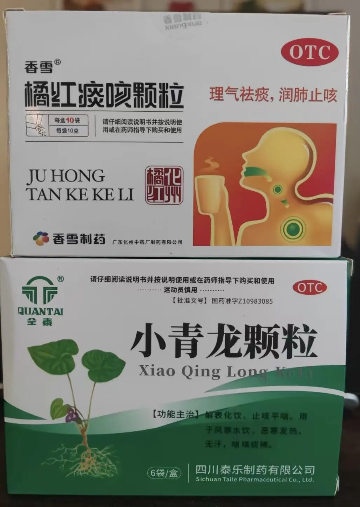

当妈的都知道，孩子一感冒，全家都跟着揪心。尤其那种一变天就中招、一感冒就鼻炎跟着犯的娃，更是让人头疼。

市面上治风寒感冒的药不少，但用了一圈下来，我心里最踏实的，还是小青龙颗粒。

很疑惑，去医院医生从来没给我开过这个药，药店也没人推荐过。

前年偶然在一个宝妈群里看到有人提了一嘴，说对付孩子受寒特别管用，我就记下了，买了两盒放家里备着。

后来我仔细研究了成分，发现这药对我家孩子简直太对症了。

我家小朋友体质偏寒，每次感冒基本都是受凉引起的。

而且他还有点鼻炎，身体里的寒气本来就比别的孩子重。所以一感冒，鼻子就不通气，鼻涕哗哗流，反反复复好不了。

我现在能做的就是平时尽量少让他受凉，但孩子嘛，总有防不住的时候。

每次他刚有点苗头，开始打喷嚏、流清鼻涕、偶尔咳两声，我立刻冲一包小青龙颗粒递过去。

味道说实话不咋好，姜味儿特别重，我自己都觉得有点冲。

好在我家娃身经百战吃药一点都不含糊，皱着眉头也能喝完。

吃完睡一觉，第二天起来基本就好得差不多了。不放心的话，再巩固一天，吃一包就够了。

另外我发现，小青龙对受寒的鼻炎也管用。如果孩子是因为着凉、寒湿引起的鼻塞、流清鼻涕，它能把体内的寒气散出去，鼻炎自然就好转了。

如果咳嗽比较厉害，我会搭配橘红口服液一起吃。这俩组合，对付受寒引起的咳嗽，我觉得特别权威。

讲个真事儿。

五一假期我们带娃去湿地公园抓螃蟹，那天风特别大，后来还淋了点小雨。孩子玩得开心，我也没太在意。结果第二天一早，他咳得厉害，鼻涕也止不住，一看就是着凉了。

出门在外，药箱没带身上。我赶紧去附近药店买了小青龙和橘红口服液，中午给他吃了一次。到傍晚的时候，咳嗽明显轻了。晚上睡前又吃了一次。第二天基本不怎么咳了，就是还有点鼻涕，又巩固了一天，彻底好了。

当妈的都知道，孩子一生病，晚上根本睡不踏实。有了这些顺手的小药，心里起码有个底。

不是说它万能，但对我们家这种寒底子、爱感冒、一感冒就犯鼻炎的小朋友来说，小青龙颗粒真的是救火队员。

现在我家药箱里常年备着它，用不上最好，用上了，心里不慌。