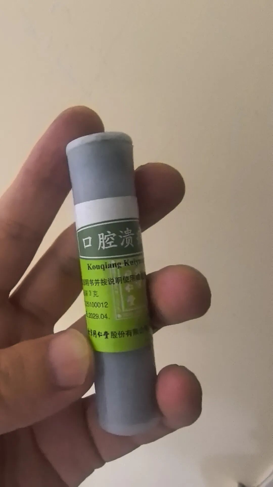
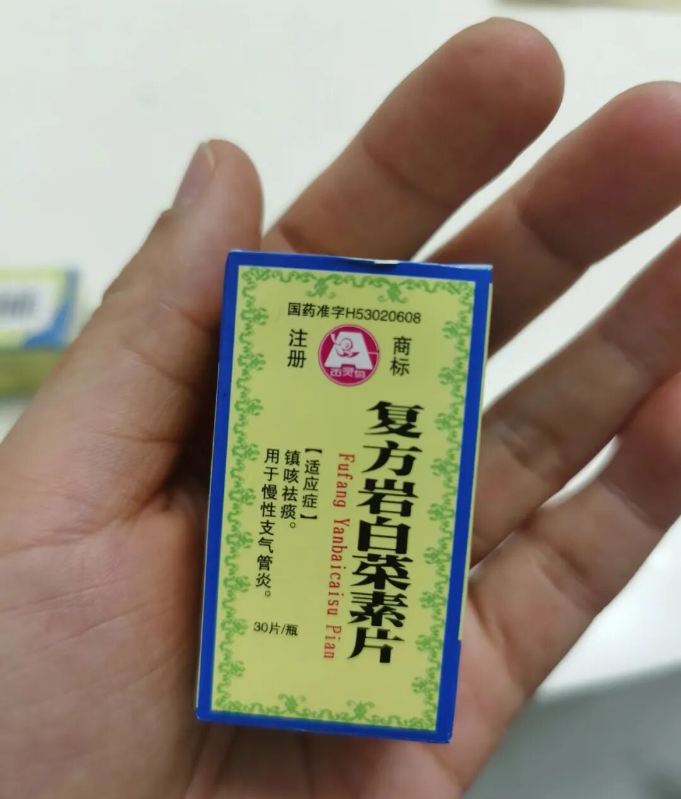
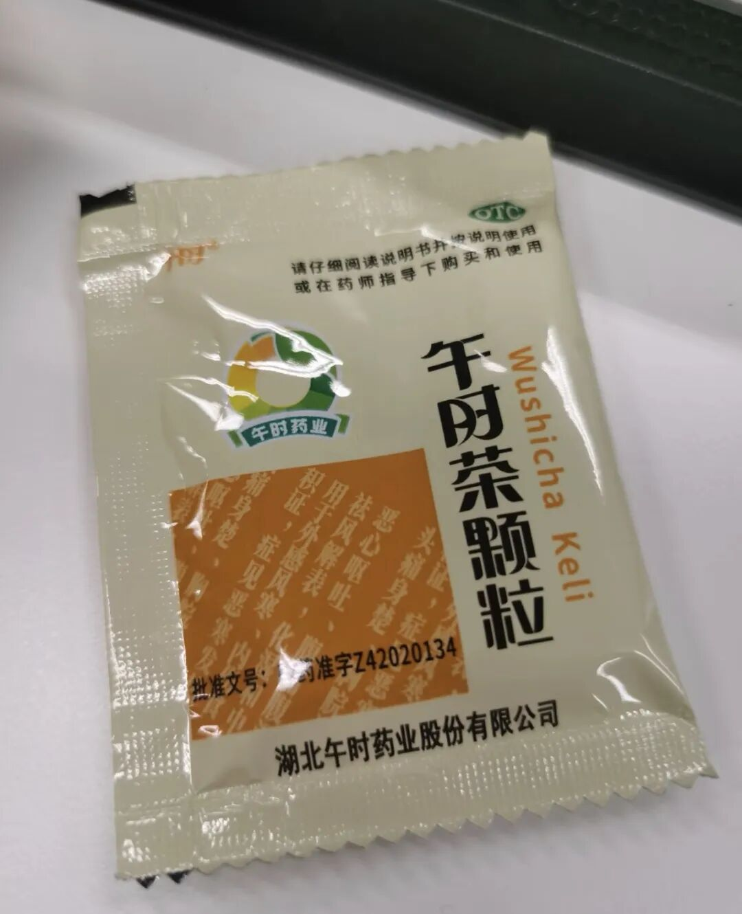
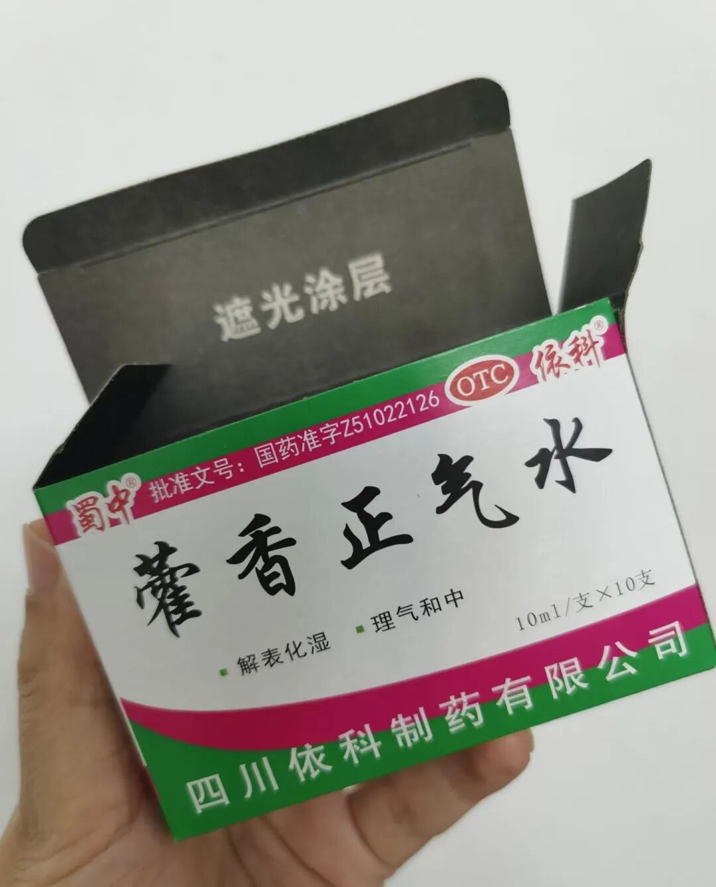
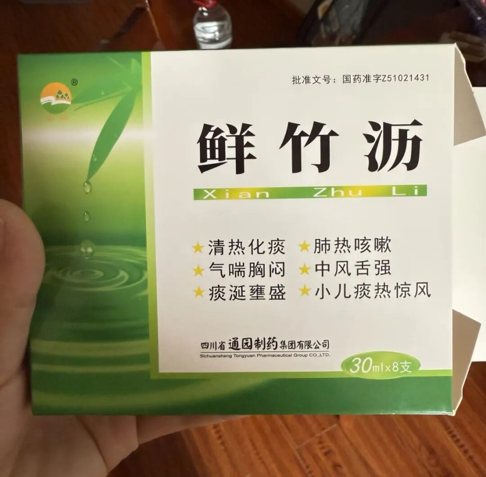
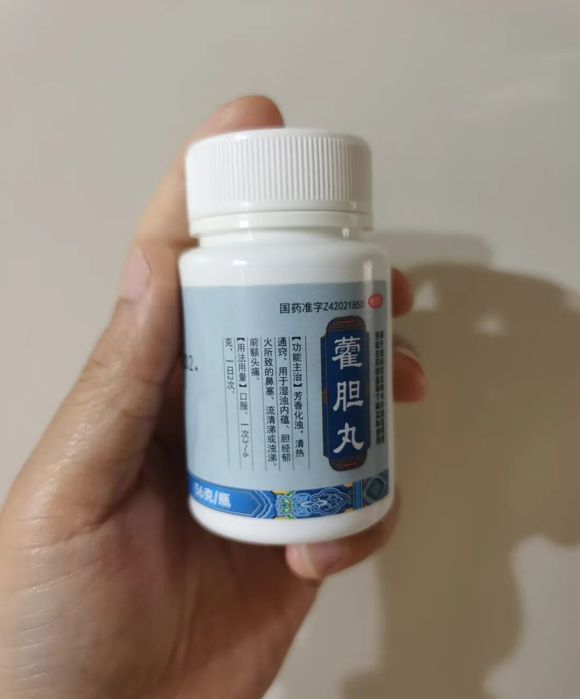
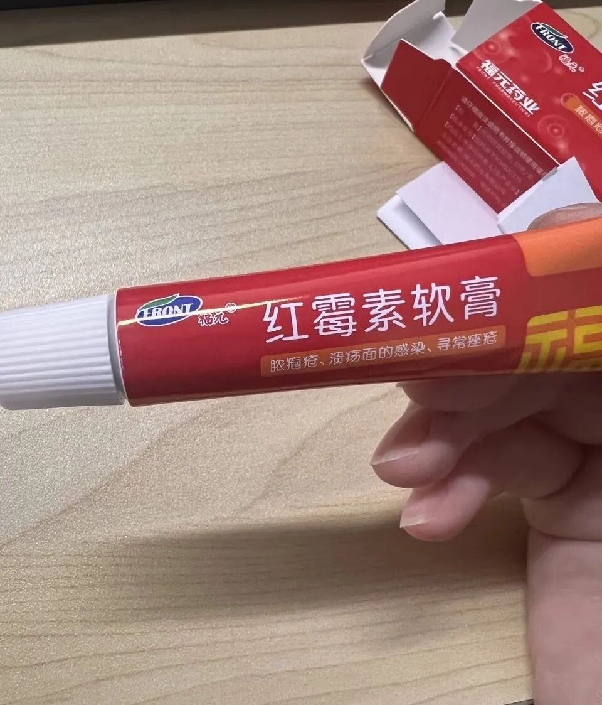
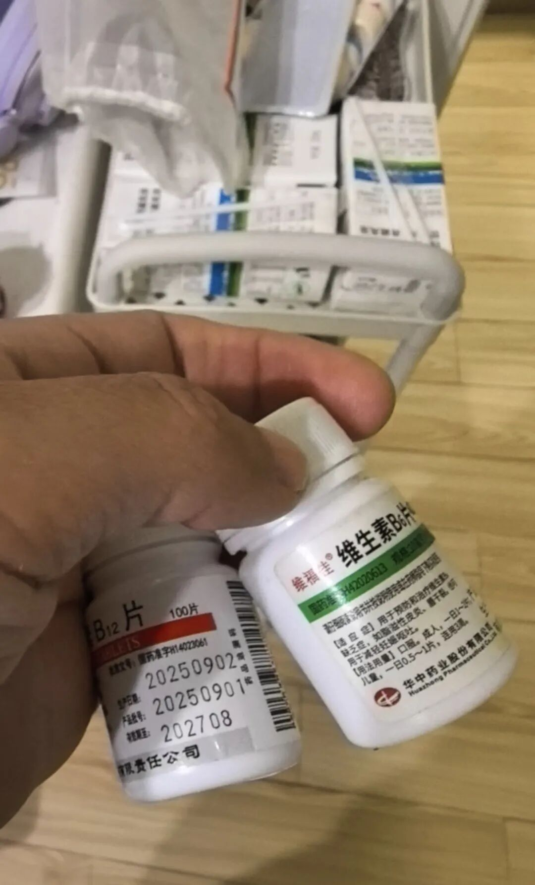

1.同仁堂口腔溃疡散  5元

熬夜太猛，吃饭咬到嘴唇，晚上就变成溃疡

涂了好几天的桂林西瓜霜，不仅没好，还变更大了，巨痛无比。

晚上悲痛欲绝之时想起小时候用过的这个同仁堂口腔溃疡散。

昨天收到货涂了一下，就不疼了，今天就完全无感了。才5块钱！！

2.复方岩白菜素片  7元

支气管炎引起的咳嗽有用，前几天阳的时候咳得死去活来，也救了我。

3.午时茶颗粒  15元

这个基本很多人家里常备，肠胃不舒服，感冒都可以上，味道也还可以。喜欢它就像喜欢金银花露一样，湖北的朋友能懂。头昏昏沉的时候吃一包就有感觉。

4.藿香正气水  3元

看清楚，是水，不是口服液。基本老祖宗的智慧特别牛。平时中暑感冒腹泻都可以用。我用的比较多的是泡脚。太难喝了，感冒的时候倒两支泡脚。

而且咳嗽厉害的时候用化妆棉湿敷在喉咙上也有效果。

小朋友发烧的时候，用化妆棉湿敷在肚脐眼帮助退烧。

越写越觉得牛了。一定要常备。

5.通元鲜竹沥水   4元

喉咙有痰，咳嗽不止，有用，而且味道挺好的，很清淡。小孩3岁之前不爱喝药，这款用得比较多。

6.太福 霍胆丸  7元

鼻炎引起的鼻塞很有效。我们之前在鼻炎发作的时候晚上洗好鼻子，会吃几天，缓解鼻塞有效。效果比鼻渊通窍鼻炎颗粒好多了。

7.红霉素软膏  2元

用了几十年，家里常备。万金油一样，啥都可以用。

8.维生素小白瓶 2-3元

日常补的维生素b6，b12，都是买的这种简单的，增加免疫力。确实补了快半年，小孩身体好很多。包括我，在换季，或者生病的时候猛猛吃几天，好的就快多了。

其实很多经典的药效果都很好，主要是对症下去。自己多研究多琢磨，钱包和人都少受冤枉罪。