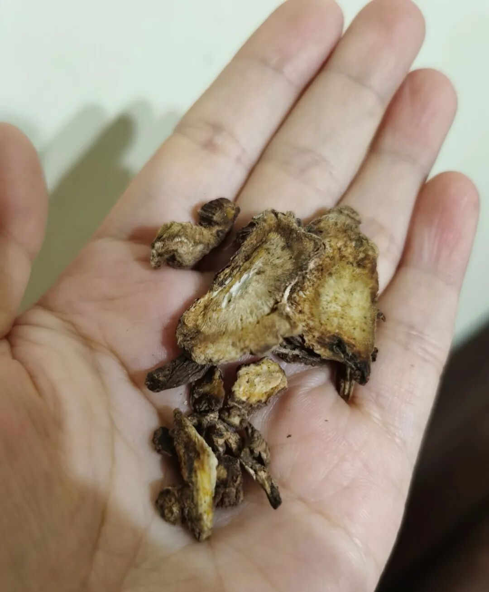
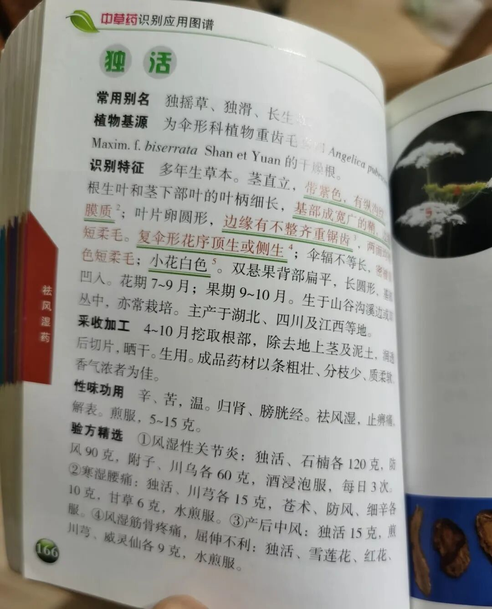

中药名字真的太神奇了，有时候很好奇给他们取名的祖先是什么精神状态。

我最近发现一味中药叫独活，感觉它的名字特别符合现在很多年轻人的状态。就是那句“不要埋怨自己，要指责他人”。

真的太像现在很多年轻人的生存哲学了：一个人挺好，不麻烦别人，也别来绑架我。

名字透着一种淡淡的疯感和冷静。

独活这味药，功效是祛风湿、止痹痛。

风湿和痹痛这种东西，说白了就是身体里积了太多浊气、湿气，走不了也排不掉，最后堵在关节里，又酸又重又疼。

这不就跟人心里憋着事儿一样吗？怨气、委屈、自责，全攒着，时间长了谁都扛不住。

独活的做法就很有意思。它不跟你讲什么疏通、和解、包容，它就是独来独往地走窜，把那些湿和风一个个揪出来赶走。你说它合群吗？不合群。但它管用。

但我第一次注意到它，是在小说《半妖司藤》里。  
  
书里有个角色叫丘山道长。他以前喜欢过一个异族女子，那个女子是植物变异的妖怪，名字叫长生。后来长生性情大变，把丘山身边的人都杀了。丘山道长从此变得特别憎恨异族，对司藤也非常差。

直到最后他才明白，原来长生和司藤一样，也有分身。

最妙的是，这味草药就有两个名字，一个叫长生，另一个叫独活。

我当时就觉得作者起名字太会了。  
  
说实话，我常常好奇古人给中药取名时到底是什么精神状态。那些名字实在太有韵味了。

我手头有一本《中国草药大全》，没事就会翻一翻，光看名字就觉得很有意思。比如《仙剑三》里的重楼、景天、龙葵，徐长卿，全部都是中药名。  
  
说回独活本身。我之前是用它来给小朋友熏鼻子的。另外还看到过一个说法，独活加鸡蛋一起煮食，对眩晕很有效果，有这方面困扰的朋友可以试试。  
  
最后想小声问一句，有没有人也觉得独活和当归长得实在太像了？还是只有我这么觉得？