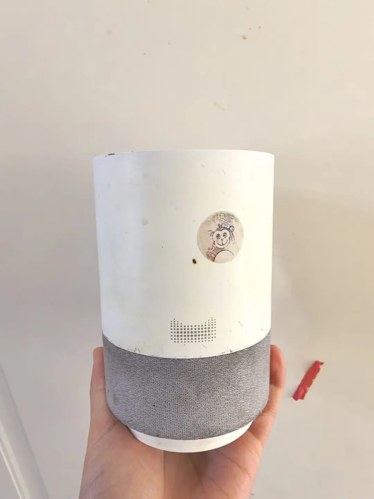

如果问我：养娃以后买过最划算的东西是什么？不是几千块的推车，也不是堆成山的乐高。而是这个比孩子年纪还大、已经用到“战损版”的——天猫精灵。回想2018年双十一，我熬夜用99元抢下第一代。当时随手下单，没想到它竟然成了我家立功最多的“功臣”。

# 1. 它是我的“哄睡救星”

现在的家长谁还没体验过哄睡的痛？但我家娃，从小就没让我操过心。小时候听着儿歌睡，大一点自己点播故事，半小时准时进入梦乡。不用老母亲陪躺到腰酸背痛，它响，我撤，主打一个省心。

# 2. 它是孩子的“知识百科”

别小看这99块的小盒子。《拉布拉多警长》、《猴子警长》、《西游记》……它肚子里装了半个图书馆。孩子边听边玩，不费妈，更不费眼睛（保护视力真的太重要了！）。前几天，这娃居然跟我聊起了“中子、质子”，还问我知道不知道“非牛顿流体”。我一脸懵逼，一问才知道：全是天猫精灵教的。其次他的拼音就是听故事学会的，直接省了几千块。还有我发现他的语言表达能力会好很多。虽然没有刻意教过成语，但是他能准确的在生活中用到。

# 3. 它解决了拖延症

它是家里的“闹钟+管家”。几点刷牙、几点运动、几点收玩具，全听它的。培养孩子的规则感，比家长在大后屁股催一百遍都管用。早上8点，准时提醒刷牙；下午2点，雷打不动喊他运动。只要设定好“5分钟后做XX”，到点它一响，娃立马执行，绝不讨价还价。说真的，这99块钱，我不仅买到了一个故事机，更买到了孩子受用一生的好习惯。哪怕它现在外壳都磨损了，我也舍不得换。如果你也是个想“偷懒”的妈妈，真的，按头推荐！