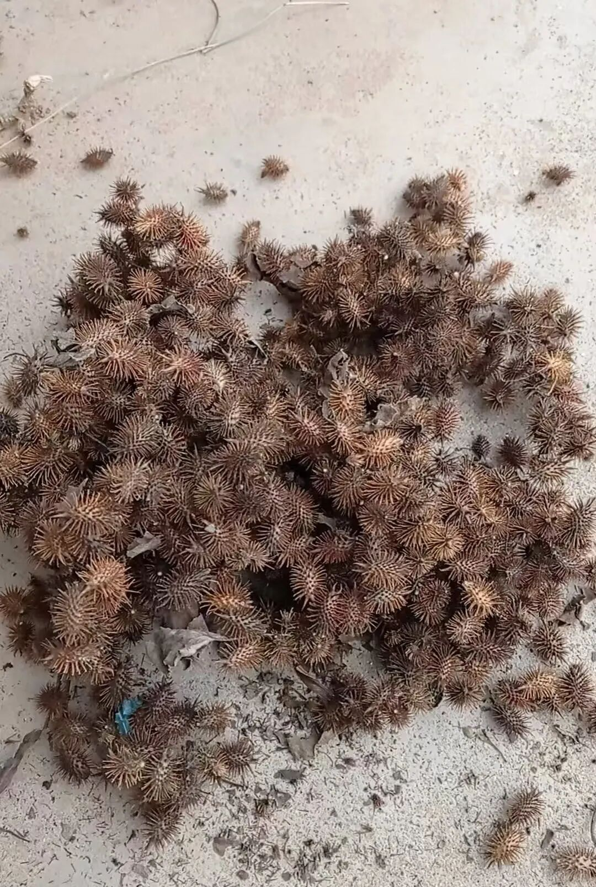
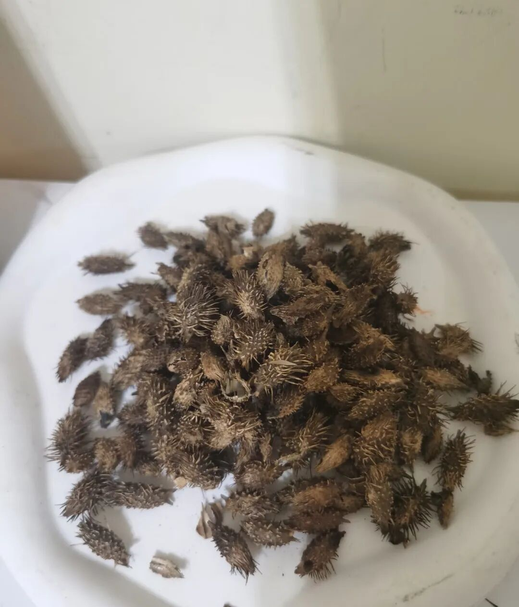
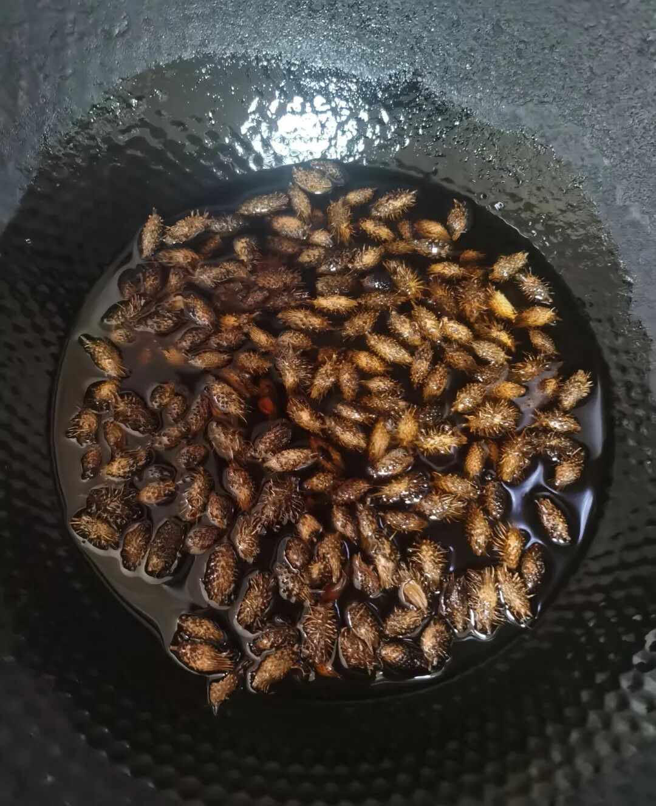

为了儿子的过敏性鼻炎，我真是操碎了心。各种偏方、中医、西医都试过了，好在他现在情况稍微稳定了一点。

最近又刷到说苍耳子油对鼻炎特别好。从中医角度看，苍耳子本来就是一味散风通窍的药，配上润燥的小磨香油，对干燥型的鼻塞挺对症的。

我想不管怎么说，只要是不太伤身体的方法，我都愿意试一试。而且说实话，他晚上睡觉鼻子确实有点干，之前滴过维生素D或者香油，多少都有些用。

反正苍耳子油也是油，总不会差到哪儿去，就动了心思自己做。

在我的记忆里，苍耳子到处都是。小时候漫山遍野都是，我们经常拿它互相扔来扔去。最烦那些男生把它扔在女生头发上，粘住了怎么都弄不下来。

可现在想找一点，还真不容易。我打电话给老家的妈妈，她真是好啊，不光帮我找了丝瓜根，还到处找苍耳子。趁着周末带着小侄子，在田埂田野里四处找，好不容易才攒了那么一小袋。

顺带还磨了小磨香油。为了大外孙的鼻炎，她也跟着操碎了心。

小时候我们管它叫“刺果子”，调皮的男生喜欢扔到女生头上，顶顶烦人。我老公居然说他从来没见过。

苍耳子很扎手，处理起来挺费功夫。

我先放锅里炒干，再用擀面杖碾一碾，把刺去掉一些，然后过筛。

听说苍耳子的刺带点小毒，所以这一步马虎不得。妈妈在油场买的小磨香油，倒出来一部分烧热，等温热的时候放进苍耳子，最后倒入玻璃瓶封口。

第一次做不太熟练，感觉油放少了。可等做好后，我闻了一口，真的好香好香，像小时候最爱吃的凉拌菜，淋上一点香油的那种香味。

儿子一开始不愿意让我滴。我每天晚上给他滴苍耳子油的时候，都会忍不住逗他：“哇，你好香啊！我真怕晚上睡觉闻着你，忍不住咬你的小鼻子。”

每次听到这儿，他就咯咯笑，乖乖让我滴了。

现在最大的感慨是：养大一个孩子真不容易。

我本来动手能力很差，现在为了孩子，一步步被逼着变强了。不光会用各种油，学会推拿，艾灸，还学会了给他做中药枕头。

果然，养孩子这件事，就是慢慢把自己重新养一遍。