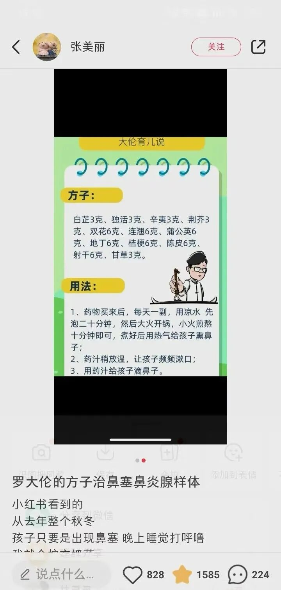
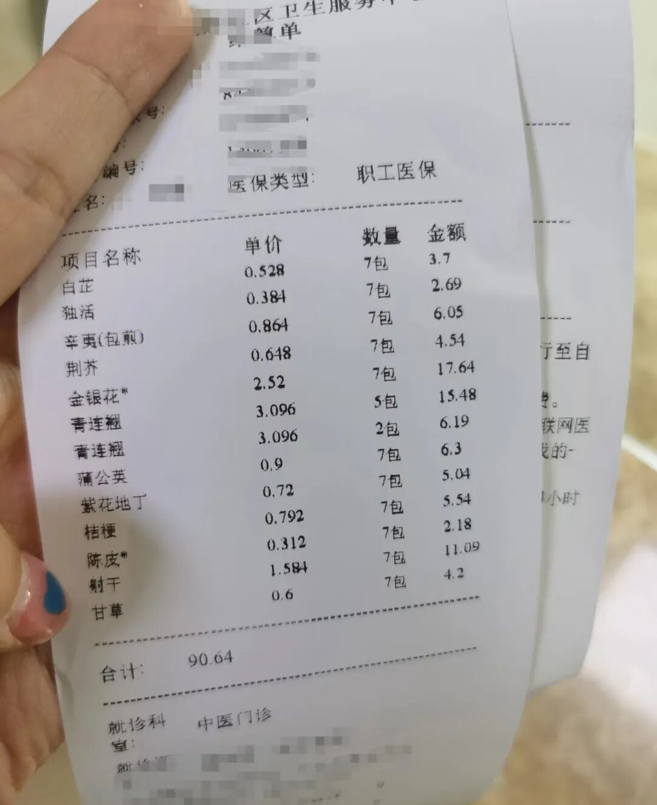
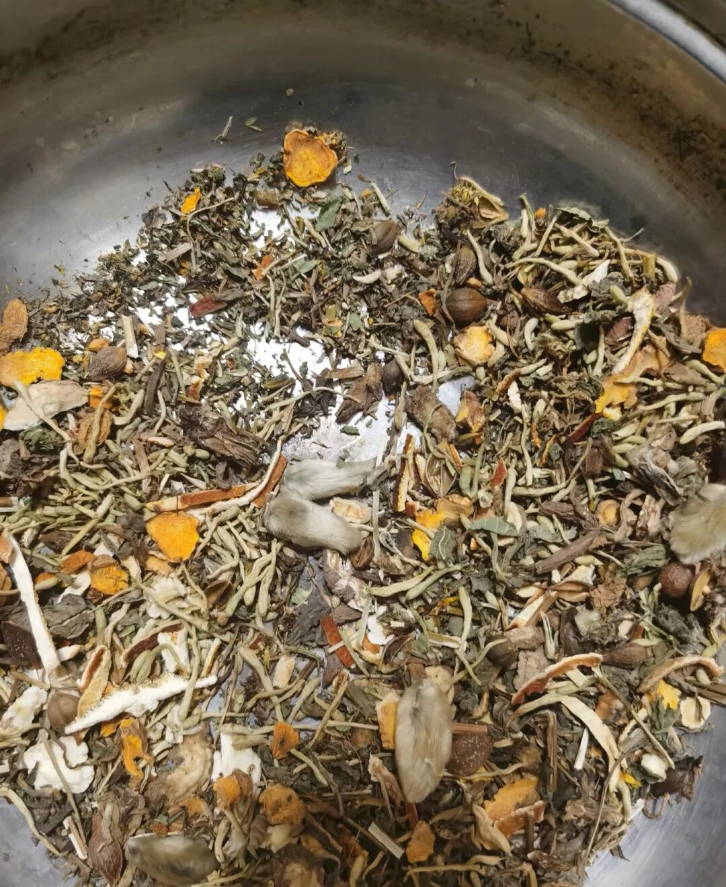
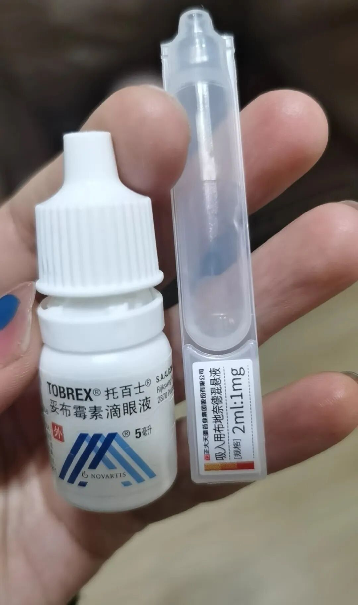

春天对鼻炎娃来说，太难熬了。天气忽冷忽热，一受寒鼻炎就犯。天天洗鼻子、涂药，效果也总是不太理想。

关注罗大伦老师的这个方子有一阵子了。看到好评很多，而且罗老师的书我也看了，感觉应该是比较靠谱的。

本来想在网上买草药，又怕品质不好。没想到社区医院就能开，价格也不贵，还能用医保卡，真的太方便了。每包药都有标签和克重，看着放心很多。

我们是鼻炎发作到后半程开始用的。当时主要症状是鼻塞、流鼻涕。连续熏了7天，效果多好不敢说，因为同时还用了洗鼻和其他药。目前情况暂时稳定了，还在坚持洗鼻子。  
  
有时间、有精力的家长可以试一试，毕竟比用西药安全一些。像内舒拿这类药用多了，确实会有抗药性。比较明显的效果是熏完鼻子洗出来比较多的浓鼻涕。  
  
具体做法是这样的：  
  
1. 按比例配好药，冷水泡20分钟，煮10分钟，直接熏鼻子。我陪着孩子一起熏，配合度一般，每次也就坚持几分钟。煮好后我会先倒一小杯出来。

2. 倒出来的药水，让孩子含在嘴里漱一漱再吐掉。他试过喝下去，味道微苦，不难喝。有一次试过用这个药水放进吸鼻器冲洗鼻子，不知道是不是比熏更管用，只试过一次。

3. 药水还有点烫的时候拿来泡脚，挺舒服的。感觉泡脚对鼻炎确实有好处。  
  
这些操作做完，再用生理盐水洗鼻子。我们洗的时间不长，10ml的量也就用几分钟。洗完往鼻子两边滴药水，左右各3滴，托百士和布地奈德两种。

滴鼻子尤其要注意姿势。躺床上，头垂下来90度。喉咙里没有苦味，就说明方法对了。

一般浓鼻涕、有炎症的话，三天左右能好转。

期间也陆续吃了几天藿胆丸。  
  
剩下的药还会继续拿来泡几天脚。配合着用，总归有点帮助吧。

调理鼻炎是条长路，真的不容易。