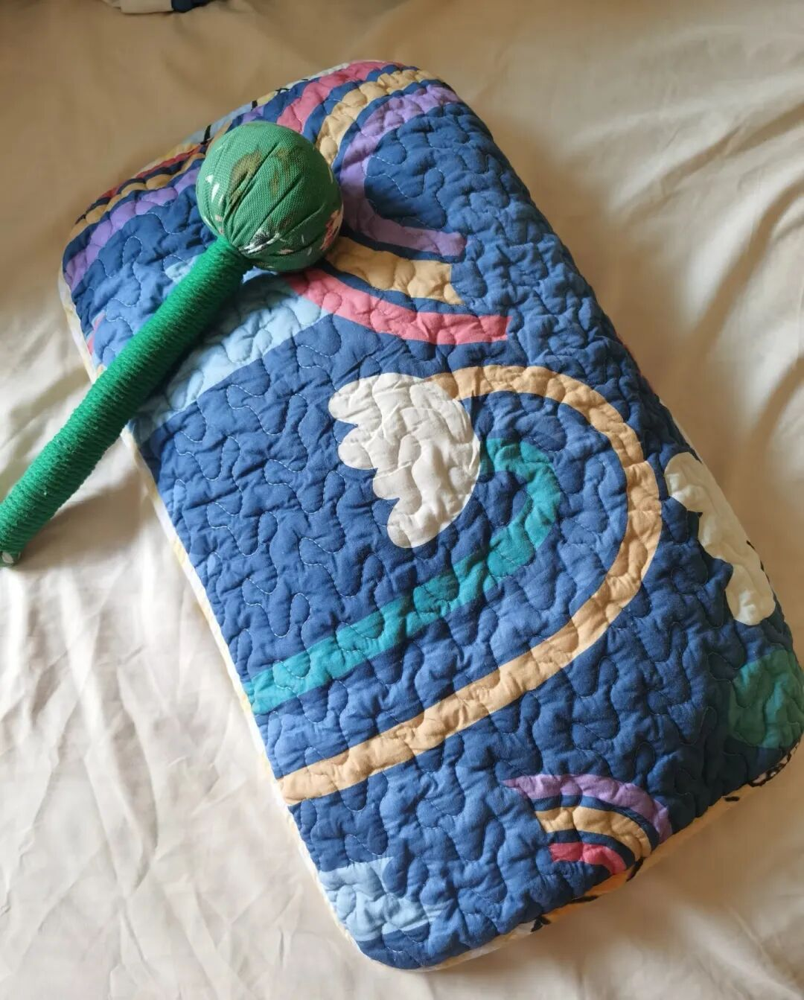
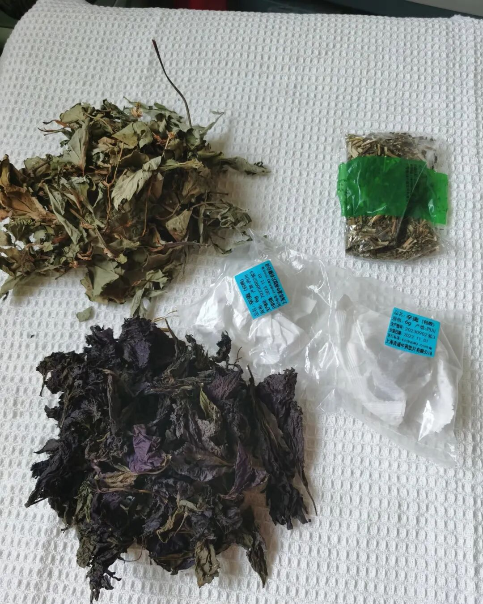
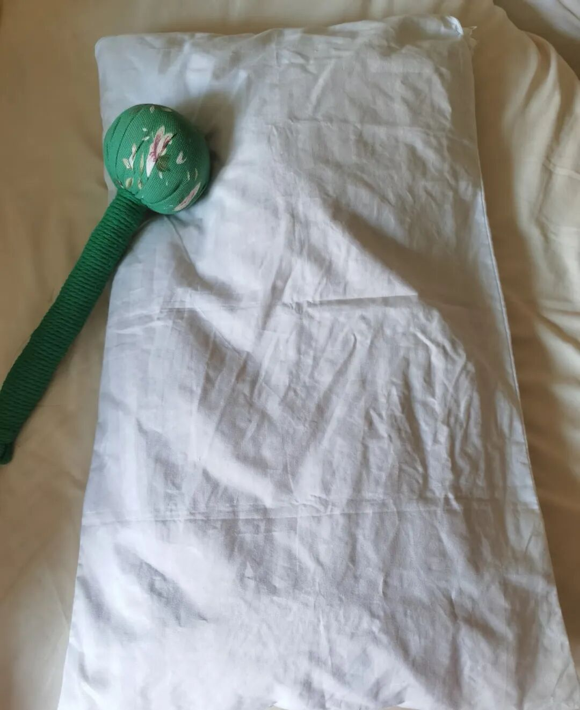

这两天天气好，把家里剩下的药材收拾了一下，给孩子做了个枕头。

别说，他睡了两个晚上，说还挺舒服的。

艾叶和紫苏是妈妈从老家寄过来的，辛夷和荆芥是之前给娃调理鼻炎剩的。本来放着也是放着，扔了又觉得可惜。后来一想，医院里头也有这种草药枕头卖，我干嘛不自己做一个？

去网上看了看，这种枕头少说也要上百块。我这自己动手，材料都是现成的，算下来等于省了99块钱。

做法其实很简单：把干药材抖掉灰尘，稍微剪碎一点，装进透气的棉布袋子，外面再套上小枕套就行了。躺上去有一股淡淡的草药味，不冲，反而挺安神的。

枕头套是pxx买的，买双层的比较好。

这些年为了孩子鼻炎，家里囤了不少中草药。洗鼻子、熏鼻子、泡脚、滴药水，能试的基本都试了。

有时候也觉得折腾，但想想，总比一直用西药强。像内舒拿那种，用久了确实担心抗药性。

没想到的是，做这个枕头的过程中，安安静静地收拾药材、剪碎、装袋，发现自己还挺享受的。

平时带娃忙忙碌碌的，难得有这么一会儿，什么都不用想，就专心做点手工，做完还挺有成就感的。

原来做做手工也是很治愈的一件事。

现在好了，剩下的药材也不浪费，给孩子做个枕头，闻着对鼻子好，睡觉也踏实。

又是勤俭持家又解压的一天。

有鼻炎娃的家长，家里如果有剩余的辛夷、荆芥、艾叶、紫苏这些，真的可以试试。

不一定能当药使，但孩子睡得香，自己也放松了一下。关键是，自己动手，省下的钱还能给孩子买点别的。