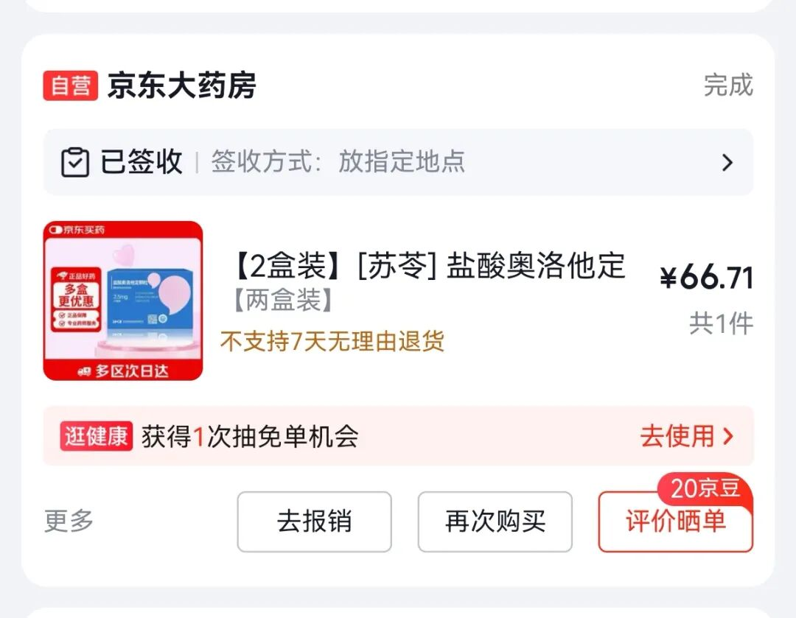
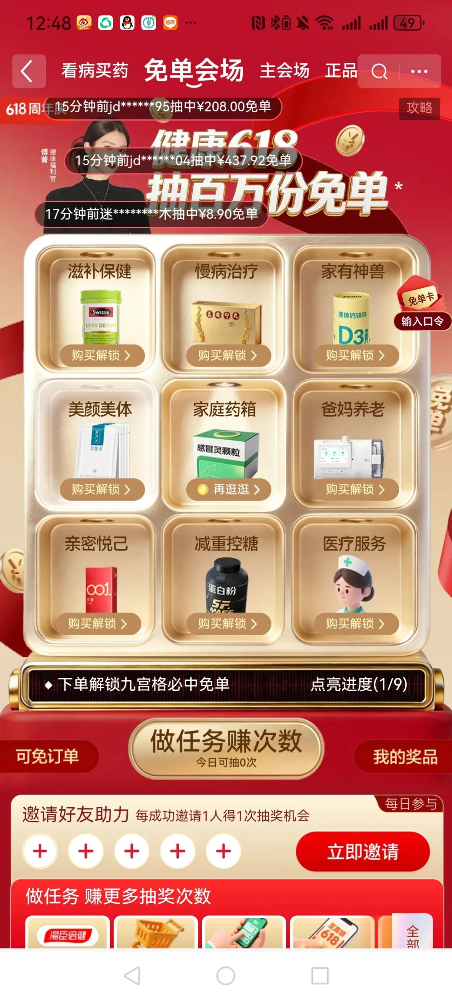
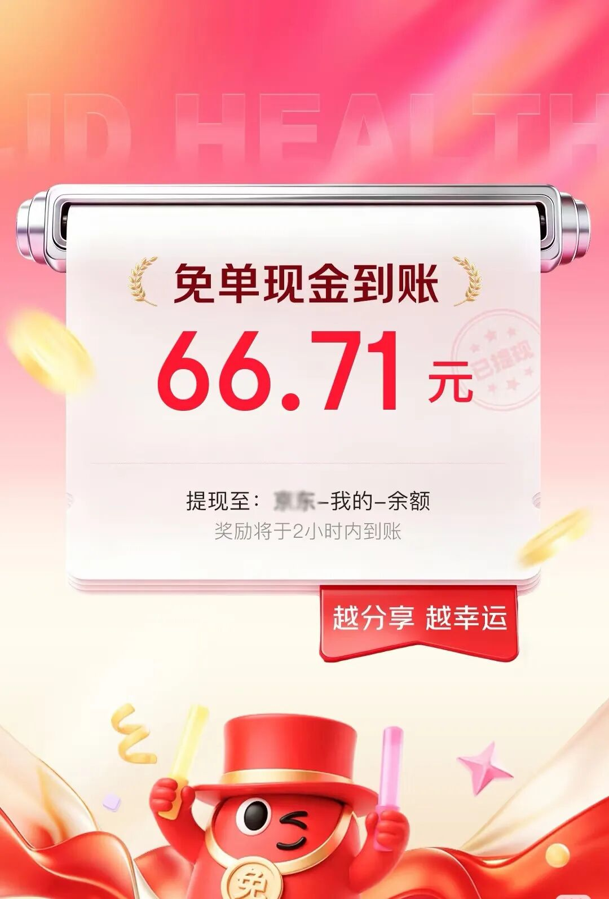
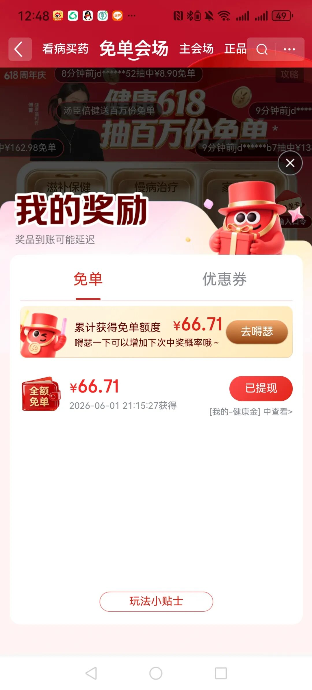

孩子吃的过敏药吃完了，昨天在京东上下了一单。付完款跳出一个抽奖页面，平时我都是中奖绝缘体，随手一抽，居然说我中了免单。

条件是要把获奖信息分享到小红书，然后把链接提交回去，就能到账。

好吧，我试试。转发到小红书，提交链接，钱真的到账了。

不过提现的话要交20%的个人所得税，不想交税就直接充到京东账户里的“健康金”，可以买所有京东大药房的产品。

第一次被免单，还是值得纪念一下的。最近买过京东大药房的朋友可以去试试抽奖。

连我这么非酋的人都能中，估计是最近中奖率真的很高吧。