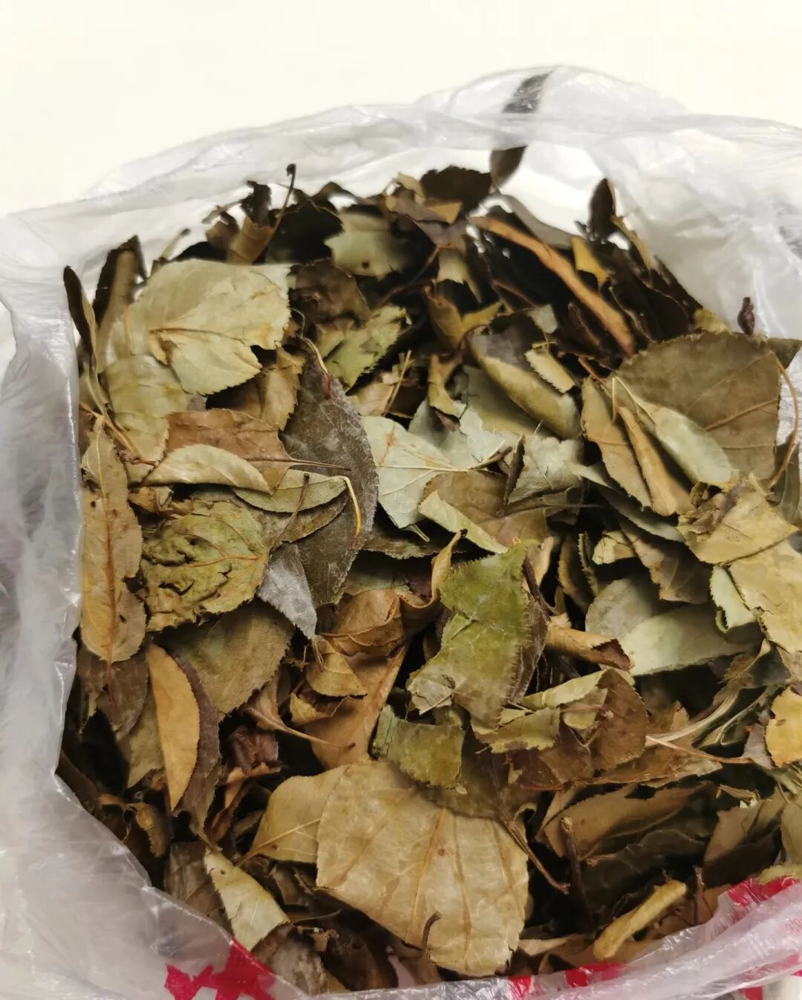
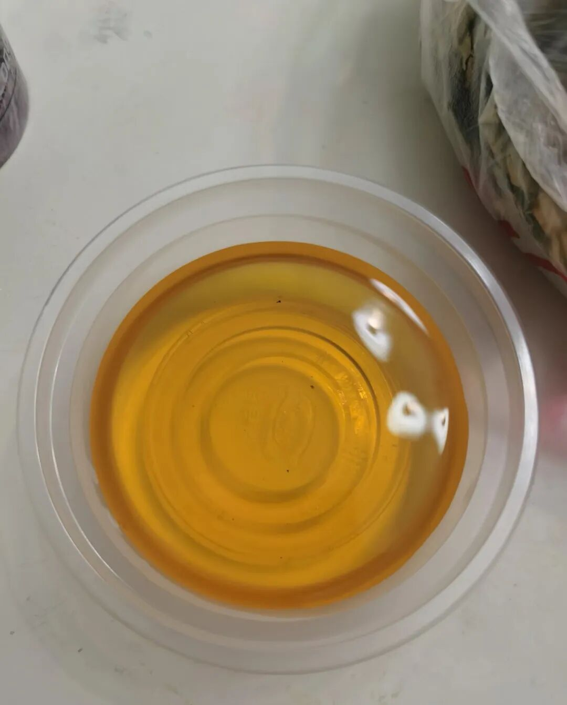

最近老想起小时候的味道。很多味道，说没就没了，想找都找不着。  
  
有一种茶，叶子跟树叶似的，我们老家叫“桦树叶”，也有地方叫“三匹罐”。听着就土，但好喝。

每年夏天，我妈就会烧一大壶水，往白瓷茶壶里扔两片这种叶子。晾着，谁渴了谁倒。  
  
那时候哪有那么多饮料、冰棍。在外面疯跑一气，跑得满头大汗，冲回家，倒一大碗凉的，咕咚咕咚灌下去。清清凉凉的，还有点甜。痛快。  
  
现在想想，大概是九几年那会儿的事。上了初中，好像就没怎么喝过了。  
  
前阵子不知怎么，特别想喝这个味儿。给妈打了个电话，问还能不能弄到。她说现在不好找了，去年在你姑父家喝过一回。隔了两天，妈说给我寄了一包过来。  
  
昨天烧了一壶，没有记忆里的白瓷壶，茶色还是这么清亮，我躺在沙发上，一碗一碗地喝。

还是小时候那个味儿。  
  
喝完了，愣了一会儿。说不上来是什么感觉，就是挺想小时候的。