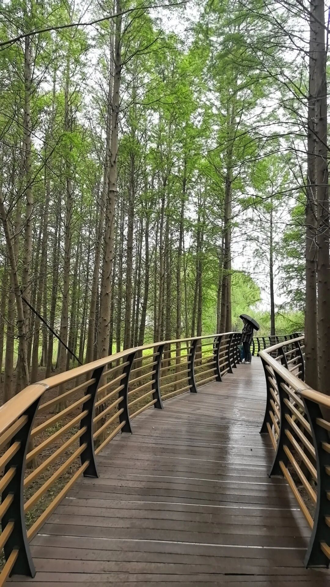

最近一直在下雨，感觉整个空气又闷又湿，人就特别难受。

头发很容易油，整个人精神状态也不好，昏昏沉沉的。去睡觉吧，也睡不踏实，很容易醒。好像每年到这个梅雨季节，都是这个样子。

之前我有了解过一段时间中医，大概说的就是湿气的困扰。中医里有句话叫“湿性重浊”，就是说湿气这个东西，会让你觉得身体很重、头很沉、人不清爽。

湿气一般分为内湿和外湿。本来天天下雨，外面就湿漉漉的，身体里面也沉沉的，特别难受。

解决起来其实也还算简单，没有网上那些花里胡哨的东西。我自己有几个比较简单的方法，可以跟你聊一聊。

第一个，就是要动一动。

中医讲“动则生阳”，你一动，身体的阳气就起来了，阳气一足，湿气就像晒衣服一样被慢慢蒸干。

你越懒，身体就越不动；你越不动，整个人就越觉得没劲。这就是一个很坑的恶性循环。

你可以试一试，每天早上起来散半个小时的步，或者打一下八段锦，提一提你身体里的气。这样身体可能就没有那么沉了。

我一般是早上六点起来。没下雨的时候就去外面溜达一圈，大概散一个小时的步。这一个小时我觉得还是很舒服的。不过因为天气比较闷热，走的时候身上会出一身汗，回来洗个澡，还是觉得整个人的身体状态会好很多。

第二个，就是吃的东西要注意。

越是这种天气，你觉得热、觉得闷，可能就越想去吃一些冷的、冰的东西。但越是这个时候，你其实越不能去吃。

因为湿气本来就是靠你的脾胃去化解的，这些凉的东西很伤脾胃。中医说“寒凉伤阳”，你把脾胃的阳气伤了，它就没有力气去运化水湿了。这时候我们要让自己的运化变得更好，可以去吃一些帮助运化的东西。

很多人会推荐煮薏米红豆水，但我觉得煮起来也比较麻烦。有一个比较简单、也很被人推荐的方法，就是去泡陈皮水喝。陈皮理气化湿，对脾胃很友好。

我自己试过，一般买稍微大一点的品牌，买个那种十五年或者二十年的陈皮，泡出来的水味道还挺好喝的。我觉得坚持喝的话，它比喝饮料对身体好很多。

第三个，就是晚上可以泡泡脚。

中医说“湿气通于脾，脾经起于足”，脚底是很多经络的起点，泡脚就是从底下把湿气往外赶。

我一般晚上八点左右，用艾草泡泡脚，边泡脚边刷刷剧，感觉对身体真的好很多。艾草是温性的，能帮着散寒祛湿，泡完脚暖暖的，睡觉也踏实。

第四个，泡好脚之后，可以按按穴位。

像什么丰隆穴、阴陵泉，都是可以按一按的，之前说是排水的穴位。但我自己用起来觉得比较麻烦，我就会刮痧——刮脚板。

我就会刮一刮，刮到微微发热，然后就睡觉，还是很舒服的。中医讲“通则不痛”，把脚底刮通了，气血走得顺，湿气也跟着排掉了。

第五个，如果你比较喜欢做艾灸，有条件的话做做艾灸，我觉得也蛮好的。

艾灸是纯阳之物，对着穴位烤一烤，能把身体深处的寒湿逼出来。

平时如果觉得自己精气神不好，可以适当喷一点薄荷油，提提精气神，都还挺好的。

最后想说一句， 中医讲“天人相应”，外面的天气怎么样，你身体里面也会跟着有反应。黄梅天湿气重，人难受，这是正常的。但你可以顺着这个节气的特点去调一调，不要跟身体对抗。

这段时间，真的就是好好养一养，不然到夏天更难熬。